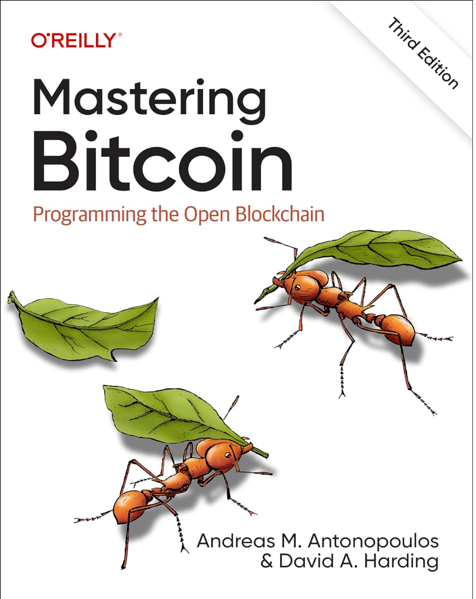

# 关于本学习内容

<figure><figcaption>
精通比特币第三版封面
</figcaption></figure>

## 精通比特币第三版翻译

网页版：[https://berryjam.gitbook.io/mastering-bitcoin-3rd](https://berryjam.gitbook.io/mastering-bitcoin-3rd)

pdf版：[https://berryjam.github.io/mastering-bitcoin-3rd/book.pdf](https://berryjam.github.io/mastering-bitcoin-3rd/book.pdf)

epub版：[https://berryjam.github.io/mastering-bitcoin-3rd/book.epub](https://berryjam.github.io/mastering-bitcoin-3rd/book.epub)

## 译者介绍

区块链领域从业者

个人编写的区块链相关博客：[https://berryjam.github.io/](https://berryjam.github.io/)

个人github：[https://github.com/berryjam](https://github.com/berryjam)

精通比特币第三版于2023年12月发布，距离2017年发布的第二版过去6年。期间比特币又增加了很多新特性，和实现了不少新的改进提案。如2018年提出的升级提案Taproot，用来增强比特币的可扩展性、隐私性和灵活性，并成为构建BTC 2层重要特性和带来了BRC-20资产。

另外除了翻译之外，本学习内容会加入一些从技术角度理解的注释，如第4章介绍私钥和公钥时，可能看完就会很快忘记其形式是怎么样，两者如何转换而来。私钥k本质上是一个256比特的大数，而公钥K是椭圆曲线的一个点坐标，通过K=k\*G转换而来。那么怎么从大数转为二维(x,y)公钥呢？通过k次椭圆曲线的“加法”操作（切线与曲线相交点的x轴对称点），而G是生成点坐标，通过这就实现了转换。这样加上一些备注，会更方便记忆。

由于很多开发者接触区块链是从以太坊开始的，以太坊开发生态比较完善，实现诸如“拉块”和发起转账和调用智能合约的例子网上也比较多，开发者很容易上手。但是比特币应用开发例子比较少，要实现“拉块”和发起转账就不是那么直观了。所以在原作基础上，第三章加入了《简单的应用开发（一）：使用bitcoinj客户端监听转账，和发起转账》，使用Java客户端实现了一个监听转账和发起转账的demo：[https://github.com/berryjam/bitcoinj](https://github.com/berryjam/bitcoinj) 。考虑到2023年以来BRC-20资产的火热，在第十四章加入了《BRC-20交易指南》的翻译，以及在第三章加入《简单的应用开发（二）：使用rust与BRC-20交互》，demo：[https://github.com/berryjam/ordhook](https://github.com/berryjam/ordhook) 。还有2024年初BTC大热，BTC的各种二层方案层出不穷，在第十四章加入《BTC二层网络Stacks介绍及代码分析》。与大家深入了解基于去中心化质押的BTC二层方案，基于此扩展出自己的二层网络。期望能够抛砖引玉，欢迎pr提交与BTC相关的技术知识或者修正优化文中错误不足。

因此希望本翻译内容能够为大家带来更新的比特币学习内容和一些技术上的思考。

第三版包含以下内容：

* 比特币及其基础区块链的广泛介绍——适合非技术用户、投资者和企业高管。
* 解释比特币的技术基础和加密货币，面向开发人员、工程师和软件及系统架构师
* 比特币去中心化网络、点对点架构、交易生命周期和安全原则的详细信息
* 新发展，如Schnorr 签名、无脚本式多签名、默克尔抽象语法树（MAST）、支付到合约（P2C）、Taproot 协议、Bech32 和 Bech32m 地址格式、手续费管理、无脚本式门限签名、紧凑区块过滤器、FIBRE区块转发系统、BIP8 和 speedy trial 激活软分叉的新方法等
* 深入探讨比特币应用，包括如何将该平台提供的构建块组合成强大的新工具
* 用户故事、类比、示例和代码片段，说明关键技术概念

## 原书购买链接：

[Amazon](https://www.amazon.com/Mastering-Bitcoin-Programming-Open-Blockchain/dp/1098150090)

## Contributors

| 
<a href="https://github.com/berryjam"> Berryjam</a>
 | 
<a href="https://github.com/PinelliaC"> Null</a>
 | 
<a href="https://github.com/0xzkm"> 0xbe</a>
 | 
<a href="https://github.com/eth2the-moon"> Irrrrr2</a>
 |
| :-----------------------------------------------------------------------------------------------------------------------------------------: | :----------------------------------------------------------------------------------------------------------------------------------------: | :---------------------------------------------------------------------------------------------------------------------------------: | :-------------------------------------------------------------------------------------------------------------------------------------------------: |
