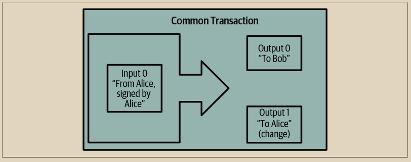
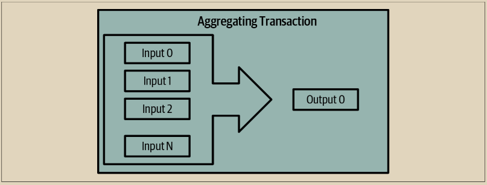
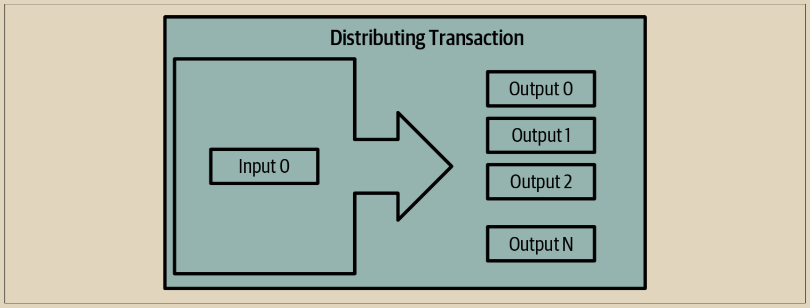

# 常见的交易形式

一种非常常见的交易形式是简单支付。这种类型的交易有一个输入和两个输出，如图2-4所示。

<figure><figcaption>
图 2-4. 最常见的交易
</figcaption></figure>

另一种常见的交易形式是合并交易，它将多个输入合并成一个输出（图2-5）。这相当于在现实世界中将一堆硬币和纸币换成一张更大的纸币。 有时，钱包和企业会生成这样的交易来清理大量较小的金额。

<figure><figcaption>
图 2-5.  合并交易聚合资金
</figcaption></figure>

最后，区块链上经常看到的另一种交易形式是支付批处理，它支付给多个输出，代表多个收款方（图2-6）。商业实体有时会使用这种类型的交易来分发资金，比如在向多名员工支付工资时。

<figure><figcaption>
图 2-6.  批处理交易分配资金
</figcaption></figure>

