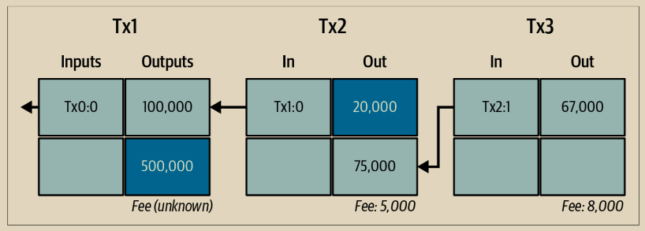

# 交易链

Alice的支付给Bob的商店使用了先前交易的输出作为其输入。在前一章中，Alice以现金换取了她朋友Joe的比特币。我们在图2-3中将其标记为Transaction 1（Tx1）。

Tx1发送了0.001比特币（100,000 satoshi）到由Alice的密钥锁定的输出。她向Bob的商店的新交易（Tx2）引用了先前的输出作为输入。在插图中，我们使用箭头显示该引用，并通过将输入标记为“Tx1:0”来标示。在实际交易中，引用是指Alice从Joe那里收到资金的交易的32字节交易标识符（txid）。“:0”表示Alice收到资金的输出的位置；在这种情况下，是第一个位置（位置0）。

如所示，实际的比特币交易并不明确包含其输入的价值。要确定输入的价值，软件需要使用输入的引用来查找要花费的先前交易输出。

Alice的Tx2包含两个新输出，一个支付75,000 satoshi购买播客，另一个支付20,000 satoshi作为找零返回给Alice。

\

<figure><figcaption>
图 2-3.  交易链是指一系列交易，其中一个交易的输出是下一个交易中的输入
</figcaption></figure>


比特币交易的序列化格式——软件用于发送交易的数据格式——使用最小的定义在链上价值单位的整数来编码要转移的价值。当比特币刚刚创建时，这个单位没有名称，一些开发者简单地称之为基本单位。后来，许多用户开始将这个单位称为“聪”（satoshi），以纪念比特币的创造者。在本书的图2-3和其他一些插图中，我们使用“聪”值，因为这是协议本身使用的单位。


