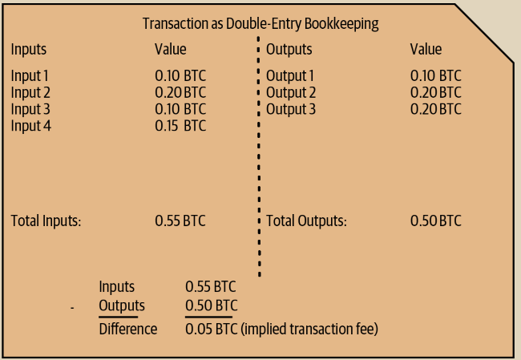

# 交易输入和输出

交易就像双重记账簿中的条目一样。每笔交易包含一个或多个输入，用于花费资金。在交易的另一侧，有一个或多个输出，用于接收资金。输入和输出不一定相等。相反，输出的总和略小于输入，差额代表隐含的交易费，这是矿工在区块链中包含交易时收取的一笔小费。比特币交易显示为双重记账簿中的条目，如图 2-2 所示。

交易还包含每笔比特币金额（输入）的所有权证明，以数字签名的形式，由所有者提供，任何人都可以进行独立验证。在比特币术语中，花费是指签署一笔交易，将价值从先前的交易转移到由比特币地址标识的新所有者名下。

<figure><figcaption>
图 2-2.  在比特币交易中，可以将其视为双重记账簿中的条目
</figcaption></figure>

