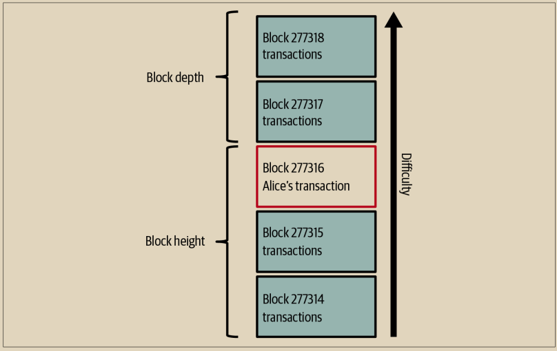

# 比特币挖矿

Alice的交易现在已经在比特币网络上传播开来。它只有在被包括在一个区块中并由全节点验证之后，才会成为区块链的一部分。详细解释请参见第12章。

\
比特币的防伪系统基于计算。交易被捆绑成区块。区块有一个非常小的头部，必须以非常特定的方式形成，需要巨大的计算量才能得到正确，但验证正确却只需要很少的计算量。挖矿过程在比特币中有两个目的：

* 矿工只能从符合所有比特币共识规则的区块中获得诚实的收入。因此，矿工通常被激励只在他们的区块和他们建立在上面的区块中包含有效的交易。这允许用户可以选择性地做一个基于信任的假设，即在区块中的任何交易都是有效的交易。
* 挖矿目前在每个区块中创建新的比特币，几乎像中央银行印刷新货币一样。每个区块中创建的比特币数量是有限的，并且随着时间的推移而减少，遵循固定的发行时间表。

挖矿实现了成本和回报之间的微妙平衡。挖矿使用电力来解决计算问题。成功的矿工将以新的比特币和交易费的形式获得奖励。然而，只有当矿工仅包含有效交易时，才会收到奖励，并且比特币协议的共识规则决定了什么是有效的。这种微妙的平衡为比特币提供了没有中央权威的安全性。

挖矿被设计成一种分散的抽奖。每个矿工可以通过创建一个包含他们想要挖掘的新交易和一些额外数据字段的候选区块来创建自己的彩票。矿工将候选区块输入到一个专门设计的算法中，该算法会对数据进行混淆（或“哈希”），产生的输出与输入数据完全不同。这个哈希函数对于相同的输入总是产生相同的输出，但是没有人可以预测对于一个新输入，即使与之前的输入略有不同，输出会是什么样子。如果哈希函数的输出与比特币协议确定的模板匹配，那么矿工就赢得了彩票，比特币用户将接受带有其交易的区块作为有效区块。如果输出与模板不匹配，矿工将对其候选区块进行微小更改，然后再次尝试。截至本文撰写时，矿工需要尝试的候选区块数量约为168亿亿。这也是哈希函数需要运行的次数。

然而，一旦找到了一个中奖组合，任何人都可以通过只运行一次哈希函数来验证区块是否有效。这使得有效区块成为需要大量工作才能创建，但只需要微不足道的工作来验证的东西。简单的验证过程能够以概率论的方式证明工作已经完成，因此生成这个证明所需的数据——在这种情况下就是区块——被称为工作证明（PoW）。

交易被添加到新的区块中，优先考虑具有最高费率的交易，并遵循其他几个标准。每个矿工在收到上一个区块后立即开始挖掘一个新的候选区块，知道其他某个矿工赢得了该轮抽奖。他们立即创建一个新的候选区块，并承诺与前一个区块相关联，填充交易，并开始为候选区块计算PoW。每个矿工在他们的候选区块中都包含一个特殊的交易，该交易支付他们自己的比特币地址，即区块奖励加上候选区块中包含的所有交易的交易费之和。如果他们找到了使候选区块成为有效区块的解决方案，那么在他们成功地将区块添加到全球区块链并且包含的奖励交易可以被花费之后，他们将获得这个奖励。参与矿池的矿工已经设置了他们的软件来创建分配奖励给矿池地址的候选区块。从那里，奖励的一部分按照他们贡献的工作量比例分配给矿池矿工的成员。

Alice的交易被网络捕获并包含在未验证交易的池中。一旦被全节点验证，它就被包含在一个候选区块中。大约五分钟后，Alice的交易首次被她的钱包传输后，一个矿工找到了区块的解，并将其宣布给网络。在其他每个矿工验证了获胜区块之后，他们开始生成下一个区块的新抽奖。

包含Alice的交易的获胜区块成为了区块链的一部分。包含Alice的交易的区块被视为对该交易的一个确认。在包含Alice的交易的区块通过网络传播后，要创建一个包含Alice的交易的另一个版本的替代区块（例如一个不支付Bob的交易）将需要执行与将所有比特币矿工创建一个完全新的区块相同的工作量。当存在多个可供选择的替代区块时，比特币全节点选择具有最高总PoW的有效区块链，称为最佳区块链。为了让整个网络接受一个替代区块，还需要在替代区块之上挖掘一个额外的新区块。

这意味着矿工有选择的余地。他们可以与Alice一起寻找一个替代方案，而不是支付给Bob的交易，也许Alice会支付给矿工之前支付给Bob的一部分钱。这种不诚实的行为将需要他们花费精力创建两个新区块。相反，行为诚实的矿工可以创建一个新区块，并收取其中包含的所有交易的费用，加上区块补贴。通常，以不诚实的方式创建两个区块以换取小额额外付款的高成本远远低于诚实地创建一个新区块，这使得确认的交易不太可能被故意更改。对于Bob来说，这意味着他可以开始相信来自Alice的支付是可靠的。


您可以查看包含[Alice交易](https://blockstream.info/block/000000000000000000027d39da52dd790d98f85895b02e764611cb7acf552e90)的区块。


\
大约19分钟后，包含Alice交易的区块被广播，另一个矿工挖掘出了一个新区块。因为这个新区块是建立在包含Alice交易的区块之上的（给予Alice交易两个确认），Alice的交易现在只能在挖掘出两个替代区块——再加上一个建立在它们之上的新区块——的情况下才能被更改，总共需要挖掘三个区块才能让Alice收回她发送给Bob的钱。每个在包含Alice交易的区块之上挖掘的区块都被视为额外的确认。随着区块越来越多地堆叠在一起，撤销交易变得更加困难，从而让Bob对Alice的支付越来越有信心。

在图2-7中，我们可以看到包含Alice交易的区块。在它下面是数十万个区块，彼此链接在一起，形成一个区块链，一直回溯到块＃0，称为创世块。随着新区块的“高度”增加，整个链的计算难度也会增加。按照惯例，任何具有超过六个确认的区块都被认为非常难以更改，因为重新计算六个区块（加上一个新区块）需要大量计算。我们将在第12章中更详细地探讨挖矿过程以及它如何增强信心。

<figure><figcaption>
图 2-7.  Alice的交易被包含在一个区块中
</figcaption></figure>

\
\

\
