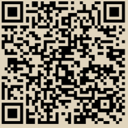

# 从在线商店购买

在前一章中介绍的爱丽丝是一位新用户，她刚刚获得了自己的第一笔比特币。在“获取你的第一笔比特币”中，爱丽丝在第11页，与她的朋友乔见面，用一些现金换取了比特币。自那以后，爱丽丝又购买了额外的比特币。现在，爱丽丝将进行她的第一笔消费交易，购买鲍勃在线商店的一个高级播客剧集的访问权限。

鲍勃的网店最近开始接受比特币支付，通过在网站上添加比特币选项。鲍勃商店的价格以当地货币（美元）列出，但在结账时，顾客可以选择以美元或比特币支付。

爱丽丝找到了她想要购买的播客剧集，并前往结账页面。在结账时，除了通常的选项外，爱丽丝还可以选择使用比特币付款。结账购物车显示了以美元和比特币（BTC）计价的价格，以及比特币的当前汇率。

鲍勃的电子商务系统将自动生成一个包含发票的二维码（见图2-1）。

\

<figure><figcaption>
图 2-1. 发票二维码
</figcaption></figure>

不同于只包含目标比特币地址的二维码，这个发票是一个包含目标地址、支付金额和描述的QR编码URI。这使得比特币钱包应用程序能够预先填写用于发送付款的信息，同时向用户显示可读的描述。您可以使用比特币钱包应用程序扫描QR码，以查看Alice将看到的内容：bitcoin:bc1qk2g6u8p4qm2s2lh3gts5cpt2mrv5skcuu7u3e4?amount=0.01577764\&label=Bob%27s%20Store\&message=Purchase%20at%20Bob%27s%20Store

URI的组成部分：

* 比特币地址："bc1qk2g6u8p4qm2s2lh3gts5cpt2mrv5skcuu7u3e4"
* 支付金额："0.01577764"
* 收款地址的标签："Bob's Store"
* 付款描述："Purchase at Bob's Store"


请尝试使用您的钱包扫描此内容，查看地址和金额，但请勿发送资金。


Alice使用她的智能手机扫描显示屏上的条形码。她的智能手机显示了向Bob's Store支付的正确金额，并选择发送以授权支付。几秒钟后（大约与信用卡授权相同的时间），Bob在注册机上看到了交易。


比特币网络可以进行分数值的交易，例如，从毫比特币（比特币的1/1000）到1/100,000,000比特币，即被称为 “聪” 的单位。本书在谈论大于一个比特币的金额以及使用小数表示法时，使用与美元和其他传统货币相同的复数规则，比如“10比特币”或“0.001比特币”。相同的规则也适用于其他比特币记账单位，如毫比特币和 “聪”。

\



您可以使用区块浏览器来检查区块链数据，比如 Alice 交易中向 Bob 支付的款项。

在接下来的章节中，我们将更详细地研究这笔交易。我们将看到 Alice 的钱包如何构建它，它是如何在网络中传播的，如何被验证的，最后，Bob 如何在随后的交易中花费这笔金额。

\
