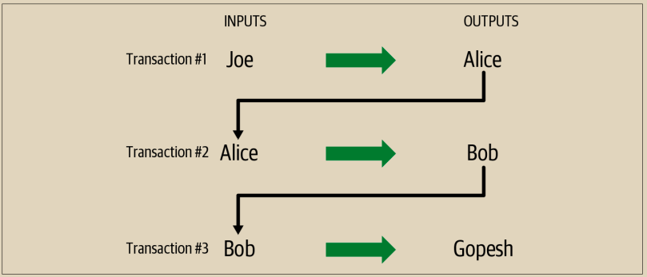

# 花费交易

现在，Alice的交易已经嵌入到区块链中作为一个区块的一部分，它对所有比特币应用程序都是可见的。每个比特币完整节点都可以独立验证交易的有效性和可支配性。完整节点验证从比特币首次生成在一个区块中开始的资金转移，直到它们到达Bob的地址的每一笔后续交易。轻量级客户端可以通过确认交易是否在区块链中，并在其后经过了几个区块的挖掘，从而部分验证支付，从而提供了矿工为其付出了大量努力的保证（参见“轻量级客户端”第228页）。

Bob现在可以花费来自此交易和其他交易的输出。例如，Bob可以通过从Alice的播客付款中转移价值来向承包商或供应商支付费用。随着Bob花费来自Alice和其他客户的付款，他扩展了交易链。假设Bob向他的网页设计师Gopesh支付了一个新的网站页面。现在，交易链将如图2-8所示。

<figure><figcaption>
图 2-8.  Alice的交易作为从Joe到Gopesh的交易链的一部分
</figcaption></figure>

在本章中，我们看到了交易如何构建一个链条，将价值从一个所有者转移到另一个所有者手中。我们还跟踪了Alice的交易，从她的钱包创建的那一刻开始，通过比特币网络，最终到记录在区块链上的矿工。在本书的其余部分，我们将深入探讨钱包、地址、签名、交易、网络和挖矿背后的具体技术。
