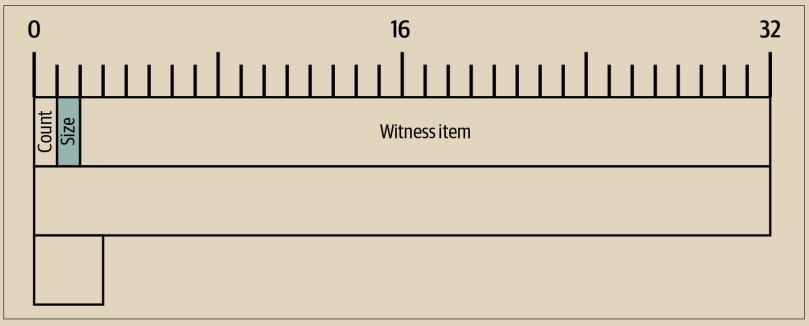

# 见证结构序列化

见证结构类似于输入和输出字段，包含其他字段，因此我们将从Alice交易的字节映射开始，如图6-5所示。

<figure><figcaption>
图 6-5. Alice的交易见证结构的字节映射
</figcaption></figure>

与输入和输出字段不同，整体的见证结构没有以包含的见证堆栈总数为开始。相反，这是由输入字段隐含的——每个交易的输入都有一个见证堆栈。

特定输入的见证结构确实以一个元素数量的计数开头。这些元素称为见证项。我们将在第7章详细探讨它们，但现在我们需要知道每个见证项都以一个表示其大小的紧凑尺寸整数为前缀。&#x20;

传统的输入不包含任何见证项，因此它们的见证堆栈完全由一个计数为零的元素组成（0x00）。&#x20;

Alice的交易包含一个输入和一个见证项。

\
