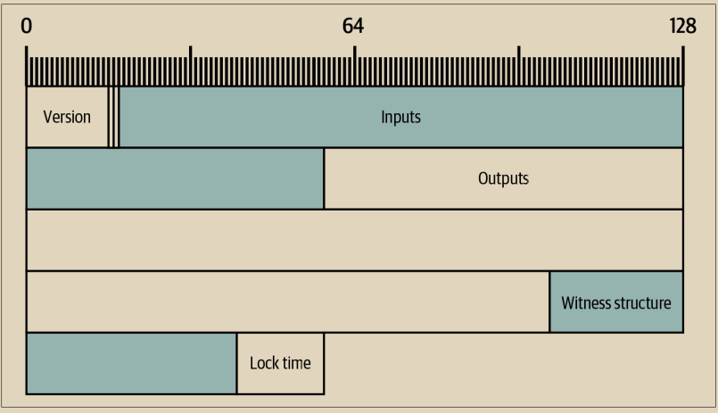

# 权重和V字节(Vbytes)

每个比特币区块在包含的交易数据量方面都有限制，因此大多数比特币软件都需要能够测量其创建或处理的交易。比特币的现代计量单位称为权重。权重的另一种版本是V字节(Vbytes)，其中四个权重单位等于一个V字节(Vbytes)，这样可以轻松地与传统比特币区块中使用的原始字节测量单位进行比较。

区块的权重限制为4百万。区块头占据240个权重。另外一个字段，交易计数，使用4或12个权重。所有剩余的权重可以用于交易数据。&#x20;

要计算交易中特定字段的权重，需要将该序列化字段的大小（以字节为单位）乘以一个因子。要计算交易的权重，请将其所有字段的权重相加。交易中每个字段的因子如表6-2所示。为了提供示例，我们还计算了本章中从Alice到Bob的示例交易中每个字段的权重。&#x20;

选择这些因子以减少花费未使用交易输出（UTXO）时使用的权重。这有助于避免不经济的输出的创建，如“不经济的输出和禁止灰尘”中所述。

表6-2. 比特币交易中所有字段的权重因子

<table><thead><tr><th width="228">字段</th><th>因子</th><th>Alice的交易权重</th></tr></thead><tbody><tr><td>Version</td><td>4</td><td>16 （因为version占4个字节，乘以4后即为16），16权重=4Vbytes</td></tr><tr><td>Marker &#x26; Flag</td><td>1</td><td>2</td></tr><tr><td>Inputs Count</td><td>4</td><td>4</td></tr><tr><td>Outpoint</td><td>4</td><td>144</td></tr><tr><td>Input script</td><td>4</td><td>14</td></tr><tr><td>Sequence</td><td>4</td><td>16</td></tr><tr><td>Output script</td><td>4</td><td>4</td></tr><tr><td>Amount</td><td>4</td><td>64 (2 outputs)</td></tr><tr><td>Output script</td><td>4</td><td>232 (2 outputs with different scripts)</td></tr><tr><td>Witness Count</td><td>1</td><td>1</td></tr><tr><td>Witness items</td><td>1</td><td>66</td></tr><tr><td>Lock time</td><td>4</td><td>16</td></tr><tr><td><strong>Total</strong></td><td><em>N/A</em></td><td><strong>569</strong></td></tr></tbody></table>

我们可以通过从比特币核心获取Alice的交易总额来验证我们的权重计算：

$ bitcoin-cli getrawtransaction 466200308696215bbc949d5141a49a41\\\
38ecdfdfaa2a8029c1f9bcecd1f96177 2 | jq .weight&#x20;

569

Alice在本章开头的示例6-1中的交易以权重单位表示如图6-6所示。通过比较两个图像中各个字段的大小差异，可以看到因子的作用。\

<figure><figcaption>
图 6-6.  Alice交易的字节映射
</figcaption></figure>

比特币权重详细介绍可参见：[比特币权重维基百科](https://en.bitcoin.it/wiki/Weight\_units)。
