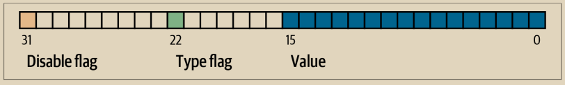

# 序列号字段

输入的最后四个字节是它的序列号。这个字段的用途和含义随着时间的推移而发生了变化。

## 最开始是基于序列号的交易替换

\
最初，序列字段旨在允许创建相同交易的多个版本，随后的版本可以替换之前的版本作为确认的候选项。序列号跟踪交易的版本。

例如，假设Alice和Bob想要在一场纸牌游戏上进行赌注。他们首先各自签署一笔交易，将一些资金存入一个脚本，该脚本要求双方签名才能支出，这是一个多重签名脚本（简称多签）。这被称为建立交易。然后，他们创建一个花费该输出的交易：

* 交易的第一个版本，带有nSequence 0（0x00000000），将最初存入的资金返还给Alice和Bob。这被称为退款交易。此时他们都不会广播退款交易。只有在出现问题时才需要它。
* Alice赢得了纸牌游戏的第一轮，因此交易的第二个版本，带有序列1，增加了支付给Alice的金额，并减少了Bob的份额。他们都签署了更新后的交易。同样，除非出现问题，否则他们不需要广播此版本的交易。
* Bob赢得了第二轮，所以序列递增为2，减少了Alice的份额，增加了Bob的份额。他们再次签署但不广播。
* 在经过了许多轮游戏，序列被递增，资金被重新分配，得到的交易被签署但不广播后，他们决定完成交易。创建一个具有最终资金余额的交易，他们将序列设置为其最大值（0xffffffff），以完成交易。他们广播了这个版本的交易，它在网络中传播，并最终被矿工确认。

我们可以看到序列的替换规则是如何工作的，如果我们考虑替代情况：

\
• 想象一下，如果Alice广播具有0xffffffff序列的最终交易，然后Bob广播其中一笔余额较高的早期交易。由于Bob的交易版本具有较低的序列号，使用原始比特币代码的全节点不会将其中继到矿工，而且也使用原始代码的矿工也不会挖掘它。

• 在另一种情况下，想象一下，Bob在Alice广播最终版本之前几秒钟广播了早期版本的交易。节点将中继Bob的版本，并且矿工将尝试对其进行挖掘，但是当带有较高序列号的Alice的版本到达时，节点也将中继它，并且使用原始比特币代码的矿工将尝试挖掘它，而不是Bob的版本。除非Bob幸运地在Alice的版本到达之前发现了一个区块，否则将确认Alice的交易版本。

这种类型的协议现在被称为支付通道。比特币的创始人在一封被归因于他的电子邮件中称这些交易为高频交易，并描述了协议中添加的一些功能以支持它们。我们稍后将了解到其他几个特性，也将发现当代支付通道的现代版本如何越来越多地在比特币中使用。

纯序列基础的支付通道存在一些问题。第一个问题是替换较低序列交易的规则仅仅是软件策略的问题。没有直接的激励使矿工更喜欢某一版本的交易而不是其他版本。第二个问题是第一个发送交易的人可能会很幸运，即使它不是最高序列的交易，也可能被确认。由于不幸的原因而导致的安全协议失败并不是一个非常有效的协议。

第三个问题是可以无限次替换交易的一个版本。每次替换都会消耗网络上所有中继全节点的带宽。例如，截至本书写作时，有约50,000个中继全节点；一个攻击者每分钟创建1,000个200字节的替代交易，每分钟将使用约10 GB的全节点网络带宽。除了他们每分钟20 KB的带宽成本和偶尔确认交易时的费用之外，攻击者不需要支付任何费用来承担对全节点运营者造成的巨大负担。

为了消除这种攻击的风险，早期比特币软件中禁用了原始类型的序列基础交易替换。数年来，比特币全节点不允许包含特定输入（由其输出点指示）的未确认交易被包含相同输入的不同交易替换。然而，这种情况并没有持续很久。

## 选择性交易替换信号

由于原始基于序列的交易替换存在滥用潜力而被禁用后，提出了一种解决方案：编写比特币核心和其他中继全节点软件，允许支付更高交易费率的交易替换支付更低费率的冲突交易。这被称为替代费率，简称RBF。一些用户和企业反对将交易替换支持重新添加到比特币核心中，因此达成了一项妥协，再次利用序列字段来支持替换。&#x20;

正如BIP125所记录的那样，具有任何输入的未确认交易，其序列设置为低于0xfffffffe的值（即至少低于最大值2），向网络发出信号，表明其签名者希望它可以被支付更高费率的冲突交易替换。比特币核心允许这些未确认交易被替换，并继续禁止其他交易被替换。 这允许反对替换的用户和企业简单地忽略包含BIP125信号的未确认交易，直到它们被确认。

现代交易替换政策不仅涉及费率和序列信号，还有更多内容，我们将在“替代费率 (RBF) 费率提升”中看到。

## 相对时间锁定的一致性强制序列

\
在“版本”一节中，我们了解到BIP68软分叉为版本号为2或更高的交易添加了一个新的约束。该约束适用于序列字段。

序列值小于2^31的交易输入被解释为具有相对时间锁定。这样的交易只能在前一个输出（由outpoint引用）的相对时间锁定量经过一段时间后才能包含在区块链中。例如，具有一个输入的交易，其相对时间锁定为30个区块，只能在至少有29个区块的区块中确认，这些区块在同一区块链中花费相同的输出。由于序列是每个输入的字段，一个交易可能包含任意数量的带有相对时间锁定的输入，所有这些输入都必须经过足够长的时间才能使交易有效。一个禁用标志允许一个交易包含具有相对时间锁定（序列<2^31）和不具有相对时间锁定（序列≥2^31）的输入。

序列值可以以区块或秒为单位指定。一个类型标志用于区分计算区块的值和计算以秒为单位的时间的值。类型标志设置在第23个最低有效位（即值1<<22）。如果类型标志被设置，则序列值将被解释为512秒的倍数。如果类型标志未设置，则序列值将被解释为区块数。&#x20;

在将序列解释为相对时间锁定时，只考虑16位最低有效位。一旦标志（位32和23）被评估，序列值通常会被使用16位掩码“掩盖”（例如，sequence & 0x0000FFFF）。512秒的倍数大致相当于区块之间的平均时间间隔，因此从16位（2^16）中得到的最大相对时间锁定的值，无论是以区块还是秒为单位，都略多于一年。

&#x20;图6-3显示了由BIP68定义的序列值的二进制布局。

<figure><figcaption>
图 6-3. BIP68对序列编码的定义（来源：BIP68）
</figcaption></figure>

请注意，任何使用序列设置相对时间锁定的交易也会发送用于选择性接受费用替换的信号，如“选择性交易替换信号”中所述。

\
