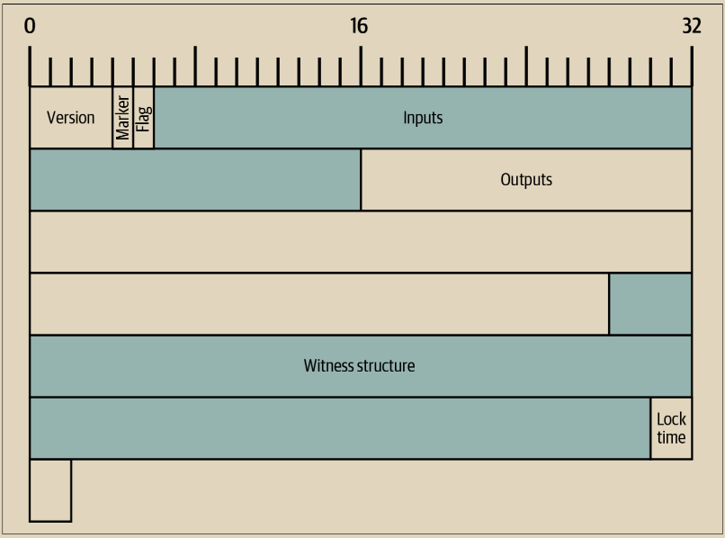

# 序列化的比特币交易

在“探索和解码交易”第43页中，我们使用了启用了 txindex 选项的 Bitcoin Core 来检索 Alice 支付给 Bob 的交易的副本。让我们再次检索包含该付款的交易，如示例 6-1 所示。

示例 6-1. Alice 的序列化交易

$ bitcoin-cli getrawtransaction 466200308696215bbc949d5141a49a41\\\
38ecdfdfaa2a8029c1f9bcecd1f96177&#x20;

01000000000101eb3ae38f27191aa5f3850dc9cad00492b88b72404f9da13569 8679268041c54a0100000000ffffffff02204e0000000000002251203b41daba 4c9ace578369740f15e5ec880c28279ee7f51b07dca69c7061e07068f8240100 000000001600147752c165ea7be772b2c0acb7f4d6047ae6f4768e0141cf5efe 2d8ef13ed0af21d4f4cb82422d6252d70324f6f4576b727b7d918e521c00b51b e739df2f899c49dc267c0ad280aca6dab0d2fa2b42a45182fc83e81713010000 0000\

Bitcoin Core 的序列化格式很特殊，因为它是用于对交易进行承诺并在比特币的 P2P 网络中传递它们的格式，但是其他程序可以使用不同的格式，只要它们传输了所有相同的数据。然而，Bitcoin Core 的格式对于传输的数据来说相当紧凑且易于解析，因此许多其他比特币程序都使用这种格式。


我们知道的唯一其他广泛使用的交易序列化格式是部分签名比特币交易（PSBT）格式，其在 BIP 174 和 370 中有文档记录（其他 BIP 中有扩展文档记录）。PSBT 允许一个不受信任的程序生成一个交易模板，可以由具有必要的私钥或其他敏感数据填充模板的受信任程序（例如硬件签名设备）进行验证和更新。为了实现这一点，PSBT 允许存储关于交易的大量元数据，使其比标准序列化格式要不紧凑得多。本书不会详细介绍 PSBT，但我们强烈建议支持使用多个密钥进行签名的钱包开发人员使用它。


示例 6-1 中以十六进制显示的交易在图 6-1 中被复制为一个字节映射。请注意，显示 32 字节需要 64 个十六进制字符。此映射仅显示顶级字段。我们将按照它们在交易中出现的顺序逐个检查它们，并描述它们包含的任何其他字段。

<figure><figcaption>
图 6-1. 爱丽丝的交易的字节映射。
</figcaption></figure>
