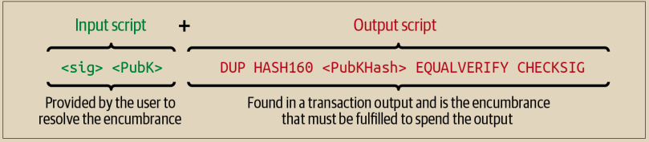
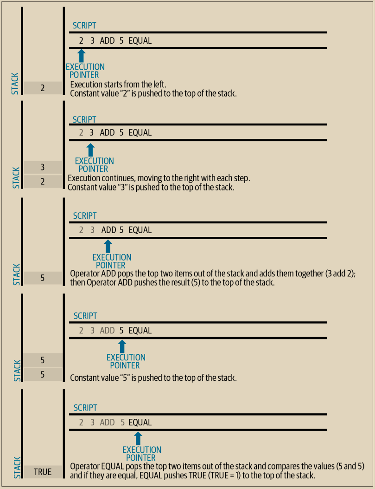

# 脚本构建

比特币的传统交易验证引擎依赖于脚本的两个部分来验证交易：输出脚本和输入脚本。&#x20;

输出脚本指定了必须满足的条件，以便在未来花费输出，例如谁被授权花费输出以及如何进行身份验证。&#x20;

输入脚本是满足输出脚本中设定条件并允许花费输出的脚本。输入脚本是每个交易输入的一部分。在传统交易中，大部分情况下它们包含用户钱包从私钥生成的数字签名，但并非所有输入脚本都必须包含签名。&#x20;

每个比特币验证节点将通过执行输出脚本和输入脚本来验证交易。正如我们在第6章中看到的那样，每个输入包含一个指向先前交易输出的输出点。输入还包含一个输入脚本。验证软件将复制输入脚本，检索由输入引用的UTXO，并从该UTXO中复制输出脚本。然后一起执行输入和输出脚本。如果输入脚本满足输出脚本的条件（参见“分别执行输出和输入脚本”），则输入有效。所有输入都独立验证，作为交易的总体验证的一部分。&#x20;

请注意，上述步骤涉及复制所有数据。先前输出和当前输入的原始数据永远不会更改。特别是，先前的输出是不变的，不受未能花费它的尝试的影响。只有一个有效的交易才能正确满足输出脚本的条件，才能将输出视为“已花费”。&#x20;

图7-1是传统比特币交易（付款给公钥哈希）最常见类型的输出和输入脚本的示例，显示了在验证之前对脚本进行串联的组合脚本。

<figure><figcaption><p>图 7-1.  组合输入脚本和输出脚本以评估交易脚本</p></figcaption></figure>

## 脚本执行堆栈

\
比特币的脚本语言被称为基于栈的语言，因为它使用一种称为栈的数据结构。栈是一种非常简单的数据结构，可以被视为一叠卡片。栈具有两个基本操作：push 和 pop。push 将一个项目添加到栈顶。pop 从栈顶移除项目。

脚本语言通过从左到右处理每个项目来执行脚本。数字（数据常量）被推送到栈上。操作符从栈中推送或弹出一个或多个参数，对它们进行操作，并可能将结果推送到栈上。例如，OP\_ADD 将从栈上弹出两个项目，将它们相加，并将结果推送到栈上。

条件运算符评估一个条件，产生一个布尔结果，为 TRUE 或 FALSE。例如，OP\_EQUAL 从栈中弹出两个项目，并在它们相等时推送 TRUE（TRUE 用数字 1 表示），在它们不相等时推送 FALSE（用数字 0 表示）。比特币交易脚本通常包含一个条件运算符，以便产生表示有效交易的 TRUE 结果。

## 一个简单的脚本

现在让我们将所学到的关于脚本和堆栈的知识应用到一些简单的示例中。

正如我们将在图7-2中看到的那样，脚本 2 3 OP\_ADD 5 OP\_EQUAL 展示了算术加法操作符 OP\_ADD，将两个数字相加并将结果放入堆栈中，然后是条件操作符 OP\_EQUAL，它检查结果的总和是否等于5。为了简洁起见，本书中的示例有时会省略 OP\_ 前缀。有关可用的脚本操作符和函数的更多详细信息，请参阅[比特币维基的脚本页面](https://en.bitcoin.it/wiki/Script)。

尽管大多数传统的输出脚本都引用了一个公钥哈希（本质上是一个传统的比特币地址），从而要求证明拥有权才能花费这些资金，但脚本并不一定要那么复杂。任何输出和输入脚本的组合，只要产生 TRUE 值，都是有效的。我们用作脚本语言示例的简单算术也是有效的脚本。

使用算术示例脚本的一部分作为输出脚本：

```
3 OP_ADD 5 OP_EQUAL
```

这可以通过包含以下输入脚本的交易来满足：

```
2
```

验证软件结合了这些脚本：

```
2 3 OP_ADD 5 OP_EQUAL
```

\
正如我们在图7-2中所看到的那样，当执行此脚本时，结果为OP\_TRUE，使得交易有效。尽管这是一个有效的交易输出脚本，但请注意，得到的UTXO可以被任何具有算术技能的人花费，以知道数字2满足脚本。

<figure><figcaption><p>图 7-2.  比特币的脚本验证进行简单的数学运算</p></figcaption></figure>


如果栈顶的结果为TRUE（任何非零值），则交易有效。如果栈顶的值为FALSE（值为零或空栈），脚本执行被明确中止（例如使用VERIFY、OP\_RETURN等操作符），或者脚本不是语义上有效的（例如包含未由OP\_ENDIF操作码终止的OP\_IF语句），则交易无效。详情请参阅比特币维基的脚本页面。


以下是一个稍微复杂一些的脚本，它计算了2 + 7 - 3 + 1。请注意，当脚本中包含多个连续的操作符时，栈允许一个操作符的结果被下一个操作符使用：

2 7 OP\_ADD 3 OP\_SUB 1 OP\_ADD 7 OP\_EQUAL

尝试使用铅笔和纸验证前面的脚本。当脚本执行结束时，您应该在堆栈上留下一个TRUE值。

## 输出脚本和输入脚本的分离执行

在最初的比特币客户端中，输出脚本和输入脚本被连接在一起并按顺序执行。出于安全原因，这在2010年发生了改变，因为存在一个漏洞，即1 OP\_RETURN bug。在当前的实现中，这些脚本是分开执行的，同时在两次执行之间传递栈数据。

首先，使用栈执行引擎执行输入脚本。如果输入脚本在执行过程中没有出现错误并且没有剩余操作，则栈数据会被复制，然后执行输出脚本。如果使用从输入脚本复制的栈数据执行输出脚本的结果为TRUE，则表示输入脚本已成功解析了输出脚本所施加的条件，因此输入是有效的，可以用于花费UTXO。如果在合并脚本执行后仍然存在除TRUE之外的任何结果，则表示输入是无效的，因为它未能满足对输出所施加的花费条件。
