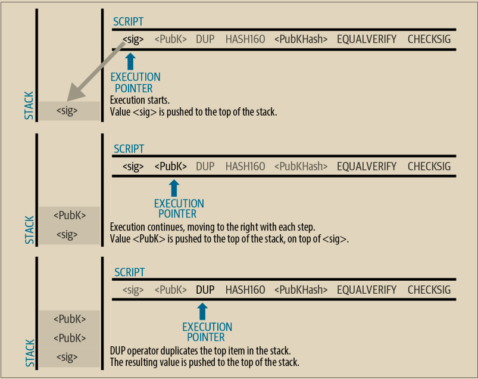
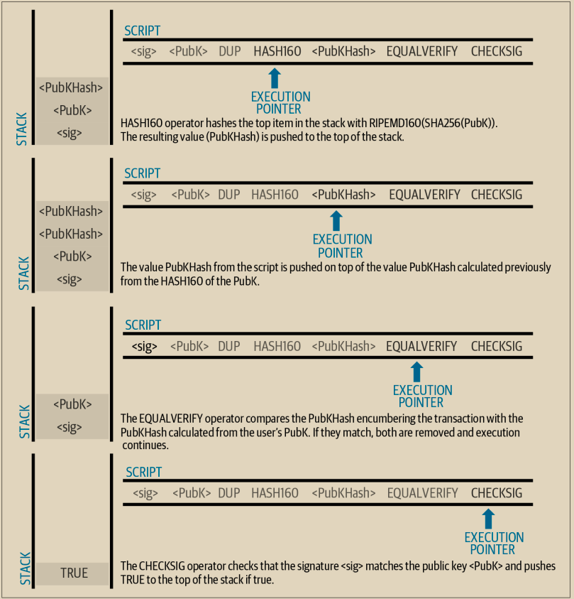

# 支付至公钥哈希（P2PKH）

支付至公钥哈希（P2PKH）脚本使用一个包含哈希值的输出脚本，该哈希值与一个公钥相关联。P2PKH 最为人熟知的是作为传统比特币地址的基础。一个 P2PKH 输出可以通过提供与哈希值相匹配的公钥以及由相应私钥创建的数字签名来进行消费（参见第 8 章）。让我们看一个 P2PKH 输出脚本的例子：

\
OP\_DUP OP\_HASH160 OP\_EQUALVERIFY OP\_CHECKSIG

密钥哈希是将编码到传统的base58check地址中的数据。大多数应用程序会使用十六进制编码显示脚本中的公钥哈希，而不是以“1”开头的熟悉的比特币地址base58check格式。&#x20;

前面的输出脚本可以通过以下形式的输入脚本满足：

\<Signature> \<Public Key>\

两个脚本合在一起将形成以下组合验证脚本：

\<Sig> OP\_DUP OP\_HASH160 OP\_EQUALVERIFY OP\_CHECKSIG

如果输入脚本具有与设置为限制条件的公钥哈希相对应的Bob的私钥的有效签名，结果将为TRUE。

图 7-3 和 7-4 分两部分展示了组合脚本的逐步执行过程，证明这是一个有效的交易。\

<figure><figcaption>
图 7-3.  执行P2PKH交易的脚本（1/2）
</figcaption></figure>

<figure><figcaption>
图 7-4.   执行P2PKH交易的脚本（2/2）
</figcaption></figure>
