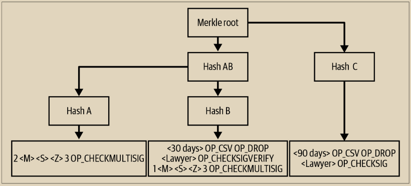
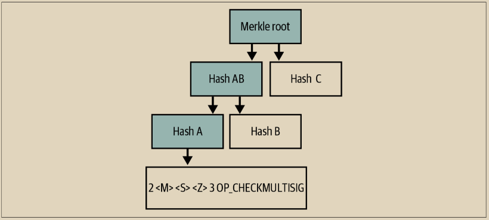
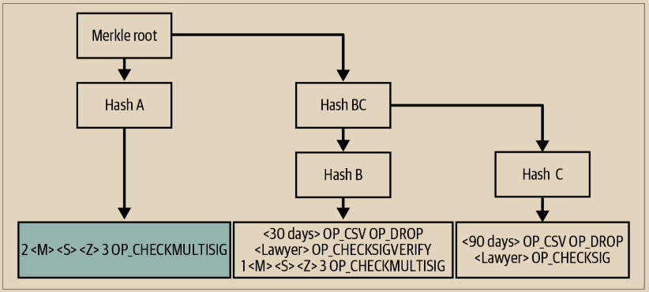
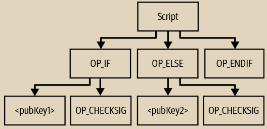
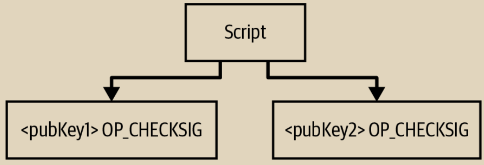

# 默克尔替代脚本树(MAST)

使用OP\_IF，您可以授权多个不同的花费条件，但这种方法具有一些不可取的方面：

\
**权重（成本）**

您添加的每个条件都会增加脚本的大小，从而增加交易的权重和需要支付的费用，以便花费受该脚本保护的比特币。

**大小受限**&#x20;

即使您愿意支付额外的条件，脚本中可放置的最大数量也是有限的。例如，传统脚本受到10,000字节的限制，实际上最多只能限制您使用几百个条件分支。 即使您可以创建与整个区块大小相同的脚本，它仍然只能包含大约20,000个有用的分支。这对于简单的支付来说已经很多了，但与比特币的某些想象中的用途相比却微不足道。

**缺乏隐私**&#x20;

您添加到脚本中的每个条件在花费受该脚本保护的比特币时都会成为公开信息。例如，当有人从示例7-1中的脚本中花费时，Mohammed的律师和业务伙伴将能够看到整个脚本。这意味着即使他们的律师不需要签名，他仍然可以追踪所有他们的交易。

然而，比特币已经使用了一种称为默克尔树的数据结构，它允许验证一个元素是否是集合的成员，而无需识别集合中的每个其他成员。

我们将在“默克尔树”（第252页）中更多了解默克尔树，但基本信息是，我们想要的数据集的成员（例如，任意长度的授权条件）可以传递到哈希函数中以创建一个短的承诺（称为默克尔树的叶子）。然后，每个叶子与另一个叶子配对，并再次进行哈希运算，创建对叶子的承诺，称为分支承诺。对分支的承诺可以以同样的方式创建。这一步对分支重复进行，直到只剩下一个标识符，称为默克尔根。

使用我们在示例7-1中的示例脚本，我们为图7-5中的三个授权条件构建了一个默克尔树。

<figure><figcaption>
图 7-5.  一个包含三个子脚本的MAST
</figcaption></figure>

现在我们可以创建一个紧凑的成员证明，证明特定的授权条件是默克尔树的成员，而不透露有关默克尔树其他成员的任何细节。请参见图7-6，并注意阴影节点可以从用户提供的其他数据计算出来，因此在花费时间不需要指定它们。

<figure><figcaption>
图 7-6.  一个子脚本的MAST成员证明
</figcaption></figure>

使用于创建承诺的哈希摘要每个都是32字节，因此证明图7-6的花费被授权（使用默克尔树和特定条件）和被认证（使用签名）需要383字节。相比之下，没有使用默克尔树的相同花费（即提供所有可能的授权条件）使用了412字节。

在这个例子中节省了29字节（7%）并不能完全体现潜在的节省。默克尔树的二叉树结构意味着每次将集合（在这种情况下是授权条件）的成员数量加倍时，您只需要一个额外的32字节承诺。在这种情况下，有三个条件，我们需要使用三个承诺（其中一个是默克尔根，需要包含在授权数据中）；我们也可以使用四个承诺来获得相同的成本。额外的承诺将给我们带来多达八个条件。使用16个承诺（512字节的承诺），我们可以拥有超过32,000个授权条件，远远超过了填充有OP\_IF语句的整个交易块中的条件数量。使用128个承诺（4,096字节），我们理论上可以创建的条件数量远远超过了世界上所有计算机能够创建的条件数量。

通常情况下，并非每个授权条件被使用的可能性都一样。在我们的示例中，我们预计Mohammed和他的合作伙伴会频繁地花费他们的钱；延迟时间条件仅在出现问题时存在。我们可以根据这一了解重构我们的树结构，如图7-7所示。

<figure><figcaption>
图 7-7.  一个带有最可能的脚本在最佳位置的MAST
</figcaption></figure>

\
现在我们只需要为常见情况提供两个承诺（节省32字节），尽管对于不太常见的情况我们仍然需要三个承诺。如果你知道（或者能够猜测）使用不同授权条件的概率，你可以使用哈夫曼算法将它们放入一个最大效率的树中；详情请参阅BIP341。

无论树是如何构建的，我们可以从前面的例子中看到，我们只会公开实际使用的授权条件。其他条件保持私密。同样保持私密的是条件的数量：一棵树可能有一个条件，也可能有一万亿个条件——单看单个交易的链上数据，没有办法知道。

除了略微增加比特币的复杂性之外，MAST对比特币没有明显的不利影响，并且之前有两个坚实的提案，即BIP114和BIP116，然后发现了一种改进的方法，我们将在“Taproot”中看到。

> **MAST与MAST的比较**&#x20;
>
> 最早关于比特币中现在所知的MAST的想法是merklized抽象语法树。在抽象语法树（AST）中，脚本中的每个条件都创建一个新的分支，如图7-8所示。
>
> 

> 图 7-8.  一个脚本的抽象语法树（AST）
>
> \
> ASTs被广泛用于解析和优化其他程序的代码，比如编译器。一个merklized AST将承诺程序的每个部分，并启用172页中描述的功能，但它将需要为程序的每个单独部分至少透露一个32字节的摘要，这在大多数情况下对于区块链来说不是很空间高效的。
>
> 在比特币中，人们在大多数情况下称为MAST的是merklized alternative script trees，这是开发者Anthony Towns创造的一个缩写词。alternative script tree 是一个由脚本组成的集合，每个脚本都是完整的，但只能选择一个——它们彼此之间是替代的，如图7-9所示。
>
> 

> 图 7-9. 一个备选脚本树
>
> 备选脚本树只需要在花费者选择的脚本和树根之间的每个层级深度上透露一个32字节的摘要。对于大多数脚本来说，这是对区块链空间更有效的利用。

