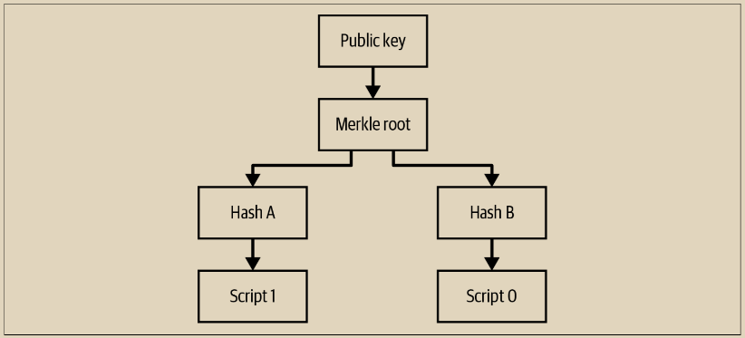

# Taproot

人们选择使用比特币的一个原因是可以创建具有高度可预测结果的合约。由法院执行的法律合同在一定程度上依赖于案件中涉及的法官和陪审员的决定。相比之下，比特币合约通常要求参与者采取行动，但除此之外由成千上万个运行功能上相同代码的全节点来执行。在给定相同的合约和相同的输入时，每个全节点将始终产生相同的结果。任何偏差都意味着比特币出现故障。人类法官和陪审团比软件更灵活，但当不需要或不想要这种灵活性时，比特币合约的可预测性是一个重要资产。

如果合同中的所有参与者都意识到其结果已经完全可预测，实际上他们就没有继续使用合同的必要了。他们可以遵循合同规定的要求，然后终止合同。在社会中，这是大多数合同终止的方式：如果利益相关方满意，他们就不会将合同提交给法官或陪审团。在比特币中，这意味着任何需要大量区块空间来解决的合同也应该提供一个条款，允许通过相互满意来解决合同。

\
在MAST和无脚本多重签名中，设计一个相互满意条款是很容易的。我们只需将脚本树的顶层之一设置为所有利益相关方之间的无脚本多重签名。我们已经在图7-7中看到了一个包含几方的复杂合同，其中包含了一个简单的相互满意条款。我们可以通过从脚本多重签名切换到无脚本多重签名来使其更加优化。

这相当有效且私密。如果使用了相互满意条款，我们只需要提供一个默克尔分支，而我们透露的只是有一个签名参与其中（可能来自一个人，也可能来自数千个不同的参与者）。但是，2018年的开发人员意识到，如果我们还使用了支付合同，我们可以做得更好。

在我们之前对支付合同的描述中，“支付合同（P2C）”中，我们通过调整公钥来承诺Alice和Bob之间的协议文本。我们可以改为通过承诺MAST的根来承诺合同的程序代码。我们调整的公钥是一个普通的比特币公钥，这意味着它可以要求来自单个人的签名，也可以要求来自多个人的签名（或者可以以特殊的方式创建，使其无法生成签名）。这意味着我们可以通过所有利益相关方的单个签名或者透露我们要使用的MAST分支来满足合同。包含公钥和MAST的承诺树如图7-10所示。

<figure><figcaption>
图 7-10.  一个公钥承诺到一个默克尔根的taproot
</figcaption></figure>

这使得使用多重签名的相互满意条款非常高效且非常私密。事实上，它的私密性甚至超出了表面上的表现，因为任何由单个用户创建的交易，只要该用户希望通过单个签名来满足它（或者通过多个不同钱包控制的多重签名），在链上看起来与相互满意的花费完全相同。在这种情况下，无论是由数百万用户参与的极其复杂的合同还是单个用户只是花费他们存储的比特币，链上都没有区别。

当可以使用密钥进行花费时，例如单个签名或无脚本多重签名，这被称为密钥路径（Keypath）花费。当使用脚本树时，这被称为脚本路径（Scriptpath）花费。对于密钥路径花费，放在链上的数据是公钥（在见证程序中）和签名（在见证堆栈上）。

对于脚本路径花费，链上的数据还包括公钥，它被放置在一个见证程序中，在这个上下文中称为taproot输出密钥。见证结构包括以下信息：

• 一个版本号。&#x20;

• 底层密钥——在被默克尔根扭曲之前存在的密钥，用于生成taproot输出密钥。这个底层密钥被称为taproot内部密钥。&#x20;

• 要执行的脚本，称为叶子脚本。&#x20;

• 沿着连接叶子和默克尔根的路径上每个节点的一个32字节哈希值。&#x20;

• 满足脚本所需的任何数据（例如签名或哈希前像）。

我们只知道一个重要的taproot缺点：希望使用MAST但不想要共同满意条款的合同参与者必须在区块链上包含一个taproot内部密钥，增加约33字节的开销。考虑到几乎所有合同都预计会受益于共同满意条款，或者其他使用顶级公钥的多签名条款，并且所有用户都受益于输出看起来相似的增加的匿名性集合，大多数参与taproot激活的用户认为这种罕见的开销并不重要。&#x20;

对于taproot的支持是通过软分叉添加到比特币中的，并于2021年11月激活。
