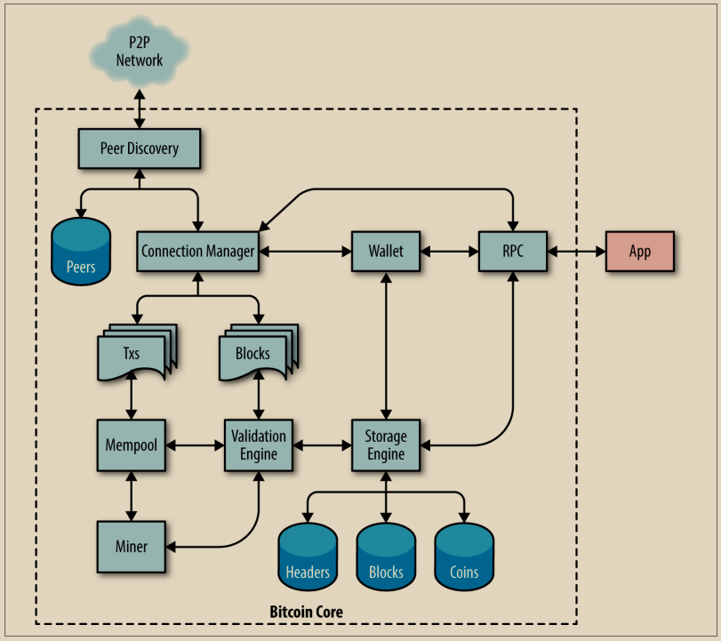

# 从比特币到比特币核心

比特币是一个开源项目，其源代码可在开放（MIT）许可下获取，可供任何目的免费下载和使用。比仅仅是开源，比特币是由一个开放的志愿者社区开发的。起初，该社区只包括中本聪（Satoshi Nakamoto）。到2023年，比特币的源代码已经有了1000多名贡献者，其中大约有十几名开发人员全职工作在代码上，还有几十名在兼职基础上工作。任何人都可以为代码做出贡献——包括您！

&#x20;当中本聪创建比特币时，软件在白皮书（见附录A）发布之前就已经基本完成了。中本聪希望在发表关于它的论文之前确保实现的可行性。那个最初的实现，当时简称为“比特币”，已经被大幅修改和改进。它已经演变成了我们所知的比特币核心，以区别于其他实现。比特币核心是比特币系统的参考实现，这意味着它提供了如何实现技术的参考。比特币核心实现了比特币的所有方面，包括钱包、交易和区块验证引擎、区块构建工具以及比特币点对点通信的所有现代部分。 图3-1显示了比特币核心的架构。

<figure><figcaption>
图 3-1. 比特币核心架构
</figcaption></figure>

虽然比特币核心作为系统的许多主要部分的参考实现，但比特币白皮书描述了系统的几个早期部分。自2011年以来，系统的大部分重要部分都已在一组比特币改进提案（BIPs）中进行了记录。在本书中，我们通过它们的编号引用BIP规范；例如，BIP9描述了用于几个重要的比特币升级的机制。
