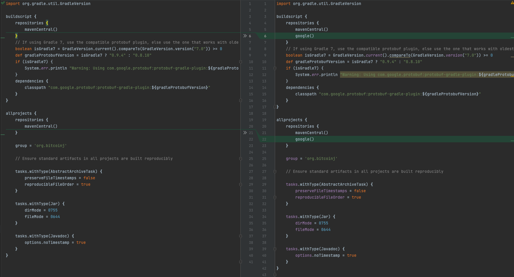
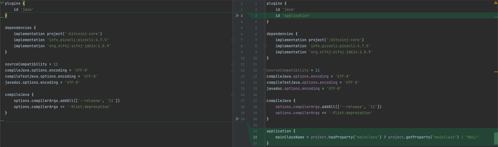
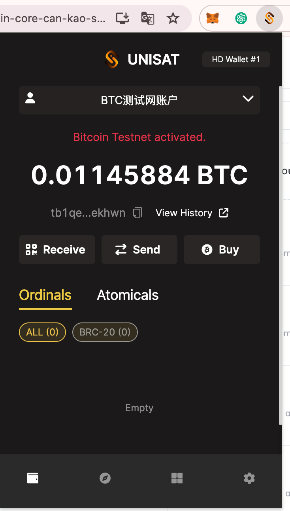
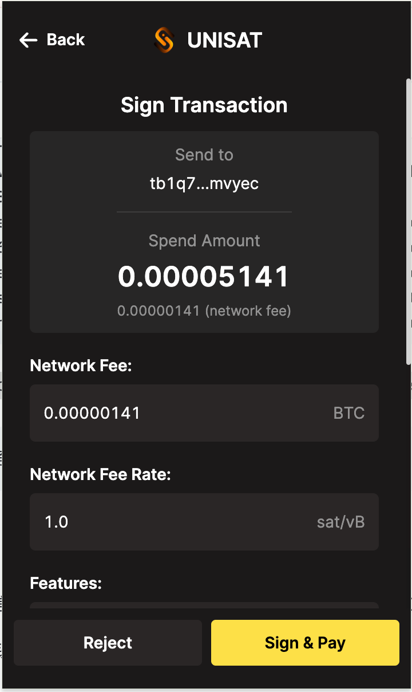
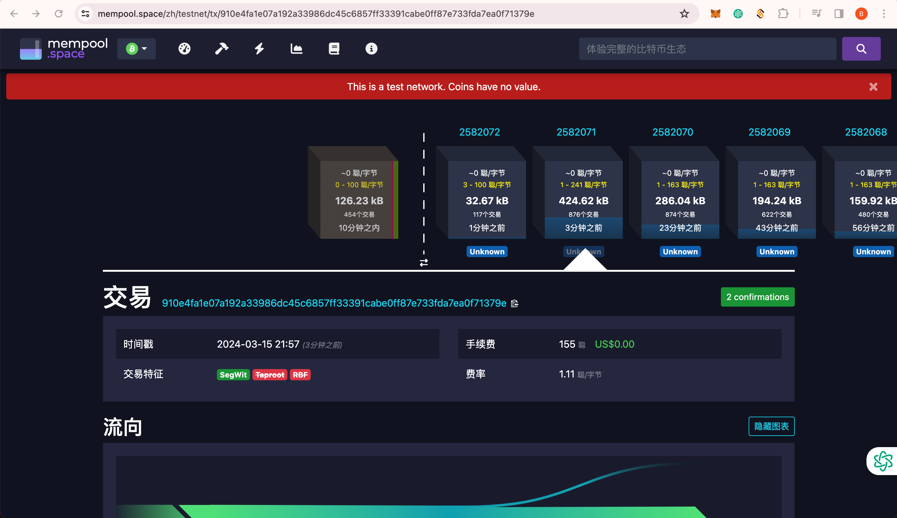
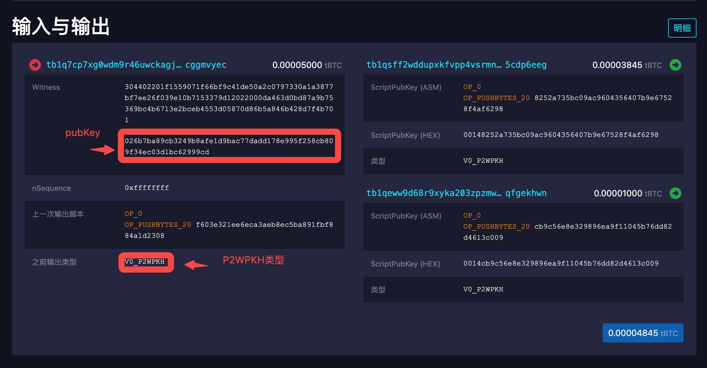

# 简单的应用开发：使用bitcoinj客户端监听转账，和发起转账

本章介绍如何使用[bitcoinj](https://github.com/bitcoinj/bitcoinj)客户端监听转账，和发起转账。demo工程：[https://github.com/berryjam/bitcoinj](https://github.com/berryjam/bitcoinj) 是基于bitcoinj的基础上，作了以下小改动：

* 修改了build.gradle，添加了google()仓库，避免编译过程中出现找不到guava包的问题，改动如图3-2所示。

<figure><figcaption><p>图 3-2. 右边绿色区域为改动内容</p></figcaption></figure>

* 修改了examples/build.gradle，添加了application插件，使得gradle可以运行指定例子，如通过mainClass指定要运行类，gradle -PmainClass=org.bitcoinj.examples.FetchBlock run --args=000000000000001535467706e8545b339e7e0adca408c5432781f4da0e94d734，改动如图3-3所示。

<figure><figcaption><p>图 3-3. 右边区域为改动内容</p></figcaption></figure>

* 修改了examples/src/main/java/org.bitcoinj.examples/Kit.java，让Kit后台运行并监听转账后再给个人UniSat钱包地址转账。
* 修改了examples/src/main/java/org.bitcoinj.examples/FetchBlock.java，检索指定块里给个人地址转账交易信息。

## 准备工作

以下两个例子都是在测试网(testnet)进行，请先安装BTC钱包（如UniSat的chrome插件）和[领取测试币](https://coinfaucet.eu/en/btc-testnet/)，[https://altquick.com/swap/ ](https://altquick.com/swap/) 也可以换取测试币。


关于testnet、signet、regtest区别请参考《第十一章：比特币的测试区块链》一节。


<figure><figcaption><p>图 3-4. UniSat钱包，领取测试币</p></figcaption></figure>

**拉取代码：**

```
$git clone git@github.com:berryjam/bitcoinj.git
$cd bitcoinj/examples
```

**本地生成钱包和监听转账：**

```
$gradle -PmainClass=org.bitcoinj.examples.Kit run
```

此刻如果正常运行，可以看到一些输出信息，并且examples目录下会生成两个文件，分别是：测试链交易信息walletappkit-example.spvchain，及个人钱包walletappkit-example.wallet。

**查看本地账户地址：**

由于Kit在后台运行，会锁住钱包文件，需要先关掉。使用WalletTool的dump命令可以查看钱包地址，其中参数--chain和--wallet指定上面两个文件路径，--net选择testnet。

```
$cd wallettool
$gradle -PmainClass=org.bitcoinj.wallettool.WalletTool run --args='dump --chain ${本地目录}/bitcoinj/examples/walletappkit-example.spvchain --wallet ${本地目录}/bitcoinj/examples/walletappkit-example.wallet --net testnet'
```

正常运行，会看到以下信息，包含钱包地址：

```
Wallet
Balances:
  0.00 BTC ESTIMATED
  0.00 BTC AVAILABLE
  0.00 BTC ESTIMATED_SPENDABLE
  0.00 BTC AVAILABLE_SPENDABLE
Transactions:
  0 pending
  0 unspent
  0 spent
  0 dead
Last seen best block: 2582064 (2024-03-15T12:42:50Z): 0000000000000007836260bd967b437a6a4d993fecafb22f2ab53a5da71d0aeb

Keys:
Earliest creation time: 2024-03-15T12:25:55Z
Seed birthday:     1710505555  [2024-03-15T12:25:55Z]
Ouput script type: P2PKH
Key to watch:      tpubD9XNB5hPxkwtc26UYmLDPLYGZZR1GLQ9KGYPeiWZZbqpWMcQbhc7gogbeSPvsQ6yybiYm9HraXLzYWWKnvASbgVB7FEZtBWnrMEtabrkYSx
Lookahead siz/thr: 100/33
  addr:mwBKsLnLBN2SLsca6gUEyBUa62aE1mDzqV  hash160:abcbb3cacded05d9e55b9b2b63781bb1cf799061  (m, root)
  addr:mnMRvhAaK51FrCFSSnXvmmvwB7qNRFZkDd  hash160:4afbc9628f5cb039d7de8468e99cd90fb02dd6e2  (m/0H, account)
  addr:mzCSon2Bcp2k7fDxEK1eSqTT2SgVMZCdwP  hash160:ccea49a1d36d9c974e674b3e5b1231dae850d116  (m/0H/0, external)
  addr:n4CZ2wLTirF1TLRgdJcL1VEBPcFetaxQ6a  hash160:f8cffd1ccec1f6119122d0ec0b4b9a69f9cc11bd  (m/0H/1, internal)

Seed birthday:     1710505555  [2024-03-15T12:25:55Z]
Ouput script type: P2WPKH
Key to watch:      vpub5VVD3WXsx7uUffZQvJfyq2hQaTvK4iVedZGsBvtXDa9zkZjMwJAKMyVH6xKMApnLchJGMpuMvEcJSmTjYLeqtZ7EkrDFtsUL2pEjzyTxaeJ
Lookahead siz/thr: 100/33
  addr:tb1q409m8jkda5zane2mnv4kx7qmk88hnyrpemvls6  hash160:abcbb3cacded05d9e55b9b2b63781bb1cf799061  (m, root)
  addr:tb1q7cp7xg0wdm9r46uwckagj8al3p9p6gcggmvyec  hash160:f603e321ee6eca3aeb8ec5ba891fbf884a1d2308  (m/1H, account)
  addr:tb1q30nky20w8gae6ednt2tkt48zakytw6kgckkhr3  hash160:8be76229ee3a3b9d65b35a9765d4e2ed88b76ac8  (m/1H/0, external)
  addr:tb1q6k35lxctlknaesw4ckxnngxl7q3f7awhn3de82  hash160:d5a34f9b0bfda7dcc1d5c58d39a0dff0229f75d7  (m/1H/1, internal)
  addr:tb1qh8h3zgr9g9zgqhed7e9ldp943xqz5vgn62pxnj  hash160:b9ef1120654144805f2df64bf684b589802a3113  (M/1H/0/0)
```

其中一个P2WPKH类型账户：tb1q7cp7xg0wdm9r46uwckagj8al3p9p6gcggmvyec。


钱包和地址类型，请参考《第五章：钱包技术栈的详细介绍》一节。


## 转账

重新让Kit后台运行，监听转账信息，并且余额足够的情况下给UniSat钱包转出0.00001 BTC。

使用UniSat钱包给上面bitcoinj钱包地址转账：

<figure><figcaption><p>图 3-5. 给bitcoinj钱包转账</p></figcaption></figure>

正常情况下，可以看到Kit后台输出以下打印信息：

```
-----> coins resceived: df2b71b76cfc6ae8f2142204a2460b348d438f5f2a05f61b57b3239ee20cc5b4
3月 15, 2024 9:03:26 下午 org.bitcoinj.wallet.WalletFiles saveNow
信息: Saving wallet; last seen block is height 2582067, date 2024-03-15T12:54:20Z, hash 000000000000000e5646ea505bb9106ca776d8f513fa7248c043e9324b2f5136
3月 15, 2024 9:03:26 下午 org.bitcoinj.wallet.WalletFiles saveNowInternal
信息: Save completed in 22 ms
3月 15, 2024 9:03:26 下午 org.bitcoinj.wallet.DeterministicKeyChain maybeLookAhead
信息: 0 keys needed for M/0H/0 = 0 issued + 100 lookahead size + 33 lookahead threshold - 133 num children
3月 15, 2024 9:03:26 下午 org.bitcoinj.wallet.DeterministicKeyChain maybeLookAhead
```

其中df2b71b76cfc6ae8f2142204a2460b348d438f5f2a05f61b57b3239ee20cc5b4为交易hash，在区块链浏览器上可以看到：[https://mempool.space/zh/testnet/tx/df2b71b76cfc6ae8f2142204a2460b348d438f5f2a05f61b57b3239ee20cc5b4](https://mempool.space/zh/testnet/tx/df2b71b76cfc6ae8f2142204a2460b348d438f5f2a05f61b57b3239ee20cc5b4) 具体内容。

在代码里，第一次接收到0.00005 BTC后，会给UniSat转账，却发现钱不够。

```

kit.wallet().addCoinsReceivedEventListener((wallet, tx, prevBalance, newBalance) -> {
            System.out.println("-----> coins resceived: " + tx.getTxId());
            System.out.println("received: " + tx.getValue(wallet));
            Address to = kit.wallet().parseAddress("tb1qeww9d68r9xyka203zpzmwmwc94rp8sqfgekhwn");
            Coin value = Coin.parseCoin("0.00001");
            org.bitcoinj.wallet.SendRequest req = org.bitcoinj.wallet.SendRequest.to(to, value);
            req.setFeePerVkb(Coin.valueOf(1100));
            try {
                Wallet.SendResult result = wallet.sendCoins(req);
                System.out.println("coins sent. transaction hash: " + result.transaction().getTxId());
            } catch (InsufficientMoneyException e) {
                System.out.println("Not enough coins in your wallet. Missing " + e.missing.getValue() + " satoshis are missing (including fees)");
                System.out.println("Please send enough money to: " + wallet.currentReceiveAddress().toString());
            }
        });
```

```
Not enough coins in your wallet. Missing 1000 satoshis are missing (including fees)
Please send enough money to: tb1qh8h3zgr9g9zgqhed7e9ldp943xqz5vgn62pxnj
-----> confidence changed: df2b71b76cfc6ae8f2142204a2460b348d438f5f2a05f61b57b3239ee20cc5b4
new block depth: 0
-----> confidence changed: df2b71b76cfc6ae8f2142204a2460b348d438f5f2a05f61b57b3239ee20cc5b4
```

深入转账代码，可以发现钱包会从账户的UTXO列表里选择最佳可用的输出（第二章的币种选择一节有过相关介绍），从里面按照最大可用金额排序，然后累加直到满足转账金额。关键是shouldSelect函数，里面会判断交易状态。因为刚接收到的交易，还没得到确认，因此无法用于转账。

```
Wallet.SendResult result = wallet.sendCoins(req);
...
public CoinSelection select(Coin target, List<TransactionOutput> candidates) {
        ArrayList<TransactionOutput> selected = new ArrayList<>();
        // Sort the inputs by age*value so we get the highest "coindays" spent.
        // TODO: Consider changing the wallets internal format to track just outputs and keep them ordered.
        ArrayList<TransactionOutput> sortedOutputs = new ArrayList<>(candidates);
        // When calculating the wallet balance, we may be asked to select all possible coins, if so, avoid sorting
        // them in order to improve performance.
        if (!target.equals(BitcoinNetwork.MAX_MONEY)) {
            sortedOutputs.sort(DefaultCoinSelector::compareByDepth);
        }
        // Now iterate over the sorted outputs until we have got as close to the target as possible or a little
        // bit over (excessive value will be change).
        long total = 0;
        for (TransactionOutput output : sortedOutputs) {
            if (total >= target.value) break;
            // Only pick chain-included transactions, or transactions that are ours and pending.
            if (!shouldSelect(output.getParentTransaction())) continue;
            selected.add(output);
            total = Math.addExact(total, output.getValue().value);
        }
        // Total may be lower than target here, if the given candidates were insufficient to create to requested
        // transaction.
        return new CoinSelection(selected);
    }
```

等待一段时间交易得到确认后，重新转账0.00001 BTC，再次触发转账交易，可以看到输出：

<pre><code><strong>coins sent. transaction hash: 910e4fa1e07a192a33986dc45c6857ff33391cabe0ff87e733fda7ea0f71379e
</strong>-----> confidence changed: 4618ab0373121312f95bab45ae408e8c5d87acd63262adb17f7af93609c9fb0c
new block depth: 0
-----> coins resceived: 910e4fa1e07a192a33986dc45c6857ff33391cabe0ff87e733fda7ea0f71379e
</code></pre>

可以在区块链浏览器上看到交易信息：[https://mempool.space/zh/testnet/tx/910e4fa1e07a192a33986dc45c6857ff33391cabe0ff87e733fda7ea0f71379e](https://mempool.space/zh/testnet/tx/910e4fa1e07a192a33986dc45c6857ff33391cabe0ff87e733fda7ea0f71379e)。

## 拉块

最后是一个简单的监控转账的小功能，比如我们需求是需要监听链上所有交易信息，然后对感兴趣的地址转账再做一些后处理。

<figure><figcaption><p>图 3-6. 交易所在块信息</p></figcaption></figure>

### 1.获取对应的交易信息

遍历块的所有交易信息，通过交易hash筛选出转账交易。

```
        for (Transaction tx : txs) {
            if ("910e4fa1e07a192a33986dc45c6857ff33391cabe0ff87e733fda7ea0f71379e".equals(tx.getTxId().toString())) {
                System.out.println("tx: " + tx);
                ...
            }
        }
```

### 2.获取输入地址

观察交易的输入信息，可以看到witness和地址类型信息(这里为P2WPKH)，但是从witness怎么获取到发送方地址呢？

<figure><figcaption><p>图 3-7. 交易输入信息</p></figcaption></figure>

我们可以通过Transaction.java的函数了解到input的witness是怎么构造出来的。

```
public TransactionInput addSignedInput(TransactionOutPoint prevOut, Script scriptPubKey, Coin amount, ECKey sigKey,
                                           SigHash sigHash, boolean anyoneCanPay) throws ScriptException {
        ...
        if (ScriptPattern.isP2PK(scriptPubKey)) {
            ...
        } else if (ScriptPattern.isP2PKH(scriptPubKey)) {
            ...
        } else if (ScriptPattern.isP2WPKH(scriptPubKey)) { // 示例为P2WPKH
            Script scriptCode = ScriptBuilder.createP2PKHOutputScript(sigKey);
            TransactionSignature signature = calculateWitnessSignature(inputIndex, sigKey, scriptCode, input.getValue(),
                    sigHash, anyoneCanPay);
            input.setScriptSig(ScriptBuilder.createEmpty());
            input.setWitness(TransactionWitness.redeemP2WPKH(signature, sigKey));
        } else {
            throw new ScriptException(ScriptError.SCRIPT_ERR_UNKNOWN_ERROR, "Don't know how to sign for this kind of scriptPubKey: " + scriptPubKey);
        }
        return input;
    }
```

可以看到通过TransactionWitness.redeemP2WPKH(signature, sigKey)构造出来witness，其中包含了sigKey，继续深入redeemP2WPKH函数就可以知道这个参数就是发送方的PubKey，并且放在witness的第二个位置（下标为0）。

```
    public static TransactionWitness redeemP2WPKH(@Nullable TransactionSignature signature, ECKey pubKey) {
        checkArgument(pubKey.isCompressed(), () ->
                "only compressed keys allowed");
        List<byte[]> pushes = new ArrayList<>(2);
        pushes.add(signature != null ? signature.encodeToBitcoin() : new byte[0]); // signature
        pushes.add(pubKey.getPubKey()); // pubkey , witness的第2个位置
        return TransactionWitness.of(pushes);
    }
```

有了公钥，就可以根据账户和网络类型算出对应的地址。

```
byte[] publicKeyBytes = input.getWitness().getPush(1); // 第二个位置，下标为1，存放的的是pubKey
// 创建一个 ECKey 对象并导入公钥
ECKey ecKey = ECKey.fromPublicOnly(publicKeyBytes);

// 将 ECKey 对象转换为 Bitcoin 地址
Address from = ecKey.toAddress(ScriptType.P2WPKH, network); // 如果是测试网络，请改为 TestNetParams.get()
```

### 3.获取输出地址和金额

遍历所有输出，通过转出地址筛选出我们所关心的输出，类似输入，地址可以从输出脚本解析得到，输出金额直接从output获取到。

```
List<TransactionOutput> outputs = tx.getOutputs();
for (TransactionOutput output : outputs) {
     Script pubKey = output.getScriptPubKey();
     Address to = pubKey.getToAddress(network);
     if ("tb1qeww9d68r9xyka203zpzmwmwc94rp8sqfgekhwn".equals(to.toString())) {
          System.out.printf("from:%s to:%s receive: %s\n", from, to, output.getValue().toFriendlyString());
     }
}
```

### 4.综合运行

将上面逻辑整合起来，运行examples/src/main/java/org.bitcoinj.examples/FetchBlock.java

```
gradle -PmainClass=org.bitcoinj.examples.FetchBlock run --args=000000009661aeca0d6092068575fe5113455fe2d28d200d367c57829686f6e9
```

输出如下：

```
16:29:40.246 28 PeerGroup.handleNewPeer: Peer{[18.162.45.10]:18333, version=70016, subVer=/Satoshi:0.21.0/, services=NETWORK, WITNESS, NETWORK_LIMITED, time=2024-03-15T16:29:40Z, height=2582085}: New peer      (10 connected, 2 pending, 12 max)
tx: Transaction{910e4fa1e07a192a33986dc45c6857ff33391cabe0ff87e733fda7ea0f71379e, wtxid d69b107bdc9079022593bd9964315fef07fba08d2789648d98bbdf8c0b94fe7f
weight: 561 wu, 141 virtual bytes, 222 bytes
purpose: UNKNOWN
   in   <empty>
        witness:304402201f1559071f66bf9c41de50a2c0797330a1a3877bf7ee26f039e10b7153379d12022000da463d0bd87a9b75369bc4b6713e2bceb4553d05870d86b5a846b428d7f4b701 026b7ba89cb3249b8afe1d9bac77dadd178e995f258cb809f34ec03d1bc62999cd
        unconnected  outpoint:df2b71b76cfc6ae8f2142204a2460b348d438f5f2a05f61b57b3239ee20cc5b4:0
   out  0[] PUSHDATA(20)[8252a735bc09ac9604356407b9e67528f4af6298]  0.00003845 BTC
        P2WPKH
   out  0[] PUSHDATA(20)[cb9c56e8e329896ea9f11045b76dd82d4613c009]  0.00001 BTC
        P2WPKH
}
from:tb1q7cp7xg0wdm9r46uwckagj8al3p9p6gcggmvyec to:tb1qeww9d68r9xyka203zpzmwmwc94rp8sqfgekhwn receive: 0.00001 BTC
```

可以看到接收来自tb1q7cp7xg0wdm9r46uwckagj8al3p9p6gcggmvyec，发送到tb1qeww9d68r9xyka203zpzmwmwc94rp8sqfgekhwn，一共0.00001 BTC的转账信息。


关于交易的结构信息，请参考《第六章：交易》。

