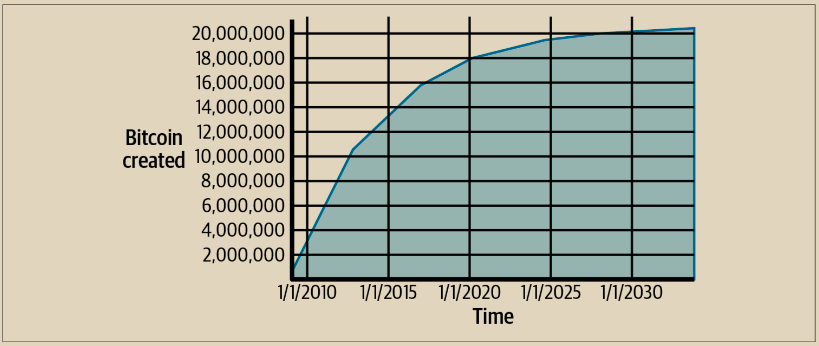

# 比特币经济学与货币创造

\
比特币在每个区块创建时以固定且递减的速率铸造。每个区块平均每10分钟产生一次，其中包含全新的比特币，从无到有地创造出来。每经过210,000个区块，或大约每四年，货币发行速度就会减少50%。在网络运行的头四年中，每个区块包含50个新的比特币。

第一次减半发生在第210,000个区块。在本书出版后的下一次减半预期将在第840,000个区块发生，这可能会在2024年4月或5月产生。新比特币的发行速度经过32次这样的减半呈指数递减，直到第6,720,000个区块（大约在2137年开采），当时它将达到最小的货币单位1个聪。最终，在大约2140年之后，几乎将发行20,999,999,997,690,000个聪，或几乎21百万比特币。此后，区块将不再包含新的比特币，矿工将仅通过交易费获得奖励。图12-1显示了随着货币发行减少，随时间推移在流通中的总比特币数量。

<figure><figcaption><p>图 12-1.  随时间推移，比特币货币供应根据几何递减的发行率而变化</p></figcaption></figure>


比特币的最大挖掘数量是比特币可能的挖掘奖励的上限。实际上，矿工可能会有意地挖出一个奖励不足的区块。这样的区块已经被挖出来了，未来可能还会被挖出更多，导致货币的总发行量降低。


在示例 12-1 中的代码中，我们计算将发行的比特币总量。&#x20;

示例 12-1. 用于计算总比特币发行量的脚本

```python
# 定义常量
initial_reward = 50  # 每个区块的初始奖励，单位为比特币
halving_interval = 210000  # 每次减半之间的区块数量
total_blocks = 6930000  # 预计直到最后一次减半的总区块数量

# 计算总的比特币发行量
total_bitcoin_issued = 0
reward = initial_reward
halvings = 0

# 循环遍历减半次数，直到达到最后一次减半
while halvings < total_blocks // halving_interval:
    total_bitcoin_issued += halving_interval * reward
    reward /= 2  # 将奖励减半
    halvings += 1

# 计算最后一次减半后剩余区块的发行量
remaining_blocks = total_blocks % halving_interval
total_bitcoin_issued += remaining_blocks * reward

# 输出总的比特币发行量
print("总比特币发行量:", total_bitcoin_issued, "比特币")
```

\
示例 12-2 展示了运行该脚本所产生的输出，所以比特币发行总量大概为2100万个。

示例 12-2. 运行 max\_money.py 脚本

```
$ python max_money.py
总比特币发行量: 20999999.99755528 比特币
```

有限且递减的发行量创造了一个固定的货币供应，抵制了通货膨胀。与中央银行可以无限制地印刷法定货币不同，没有任何个人或实体有能力膨胀比特币的供应。

> **通货紧缩的货币**&#x20;
>
> 固定且递减的货币发行最重要且备受争议的后果是货币往往具有固有的通货紧缩性。通货紧缩是由于供需不平衡导致货币价值上升（和汇率上升）的现象。价格通货紧缩是通货膨胀的反面，意味着货币随时间具有更多的购买力。&#x20;
>
> 许多经济学家认为通货紧缩的经济是一场灾难，应该尽一切努力避免。这是因为在通货紧缩迅速的时期，人们往往会囤积货币而不是花费它，希望价格会下跌。这种现象在日本的“失落的十年”期间出现过，当时需求完全崩溃，推动该货币陷入通货紧缩螺旋。
>
> 比特币专家认为，通货紧缩本身并不是坏事。相反，通货紧缩与需求崩溃相关，因为这是我们研究通货紧缩的最明显的例子。在可能无限印刷货币的法定货币中，要进入通货紧缩螺旋是非常困难的，除非需求完全崩溃且不愿意印刷货币。比特币中的通货紧缩不是由于需求崩溃引起的，而是由于可预测的供应受限造成的。 当然，通货紧缩的积极方面是它是通货膨胀的反面。通货膨胀会导致货币逐渐贬值，从而导致一种形式的隐性税收，惩罚储户以援助债务人（包括最大的债务人，即政府本身）。受政府控制的货币存在易于发行债务的道德风险，这些债务后来可以通过贬值以牺牲储户的利益而被抹去。&#x20;
>
> 尚待观察的是，当通货紧缩不是由经济迅速收缩驱动时，货币的通货紧缩特征是否是一个问题，还是一个优势，因为对通货膨胀和贬值的保护超过了通货紧缩的风险。

