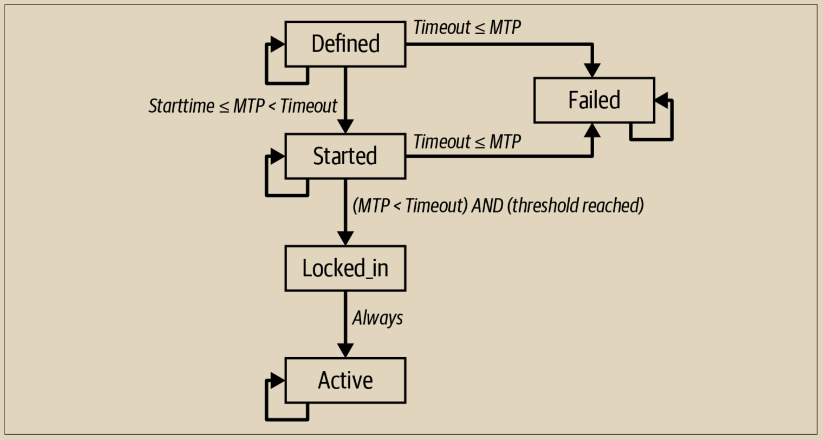

# 软分叉

\
并非所有的共识规则更改都会引起硬分叉。只有那些不向前兼容的共识更改才会导致分叉。如果更改是以这样一种方式实现的，即未修改的客户端仍然将交易或区块视为在先前规则下有效，那么更改就可以在不进行分叉的情况下进行。

术语软分叉被引入以区分这种升级方法与“硬分叉”。实际上，软分叉根本不是一种分叉。软分叉是对共识规则的前向兼容更改，使得未升级的客户端可以继续与新规则保持一致。

软分叉的一个并非立即显而易见的方面是，软分叉升级只能用于约束共识规则，而不能用于扩展它们。为了实现向前兼容，根据新规则创建的交易和区块必须在旧规则下也是有效的，但反之则不然。新规则只能限制有效内容；否则，它们将在旧规则下被拒绝时触发硬分叉。

软分叉可以以多种方式实现——这个术语并未指定特定的方法，而是一组具有共同特点的方法：它们不要求所有节点都进行升级，也不会强制非升级节点退出共识。比特币已经实施了两个软分叉，基于对NOP操作码的重新解释。比特币脚本中保留了10个NOP操作码以备将来使用，从NOP1到NOP10。根据共识规则，脚本中存在这些操作码被解释为一个空操作符，意味着它们没有任何效果。执行在NOP操作码之后继续，就好像它不存在一样。

因此，软分叉可以修改NOP代码的语义，赋予它新的含义。例如，BIP65（CHECKLOCKTIMEVERIFY）重新解释了NOP2操作码。实现BIP65的客户端将NOP2解释为OP\_CHECKLOCKTIMEVERIFY，并对包含此操作码的UTXO施加绝对锁定时间的共识规则。这个更改是一个软分叉，因为根据BIP65有效的交易也在不实现（不了解）BIP65的任何客户端上有效。对于旧的客户端来说，脚本包含一个NOP代码，而这个代码会被忽略。

## 软分叉的批评

\
基于 NOP 操作码的软分叉相对来说是比较少有争议的。NOP 操作码被放置在比特币脚本中，其明确的目标是允许非破坏性的升级。

然而，许多开发者担心软分叉升级的其他方法会做出不可接受的折衷。软分叉变更的常见批评包括：

1. **技术债务**：由于软分叉比硬分叉升级更加技术复杂，它们引入了技术债务。技术债务是指由于过去的设计折衷而增加了未来代码维护成本的情况。代码复杂性又增加了出现错误和安全漏洞的可能性。
2. **验证放宽**：未修改的客户端将交易视为有效，而不评估修改后的共识规则。实际上，未修改的客户端不是使用完整范围的共识规则进行验证，因为它们对新规则视而不见。这适用于基于 NOP 的升级，以及其他软分叉升级。
3. **不可逆转的升级**：由于软分叉创建了具有额外共识约束的交易，它们在实践中变成了不可逆转的升级。如果软分叉升级在激活后被撤销，那么根据旧规则创建的任何交易都可能导致在旧规则下损失资金。例如，如果 CLTV 交易在旧规则下进行评估，则没有时间锁定约束，可以随时使用。因此，批评者认为，由于错误而必须撤销的软分叉几乎肯定会导致资金损失。

## 基于区块版本的软分叉信号

由于软分叉允许未修改的客户端继续在共识中运行，一种“激活”软分叉的机制是通过矿工表明他们已准备好并愿意执行新的共识规则。如果所有矿工都执行新规则，那么未升级的节点接受的块不会被升级的节点拒绝，因此不会有风险。这种机制由 BIP34 引入。

## BIP34: 信号传递和激活

\
BIP34使用区块版本字段允许矿工表明他们对特定共识规则变更的准备就绪。在BIP34之前，按照共识规定，区块版本被设置为“1”，但并未被强制执行。

BIP34定义了一项共识规则变更，要求coinbase交易的coinbase字段（输入）包含区块高度。在BIP34之前，coinbase可以包含矿工选择包含的任意数据。激活BIP34后，有效的区块必须在coinbase的开头包含特定的区块高度，并且用大于或等于“2”的区块版本号进行标识。

为了表示他们准备好执行BIP34规则，矿工将区块版本设置为“2”，而不是“1”。这并不立即使版本“1”的区块无效。一旦激活，版本“1”的区块将变得无效，所有版本“2”的区块必须包含coinbase中的区块高度才能被视为有效。

BIP34定义了一个基于最近1,000个区块的滚动窗口的两步激活机制。矿工通过构造区块并将版本号设置为“2”来表示他们个人对BIP34的准备就绪。严格来说，这些区块还不必符合在coinbase交易中包含区块高度的新共识规则，因为共识规则尚未被激活。共识规则分两步激活：

* 如果最近1,000个区块中有75%（即750个）标记为版本“2”，则版本“2”区块必须在coinbase交易中包含区块高度，否则将被拒绝为无效。版本“1”区块仍然被网络接受，不需要包含区块高度。在此期间，新旧共识规则并存。
* 当95%（即最近1,000个区块中的950个）为版本“2”时，版本“1”区块不再被视为有效。只有包含coinbase中区块高度的版本“2”区块才有效（根据以前的阈值）。此后，所有区块必须符合新的共识规则，所有有效的区块必须在coinbase交易中包含区块高度。

在BIP34规则下成功进行信号传递和激活后，这一机制又被用于两次激活软分叉：

* [BIP66](https://github.com/bitcoin/bips/blob/master/bip-0066.mediawiki) 严格的DER签名编码通过使用区块版本“3”进行BIP34风格的信号传递和激活。
* [BIP65](https://github.com/bitcoin/bips/blob/master/bip-0065.mediawiki) CHECKLOCKTIMEVERIFY通过使用区块版本“4”进行BIP34风格的信号传递和激活。

在激活BIP65之后，BIP34的信号传递和激活机制被废除，并被下文描述的BIP9信号传递机制所取代。

## BIP9: 信号传递和激活

\
BIP34、BIP66和BIP65采用的机制成功激活了三次软分叉。然而，它被替换掉，因为它有几个局限性：

* 通过使用区块版本的整数值，一次只能激活一个软分叉，因此需要在软分叉提案之间进行协调，并就它们的优先级和顺序达成一致。
* 此外，由于区块版本是递增的，这种机制没有提供拒绝更改然后提出不同更改的简单方法。如果旧客户端仍在运行，它们可能会将新更改的信号误认为是先前被拒绝更改的信号。
* 每次新更改都会无法撤销地减少未来更改的可用区块版本。

为了克服这些挑战并提高未来更改的实施速度和便利性，提出了BIP9。

BIP9将区块版本解释为位字段而不是整数。由于区块版本最初是用作整数表示的，从版本1到版本4，因此只剩下29位可用于作为位字段。这意味着有29个位可用于独立且同时地对29个不同的提案进行准备就绪的信号传递。

BIP9还设置了信号传递和激活的最大时间。这样，矿工不需要永远进行信号传递。如果在超时期限（在提案中定义）内未激活提案，则将视为被拒绝。提案可以使用不同的位重新提交进行信号传递，以延长激活期限。

此外，在超时期限过去并且功能已被激活或拒绝后，信号位可以在不引起混淆的情况下用于其他功能。因此，最多可以同时传递29个更改。超时后，位可以“回收”以提出新的更改。


虽然信号位可以被重用或回收，只要投票期不重叠，但BIP9的作者建议只在必要时重用位；由于旧软件中的错误可能导致意外行为。简而言之，在所有29个位都被使用一次之前，我们不应该期望看到重用。


提出的更改由包含以下字段的数据结构标识：

\
名称&#x20;

&#x20;       用于区分提案之间的简短描述。通常是BIP描述提案，格式为“bipN”，其中N是BIP编号。&#x20;

比特&#x20;

&#x20;       0到28，矿工用于表示对此提案的批准意见的区块版本中的比特。&#x20;

开始时间&#x20;

&#x20;       信号开始的时间（基于MTP），在此之后，比特的值被解释为对提案的准备就绪进行信号传递。&#x20;

结束时间&#x20;

&#x20;       如果在这个时间（基于MTP）之后，变更尚未达到激活阈值，那么该变更将被视为被拒绝。

与BIP34不同，BIP9根据2,016个区块的难度调整周期中的整个时间间隔来计算激活信号。对于每个调整周期，如果对某个提案进行信号传递的区块总数超过95%（即2,016个中的1,916个），则该提案将在下一个调整周期后被激活。&#x20;

BIP9提供了一个提案状态图，以图12-3所示的各种阶段和转换来说明提案的不同阶段和转换。

<figure><figcaption>
图 12-3. BIP9 状态转移图
</figcaption></figure>

\
提案一旦在比特币软件中的参数已知（已定义），则会进入DEFINED状态。对于MTP在开始时间之后的区块，提案状态将转换为STARTED。如果在一个调整周期内超过了投票门槛，并且超时时间尚未到期，则提案状态将转换为LOCKED\_IN。一个调整周期后，提案将变为ACTIVE。一旦提案达到该状态，将永久保持在ACTIVE状态。如果超时时间到期，而投票门槛尚未达到，则提案状态将变为FAILED，表示提案被拒绝。FAILED提案将永久保持在该状态。

BIP9首次用于激活CHECKSEQUENCEVERIFY及相关的BIPs（68、112、113）。名为“csv”的提案于2016年7月成功激活。

该标准在BIP9（带有超时和延迟的版本位）中定义。

## BIP8: 强制性的提前激活期锁定

在BIP9成功用于与CSV相关的软分叉之后，下一个软分叉共识更改的实施也试图使用它进行矿工强制激活。然而，一些人反对该软分叉提案，称为segwit，很少有矿工在几个月内表明愿意执行segwit。&#x20;

后来发现，一些矿工，尤其是与持不同意见者有关的矿工，可能使用了一种称为隐蔽ASICBoost的功能的硬件，使他们比使用隐蔽ASICBoost的其他矿工具有隐藏优势。无意中，segwit干扰了使用隐蔽ASICBoost的能力 - 如果激活segwit，那些使用它的矿工将失去他们的隐藏优势。&#x20;

在社区发现这种利益冲突后，一些用户决定行使他们的权力，不接受矿工不遵循特定规则的区块。用户最终想要的规则是segwit添加的新规则，但用户想要通过利用计划执行segwit规则的大量节点来增加他们的努力，只要有足够的矿工表示愿意。一个化名开发者提出了BIP148，该提案要求实施它的任何节点从某个日期开始拒绝所有不为segwit进行信号的区块，并持续到segwit激活。&#x20;

尽管只有少数用户实际运行了BIP148代码，但许多其他用户似乎同意这种情绪，并可能准备承诺BIP148。在BIP148即将生效几天前，几乎所有矿工开始表明他们准备好执行segwit规则。大约两周后，Segwit达到了其锁定阈值，并在两周后激活。&#x20;

许多用户开始相信，BIP9的一个缺陷是矿工可以通过不发出信号一年来阻止激活尝试成功。他们希望有一种机制，可以确保软分叉在特定的区块高度激活，但也允许矿工提前发出信号以锁定它。&#x20;

为此开发的方法是BIP8，它与BIP9类似，不同之处在于它定义了一个MUST\_SIGNAL期间，在这个期间，矿工必须发出信号表示他们准备执行软分叉提案。

在2021年，已经发布了使用BIP8尝试激活taproot提案的软件，并且有证据表明至少有少数用户运行了该软件。其中一些用户还声称，他们愿意使用BIP8来强制矿工激活taproot是它最终激活的原因。他们声称，如果taproot没有迅速激活，其他用户也会开始运行BIP8。不幸的是，我们无法证明会发生什么，因此我们无法确定BIP8对taproot激活的贡献有多大。

## 速审试验(Speedy trial): 快速失败或最终成功

\
尽管 BIP9 本身似乎没有导致 SegWit 的激活，尽管该提案得到了广泛支持，但对许多协议开发人员来说，BIP9 本身是否是失败并不清楚。正如前面提到的，矿工最初未能表达对 SegWit 的支持可能主要是由于一次性利益冲突导致的，这种情况在未来可能不再适用。对一些人来说，值得再次尝试 BIP9。另一些人则持不同意见，希望使用 BIP8。

经过数月的讨论，那些对特定激活方案最感兴趣的人之间达成了一个妥协，以激活 Taproot。提出了修改版的 BIP9，该版将只允许矿工在非常短的时间内表达他们打算执行 Taproot 规则的意图。如果信号不成功，可以使用其他激活机制（或者可能放弃这个想法）。如果信号成功，将在约六个月后的特定区块高度开始执行。这个机制由其中一位促进者命名为 “speedy trial”。

Speedy trial 激活尝试进行了，矿工迅速表示愿意执行 Taproot 规则，大约六个月后成功激活了 Taproot。对于 speedy trial 的支持者来说，这是一个明显的成功。其他人仍然对未使用 BIP8 表示失望。

目前尚不清楚 speedy trial 是否会再次用于未来尝试激活软分叉。
