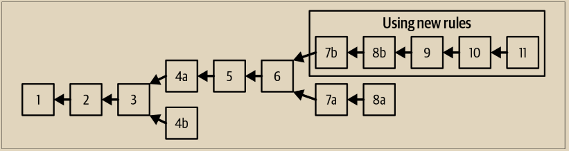

# 硬分叉

在第282页的“组装和选择区块链”的部分，我们看到比特币网络可能会短暂地分歧，网络的两个部分会在短时间内跟随区块链的两个不同分支。我们看到了这个过程是如何自然地发生的，作为网络正常运行的一部分，以及在挖出一个或多个区块后，网络如何汇聚到一个共同的区块链上。

还有另一种情况会导致网络分歧并跟随两个链的情况：共识规则的变化。这种类型的分叉被称为硬分叉，因为在分叉之后，网络可能无法汇聚到一个单一的链上。相反，这两个链可以独立发展。硬分叉发生在网络的一部分根据与其余网络不同的一组共识规则运行时。这可能是因为存在错误，也可能是因为故意改变了共识规则的实现方式。

硬分叉可以用来改变共识规则，但它们需要系统中所有参与者之间的协调。任何没有升级到新共识规则的节点都无法参与共识机制，并在硬分叉时被迫进入另一个链。因此，硬分叉引入的变化可以被认为是不“向前兼容”的，因为未升级的系统由于新的共识规则而无法处理区块。

让我们通过一个具体的例子来看一下硬分叉的机制。

图12-2显示了一个具有两个分叉的区块链。在第4个区块高度处发生了一个区块的分叉。这是我们在第282页“组装和选择区块链”中看到的一种自发性分叉。随着第5个区块的挖掘，网络汇聚到一个链上，分叉被解决了。

<figure><figcaption>
图 12-2. 一个带有分叉的区块链
</figcaption></figure>

然而，到了区块高度 6，一个新版本的客户端实现发布了，其中包含了对共识规则的更改。从区块高度 7 开始，运行此新版本实现的矿工将接受一种新类型的比特币；我们将其称为“foocoin”。就在这之后，运行新实现的节点创建了一个包含 foocoin 的交易，而一个使用更新软件的矿工挖出了包含此交易的 7b 区块。

任何未升级软件以验证 foocoin 的节点或矿工现在都无法处理 7b 区块。从他们的角度来看，既包含 foocoin 的交易，也包含该交易的 7b 区块都是无效的，因为他们是基于旧的共识规则进行评估的。这些节点将拒绝该交易和该区块，并且不会传播它们。使用旧规则的任何矿工都不会接受区块 7b，并将继续挖掘一个父块为区块 6 的候选区块。实际上，如果他们所连接的所有节点也遵循旧规则并因此不传播该区块，他们甚至可能都收不到区块 7b。最终，他们将能够挖掘区块 7a，这个区块在旧规则下是有效的，且不包含任何 foocoin 交易。

从这一点开始，两条链将继续分歧。在“b”链上的矿工将继续接受和挖掘包含 foocoin 的交易，而在“a”链上的矿工将继续忽略这些交易。即使区块 8b 不包含任何 foocoin 交易，使用“a”链的矿工也无法处理它。对他们来说，它似乎是一个无效的区块，因为其父区块“7b”未被识别为有效区块。

## 硬分叉：软件、网络、挖矿和链

对于软件开发者来说，“分叉”一词还有另一种含义，这给“硬分叉”一词增添了困惑。在开源软件中，当一组开发者选择遵循不同的软件路线图并开始竞争性地实现一个开源项目时，就会发生分叉。我们已经讨论了导致硬分叉的两种情况：共识规则中的错误和对共识规则的有意修改。在有意修改共识规则的情况下，软件分叉将先于硬分叉发生。然而，要发生这种类型的硬分叉，必须开发、采纳和启动一种新的共识规则的软件实现。

试图改变共识规则的软件分叉的例子包括比特币 XT 和比特币 Classic。然而，这两个程序都没有导致硬分叉。虽然软件分叉是一个必要的先决条件，但它本身并不足以导致硬分叉发生。要发生硬分叉，必须采纳竞争性的实现并激活新的规则，由矿工、钱包和中间节点完成。相反，比特币核心有许多替代实现，甚至软件分叉，它们不改变共识规则，除非存在错误，否则可以在网络上共存并互操作而不会导致硬分叉。

共识规则在验证交易或区块时可能以明显和明确的方式存在差异。这些规则也可能以更微妙的方式存在差异，比如在应用于比特币脚本或数字签名等密码原语的共识规则的实现上。最后，由于系统限制或实现细节所施加的隐含共识约束，共识规则可能以意想不到的方式存在差异。一个例子是在将比特币核心 0.7 升级到 0.8 时发生的未预期的硬分叉，这是由于用于存储区块的 Berkeley DB 实现的限制引起的。

在概念上，我们可以将硬分叉分为四个阶段：软件分叉、网络分叉、挖矿分叉和链分叉。这个过程始于开发者创建了一个具有修改后共识规则的替代客户端的实现。

当这个分叉实现在网络中部署时，一定比例的矿工、钱包用户和中间节点可能会采用并运行这个实现。首先，网络将会发生分叉。基于原始共识规则实现的节点将拒绝任何根据新规则创建的交易和区块。此外，遵循原始共识规则的节点可能会与向它们发送这些无效交易和区块的任何节点断开连接。因此，网络可能会分裂为两个部分：旧节点只会保持与旧节点连接，而新节点只会与新节点连接。一个基于新规则的区块会在网络中传播并导致网络分裂为两个。新矿工可能会在新区块的基础上挖矿，而旧矿工将在旧规则的基础上挖掘另一条链。由于连接到两个独立网络，分区的网络将使得根据不同共识规则运作的矿工不太可能接收到对方的区块。

对于软件开发者来说，“分叉”一词还有另一种含义，这给“硬分叉”一词增添了困惑。在开源软件中，当一组开发者选择遵循不同的软件路线图并开始竞争性地实现一个开源项目时，就会发生分叉。我们已经讨论了导致硬分叉的两种情况：共识规则中的错误和对共识规则的有意修改。在有意修改共识规则的情况下，软件分叉将先于硬分叉发生。然而，要发生这种类型的硬分叉，必须开发、采纳和启动一种新的共识规则的软件实现。

试图改变共识规则的软件分叉的例子包括比特币 XT 和比特币 Classic。然而，这两个程序都没有导致硬分叉。虽然软件分叉是一个必要的先决条件，但它本身并不足以导致硬分叉发生。要发生硬分叉，必须采纳竞争性的实现并激活新的规则，由矿工、钱包和中间节点完成。相反，比特币核心有许多替代实现，甚至软件分叉，它们不改变共识规则，除非存在错误，否则可以在网络上共存并互操作而不会导致硬分叉。

共识规则在验证交易或区块时可能以明显和明确的方式存在差异。这些规则也可能以更微妙的方式存在差异，比如在应用于比特币脚本或数字签名等密码原语的共识规则的实现上。最后，由于系统限制或实现细节所施加的隐含共识约束，共识规则可能以意想不到的方式存在差异。一个例子是在将比特币核心 0.7 升级到 0.8 时发生的未预期的硬分叉，这是由于用于存储区块的 Berkeley DB 实现的限制引起的。

在概念上，我们可以将硬分叉分为四个阶段：软件分叉、网络分叉、挖矿分叉和链分叉。这个过程始于开发者创建了一个具有修改后共识规则的替代客户端的实现。

当这个分叉实现在网络中部署时，一定比例的矿工、钱包用户和中间节点可能会采用并运行这个实现。首先，网络将会发生分叉。基于原始共识规则实现的节点将拒绝任何根据新规则创建的交易和区块。此外，遵循原始共识规则的节点可能会与向它们发送这些无效交易和区块的任何节点断开连接。因此，网络可能会分裂为两个部分：旧节点只会保持与旧节点连接，而新节点只会与新节点连接。一个基于新规则的区块会在网络中传播并导致网络分裂为两个。

新矿工可能会在新区块的基础上挖矿，而旧矿工将在旧规则的基础上挖掘另一条链。由于连接到两个独立网络，分区的网络将使得根据不同共识规则运作的矿工不太可能接收到对方的区块。

## 矿工和难度的分歧

\
随着矿工分散到挖掘两条不同的链上，算力被分配到了这两条链之间。挖矿算力可以以任意比例分配到这两条链上。新规则可能只被少数矿工遵循，也可能被绝大多数矿工遵循。

举个例子，假设出现了80% - 20%的分割，其中大部分的挖矿算力采用了新的共识规则。同时假设分叉发生在一个重新调整难度期之后。

这两条链将分别继承重新调整难度期的难度。新的共识规则将有80%的之前可用的挖矿算力加入其中。从这条链的角度来看，挖矿算力突然下降了20%，相对于之前的周期。区块平均每12.5分钟被发现一次，代表了用于扩展这条链的挖矿算力下降了20%。这种区块发行速率会持续（除非挖矿算力发生变化），直到挖出2,016个区块，这将需要大约25,200分钟（每个区块12.5分钟），或者17.5天。之后，将进行一次重新调整，并根据这条链中挖矿算力的减少（减少了20%）来产生10分钟的区块。

少数链，使用旧规则挖矿，只拥有20%的挖矿算力，将面临更为困难的任务。在这条链上，区块的平均挖掘时间将增加到50分钟。在挖掘2,016个区块之前，难度将不会进行调整，这将需要100,800分钟，或者大约10周来挖掘完毕。假设每个区块的容量是固定的，这也将导致交易容量减少5倍，因为每小时可用于记录交易的区块数量减少了。

## 有争议的硬分叉

\
这标志着去中心化共识软件开发的黎明。就像开发中的其他创新改变了软件的方法和产品，并在其后产生了新的方法、新的工具和新的社区一样，共识软件开发也代表着计算机科学的一个新领域。通过比特币开发的辩论、实验和磨难，我们将看到新的开发工具、实践、方法和社区涌现出来。

硬分叉被视为风险，因为它迫使少数人要么升级，要么留在少数链上。许多人认为将整个系统分裂为两个竞争系统的风险是不可接受的。因此，许多开发人员不愿意使用硬分叉机制来实现对共识规则的升级，除非整个网络几乎一致支持。任何没有几乎一致支持的硬分叉提案都被认为是太有争议的，不值得尝试，因为会有分裂系统的风险。

我们已经看到新的方法论出现来解决硬分叉的风险。在接下来的部分中，我们将看看软分叉以及共识修改的信号和激活方法
