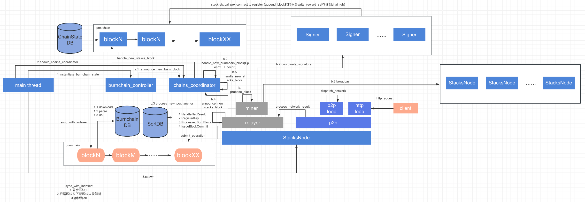

# BTC二层网络Stacks介绍及代码分析

随着2024年初BTC的大热，各种BTC二层网络如雨后春笋般出现。在个人博客里[《BTC Layer2的3种方案（转载+翻译）》](https://berryjam.github.io/2024/02/\(%E8%BD%AC%E8%BD%BD+%E7%BF%BB%E8%AF%91\)BTC-Layer2%E6%96%B9%E6%A1%88%E6%B1%87%E6%80%BB/)，对当前火热的三个项目：**B²、Merlin、BEVM**进行了初步介绍**。**其中B²、BEVM实现原理是类似ethereum的ZK-Rollup的扩容方案，但局限于比特币脚本并不是图灵完备，实现上挑战还是比较高的。而Merlin是基于质押BTC的方式，质押节点是由Merlin指定的，不够去中心化。

接下来要介绍的Stacks与Merlin类似，也是基于质押的方式，但是任何人都能成为Stacker，创新性地引入新的共识算法**PoX**实现去中心化。并且通过“链锚定”的方式，利用BTC主链的**PoW**来保护Stacks子链的安全性，同时引入microblock、anchorblock机制来实现交易的快速确认，以此实现扩容。

下面将对如何启动Stacks、Stacker节点和代码进行具体介绍。还有对整体架构以及其中不同组件：区块生成、交易处理、共识机制、与比特币交互、Clarity智能合约进行分析。

## 1.启动Stacks节点

Stacks支持以不同网络模式启动节点，如果想完整的运行Stacks节点并加入已有网络进行挖矿的话，可以参考《[Stacks Blockchain Miner](https://gist.github.com/wileyj/26cc0a3daf55c9b70d30301e9e4200f2)》。如果是基于Stacks进行开发或者调试，可以选择mocknet。这样并不需要启动比特币节点，能够快速把Stacks节点运行起来。下面是启动mocknet模式Stacks节点的流程：

### 1.0 安装rust依赖

```
$ curl -sL https://deb.nodesource.com/setup_16.x | sudo -E bash -
$ sudo apt-get update -y && sudo apt-get install -y build-essential jq netcat nodejs git autoconf libboost-system-dev libboost-filesystem-dev libboost-thread-dev libboost-chrono-dev libevent-dev libzmq5 libtool m4 automake pkg-config libtool libboost-system-dev libboost-filesystem-dev libboost-chrono-dev libboost-program-options-dev libboost-test-dev libboost-thread-dev libboost-iostreams-dev
$ curl --proto '=https' --tlsv1.2 -sSf https://sh.rustup.rs | sh && source $HOME/.cargo/env
```

### 1.1 下载代码

```
git clone git@github.com:stacks-network/stacks-core.git
```

### 1.2 生成节点私钥

请将下面输出保存到安全地方

```
$ cd $HOME && npm install @stacks/cli shx rimraf
$ npx @stacks/cli make_keychain 2>/dev/null | jq
{
  "mnemonic": "frown lens very suit ocean trigger animal flip retire dose various mobile record emerge torch client sorry shy party session until planet member exclude",
  "keyInfo": {
    "privateKey": "ooxeemeitar4ahw0ca8anu4thae7aephahshae1pahtae5oocahthahho4ahn7eici",
    "address": "STTXOG3AIHOHNAEH5AU6IEX9OOTOH8SEIWEI5IJ9",
    "btcAddress": "Ook6goo1Jee5ZuPualeiqu9RiN8wooshoo",
    "wif": "rohCie2ein2chaed9kaiyoo6zo1aeQu1yae4phooShov2oosh4ox",
    "index": 0
  }
}
```

上面mnemonic是助记词，privateKey是私钥，address是stx的地址，btcAddress是对应的比特币地址，wif(wallet import format)是可导入比特币钱包格式的私钥。

### 1.3 修改网络&节点配置

stacks在nakamoto升级后，才支持去中心化的signer，但是当前mocknet模式下的配置并不支持。需要修改**testnet/stacks-node/src/burnchains/mocknet\_controller.rs**：

```
fn get_stacks_epochs(&self) -> Vec<StacksEpoch> {
        match &self.config.burnchain.epochs {
            Some(epochs) => epochs.clone(),
            None => vec![
                StacksEpoch {
                    epoch_id: StacksEpochId::Epoch20,
                    start_height: 0,
                    end_height: 1,
                    block_limit: ExecutionCost::max_value(),
                    network_epoch: PEER_VERSION_EPOCH_2_0,
                },
                StacksEpoch {
                    epoch_id: StacksEpochId::Epoch2_05,
                    start_height: 1,
                    end_height: 2,
                    block_limit: ExecutionCost::max_value(),
                    network_epoch: PEER_VERSION_EPOCH_2_05,
                },
                StacksEpoch {
                    epoch_id: StacksEpochId::Epoch21,
                    start_height: 2,
                    end_height: 3,
                    block_limit: ExecutionCost::max_value(),
                    network_epoch: PEER_VERSION_EPOCH_2_1,
                },
                StacksEpoch {
                    epoch_id: StacksEpochId::Epoch22,
                    start_height: 3,
                    end_height: 4,
                    block_limit: ExecutionCost::max_value(),
                    network_epoch: PEER_VERSION_EPOCH_2_2,
                },
                StacksEpoch {
                    epoch_id: StacksEpochId::Epoch23,
                    start_height: 4,
                    end_height: 5,
                    block_limit: ExecutionCost::max_value(),
                    network_epoch: PEER_VERSION_EPOCH_2_3,
                },
                StacksEpoch {
                    epoch_id: StacksEpochId::Epoch24,
                    start_height: 5,
                    end_height: 6,
                    block_limit: ExecutionCost::max_value(),
                    network_epoch: PEER_VERSION_EPOCH_2_4,
                },
                StacksEpoch {
                    epoch_id: StacksEpochId::Epoch25,
                    start_height: 6,
                    end_height: STACKS_EPOCH_MAX,
                    block_limit: ExecutionCost::max_value(),
                    network_epoch: PEER_VERSION_EPOCH_2_5,
                },
            ],
        }
    }
```

为了便于debug，把pox相关参数**stackslib/src/burnchains/mod.rs**，reward\_cycle\_length 、prepare\_length、epoch生效时间改成与上面一致：

```
pub fn regtest_default() -> PoxConstants {
        PoxConstants::new(
            20,
            10,
            11,
            3333333333333333,
            1,
            BITCOIN_REGTEST_FIRST_BLOCK_HEIGHT + POX_SUNSET_START,
            BITCOIN_REGTEST_FIRST_BLOCK_HEIGHT + POX_SUNSET_END,
            3,
            4,
            7,
            7,
        )
    }
```

以及**testnet/stacks-node/src/node.rs**:

```
/// Constructs and returns a LeaderBlockCommitOp out of the provided params
    fn generate_block_commit_op(
        &mut self,
        block_header_hash: BlockHeaderHash,
        burn_fee: u64,
        key: &RegisteredKey,
        burnchain_tip: &BurnchainTip,
        vrf_seed: VRFSeed,
    ) -> BlockstackOperationType {
        //...

        BlockstackOperationType::LeaderBlockCommit(LeaderBlockCommitOp {
            sunset_burn: 0,
            block_header_hash,
            burn_fee,
            input: (Txid([0; 32]), 0),
            apparent_sender: self.keychain.get_burnchain_signer(),
            key_block_ptr: key.block_height as u32,
            key_vtxindex: key.op_vtxindex as u16,
            memo: vec![STACKS_EPOCH_3_0_MARKER], // 原来是STACKS_EPOCH_2_1_MARKER，需要改为STACKS_EPOCH_3_0_MARKER
            new_seed: vrf_seed,
            parent_block_ptr,
            parent_vtxindex,
            vtxindex: 2,
            txid,
            commit_outs,
            block_height: 0,
            burn_header_hash: BurnchainHeaderHash::zero(),
            burn_parent_modulus,
        })
    }
```

最后是修改节点配置**testnet/stacks-node/conf/mocknet-miner-conf.toml**：

```
[node]
# working_dir = "/dir/to/save/chainstate"
rpc_bind = "0.0.0.0:20443"
p2p_bind = "0.0.0.0:20444"
seed = "<npx privateKey>"
local_peer_seed = "<npx privateKey>"
miner = true
wait_time_for_microblocks = 10000
use_test_genesis_chainstate = true

[connection_options]
public_ip_address = "127.0.0.1:20444"

[burnchain]
chain = "bitcoin"
mode = "mocknet"

[[ustx_balance]]
address = "ST3EQ88S02BXXD0T5ZVT3KW947CRMQ1C6DMQY8H19"
amount = 100000000000000

[[ustx_balance]]
address = "ST3KCNDSWZSFZCC6BE4VA9AXWXC9KEB16FBTRK36T"
amount = 100000000000000

[[ustx_balance]]
address = "STB2BWB0K5XZGS3FXVTG3TKS46CQVV66NAK3YVN8"
amount = 100000000000000

[[ustx_balance]]
address = "STSTW15D618BSZQB85R058DS46THH86YQQY6XCB7"
amount = 100000000000000


```

将**seed**、**local\_peer\_seed**替换为上面npx命令输出的**privateKey**。

### 1.4 启动节点

编译和运行节点：

```
$cd stacks-core
$nohup cargo run --bin stacks-node -- start --config ./testnet/stacks-node/conf/mocknet-miner-conf.toml >> run.log 2>&1 &
```

<figure><figcaption><p>Stacks Node日志输出</p></figcaption></figure>

## 2.启动Stacks Signer

创建signer配置：

```
$touch testnet/stacks-node/conf/signer-config.toml
```

```
# The IP address and port where your Stacks node can be accessed.
# The port 20443 is the default RPC endpoint for Stacks nodes.
# Note that you must use an IP address - DNS hosts are not supported at this time.
# This should be the IP address accessible via Docker, usually via a network.
node_host = "127.0.0.1:20443"

# This is the location where the signer will expose an RPC endpoint for
# receiving events from your Stacks node.
endpoint = "0.0.0.0:30000"

# Either “testnet” or “mainnet”
network = "testnet"

# this is a file path where your signer will persist data. If using Docker,
# this must be within a volume, so that data can be persisted across restarts
db_path = "/Users/bj89200ml/Documents/llm_signer_local/signer.db"

# an authentication token that is used for some HTTP requests made from the
# signer to your Stacks node. You’ll need to use this later on when configur$ng
# your Stacks node. You create this field yourself, rather than it being generated
# with your private key.
auth_password = "<mocknet-miner-conf.toml>"

# This is the privateKey field from the keys you generated in the
# previous step.
stacks_private_key = "<npx privateKey>"
```

## 3.质押STX，成为Stacker

参考https://github.com/hirosystems/stacks.js/tree/main/packages/cli 安装stx命令行工具：

但是由于这个不支持mocknet模式，并且不支持nakamoto的pox4合约的质押，需要修改cli.js相关代码:。

```
async function stack(network, args) {
    const amount = BigInt(args[0]);
    const cycles = Number(args[1]);
    const poxAddress = args[2];
    const privateKey = args[3];
    const maxAmountMicroStx = amount;
    const signerPrivateKey = transactions_1.createStacksPrivateKey(privateKey);
    const signerKey = transactions_1.getPublicKey(signerPrivateKey);
    console.log("signerPrivateKey:", signerPrivateKey, "signerKey:", signerKey);

    const txNetwork = network.isMainnet() ? new network_1.StacksMainnet() : new network_1.StacksTestnet({url: 'http://127.0.0.1:20443'}); // 指定为本地节点
    const txVersion = txNetwork.isMainnet() ? transactions_1.TransactionVersion.Mainnet : transactions_1.TransactionVersion.Testnet;
    const apiConfig = new blockchain_api_client_1.Configuration({
        fetchApi: cross_fetch_1.default,
        basePath: txNetwork.coreApiUrl,
    });
    const accounts = new blockchain_api_client_1.AccountsApi(apiConfig);
    const stxAddress = (0, transactions_1.getAddressFromPrivateKey)(privateKey, txVersion);
    /*const balancePromise = accounts.getAccountBalance({
        principal: stxAddress,
    });*/
    const stacker = new stacking_1.StackingClient(stxAddress, txNetwork);
    const poxInfoPromise = stacker.getPoxInfo();
    const coreInfoPromise = stacker.getCoreInfo();
    const stackingEligiblePromise = stacker.canStack({ poxAddress, cycles });
    return Promise.all([poxInfoPromise, coreInfoPromise, stackingEligiblePromise])
        .then(([poxInfo, coreInfo, stackingEligible]) => {
        console.log("poxInfo:", poxInfo);
        const minAmount = BigInt(poxInfo.min_amount_ustx);
        const currentCycle = poxInfo.reward_cycle_id;
        //const balanceBN = BigInt(balance.stx.balance);
        console.log("coreInfo:", coreInfo);
        const burnChainBlockHeight = coreInfo.burn_block_height;
        const startBurnBlock = burnChainBlockHeight;
        // const startBurnBlock = burnChainBlockHeight + 3;
        if (minAmount > amount) {
            throw new Error(`Stacking amount less than required minimum of ${minAmount.toString()} microstacks`);
        }
        /*if (amount > balanceBN) {
            throw new Error(`Stacking amount greater than account balance of ${balanceBN.toString()} microstacks`);
        }*/
        if (!stackingEligible.eligible) {
            throw new Error(`Account cannot participate in stacking. ${stackingEligible.reason}`);
        }
        console.log("amount:", amount, "poxAddress:", poxAddress, "cycles:", cycles, "privateKey:", privateKey, "startBurnBlock:", startBurnBlock);
        // the auth id of the signer (a random id to not allow reusing the signature)
        const authId = 702;
        const signerSignature = stacker.signPoxSignature({
            topic: 'stack-stx', // the topic of the transaction
            poxAddress,
            rewardCycle: currentCycle,
            period: cycles,
            maxAmount: amount,
            authId,
            signerPrivateKey,
        });
        return stacker.stack({
            amountMicroStx: amount,
            poxAddress,
            cycles,
            burnBlockHeight: burnChainBlockHeight,

            signerKey: '<npx publicKey>',
            signerSignature,
            maxAmount: maxAmountMicroStx,
            authId,

            privateKey,
        });
    })
        .then((response) => {
        if (response.hasOwnProperty('error')) {
            return response;
        }
        return {
            txid: `0x${response.txid}`,
            transaction: (0, utils_1.generateExplorerTxPageUrl)(response.txid, txNetwork),
        };
    })
        .catch(error => {
        return error;
    });
}
```

质押stx：

```
$stacks stack 8206330000000000 1 <npx btcAddress> <npx privateKey> -l
```

再通过下面url查询节点信息

```
$curl -sL localhost:20443/v2/pox | jq
```

当前网络信息:

```
{
  "contract_id": "ST000000000000000000002AMW42H.pox-4",
  "pox_activation_threshold_ustx": 1300057388429055,
  "first_burnchain_block_height": 0,
  "current_burnchain_block_height": 21,
  "prepare_phase_block_length": 10,
  "reward_phase_block_length": 10,
  "reward_slots": 20,
  "rejection_fraction": null,
  "total_liquid_supply_ustx": 130005738842905579,
  "current_cycle": {
    "id": 1,
    "min_threshold_ustx": 1625080000000000,
    "stacked_ustx": 8206330000000000, // 刚才质押的数量
    "is_pox_active": false
  },
  "next_cycle": {
    "id": 2,
    "min_threshold_ustx": 1625080000000000,
    "min_increment_ustx": 16250717355363,
    "stacked_ustx": 0,
    "prepare_phase_start_block_height": 30,
    "blocks_until_prepare_phase": 9,
    "reward_phase_start_block_height": 40,
    "blocks_until_reward_phase": 19,
    "ustx_until_pox_rejection": null
  },
  "epochs": [
    {
      "epoch_id": "Epoch20",
      "start_height": 0,
      "end_height": 1,
      "block_limit": {
        "write_length": 18446744073709551615,
        "write_count": 18446744073709551615,
        "read_length": 18446744073709551615,
        "read_count": 18446744073709551615,
        "runtime": 18446744073709551615
      },
      "network_epoch": 0
    },
    {
      "epoch_id": "Epoch2_05",
      "start_height": 1,
      "end_height": 2,
      "block_limit": {
        "write_length": 18446744073709551615,
        "write_count": 18446744073709551615,
        "read_length": 18446744073709551615,
        "read_count": 18446744073709551615,
        "runtime": 18446744073709551615
      },
      "network_epoch": 5
    },
    {
      "epoch_id": "Epoch21",
      "start_height": 2,
      "end_height": 3,
      "block_limit": {
        "write_length": 18446744073709551615,
        "write_count": 18446744073709551615,
        "read_length": 18446744073709551615,
        "read_count": 18446744073709551615,
        "runtime": 18446744073709551615
      },
      "network_epoch": 6
    },
    {
      "epoch_id": "Epoch22",
      "start_height": 3,
      "end_height": 4,
      "block_limit": {
        "write_length": 18446744073709551615,
        "write_count": 18446744073709551615,
        "read_length": 18446744073709551615,
        "read_count": 18446744073709551615,
        "runtime": 18446744073709551615
      },
      "network_epoch": 7
    },
    {
      "epoch_id": "Epoch23",
      "start_height": 4,
      "end_height": 5,
      "block_limit": {
        "write_length": 18446744073709551615,
        "write_count": 18446744073709551615,
        "read_length": 18446744073709551615,
        "read_count": 18446744073709551615,
        "runtime": 18446744073709551615
      },
      "network_epoch": 8
    },
    {
      "epoch_id": "Epoch24",
      "start_height": 5,
      "end_height": 6,
      "block_limit": {
        "write_length": 18446744073709551615,
        "write_count": 18446744073709551615,
        "read_length": 18446744073709551615,
        "read_count": 18446744073709551615,
        "runtime": 18446744073709551615
      },
      "network_epoch": 9
    },
    {
      "epoch_id": "Epoch25",
      "start_height": 6,
      "end_height": 9223372036854775807,
      "block_limit": {
        "write_length": 18446744073709551615,
        "write_count": 18446744073709551615,
        "read_length": 18446744073709551615,
        "read_count": 18446744073709551615,
        "runtime": 18446744073709551615
      },
      "network_epoch": 10
    }
  ],
  "min_amount_ustx": 1625080000000000,
  "prepare_cycle_length": 10,
  "reward_cycle_id": 1,
  "reward_cycle_length": 20,
  "rejection_votes_left_required": null,
  "next_reward_cycle_in": 19,
  "contract_versions": [
    {
      "contract_id": "ST000000000000000000002AMW42H.pox",
      "activation_burnchain_block_height": 0,
      "first_reward_cycle_id": 0
    },
    {
      "contract_id": "ST000000000000000000002AMW42H.pox-2",
      "activation_burnchain_block_height": 3,
      "first_reward_cycle_id": 1
    },
    {
      "contract_id": "ST000000000000000000002AMW42H.pox-3",
      "activation_burnchain_block_height": 7,
      "first_reward_cycle_id": 1
    },
    {
      "contract_id": "ST000000000000000000002AMW42H.pox-4",
      "activation_burnchain_block_height": 7,
      "first_reward_cycle_id": 1
    }
  ]
}
```

这时候等网络达到reward cycle 1的时候再重启signer（**因为mocknet模式下不支持推送burnchain block，无法主动刷新注册信息，故需要重启**），就能看到以下输出：

<figure><figcaption><p>signer日志输出，已经注册到reward cycle 1</p></figcaption></figure>

## 4.整体架构及代码分析


### 4.1 整体机制

Stacks网络主要由2类节点组成，分别是miner和signer。其中miner负责参与竞选出块，而signer负责验证块的内容和签名，只有达到70%以上的signer同意，miner出的块才会被接受。如下图所示：signer通过质押stx成为stacker，获取btc奖励。而miner通过发送btc，获取coinbase和交易手续费奖励(stx形式)。以此将btc与stx代币经济模型形成闭环。

<figure><figcaption><p>miner、stacker关系</p></figcaption></figure>

### 4.2 Miner流程：

<figure><figcaption></figcaption></figure>

1.发送RegisterKey交易到主链（btc），注册成为miner。

2.发送LeaderBlockCommit交易到主链（btc），里面会使用VRF从当前reward cycle里选中两个stacker进行发送btc，从而参与竞选。

3.由VRF选出任期内的miner，这里每一个btc块是一个单独的任期，miner也可以进行连任。miner由Verifiable Random Function（VRF）根据发送btc数量占当期总发送量为概率进行抽签选中。同样，接收btc奖励的stackers也是由VRF每次选择其中2个作为接收方。

4.被VRF选中的miner负责出microblocks，这个阶段执行交易出块会非常块，因为不需要进行锚定和共识，当满足出anchor block的条件时，会将多个microblocks串联成一个anchor block并锚定到主链（btc）上。间接利用主链的工作量证明来保护子链的安全，因为要篡改子链的区块，需要改写btc主链的区块，这个需要的计算量非常巨大。


### 4.3 Stacker流程

<figure><figcaption></figcaption></figure>

1.调用API获取有关即将到来的奖励周期的详细信息

2.对于特定的Stacks账户，确认其符合条件

3.确认比特币奖励地址和锁定期限

4.交易已广播，STX代币已被锁定。这需要在下一个奖励周期的准备阶段之前完成，即正在进行的奖励阶段的最后100个比特币块

5.stacking机制执行奖励周期，并向设置的BTC奖励地址发送奖励

6.在锁定期间，可以获取有关解锁时间、奖励等的详细信息

7.一旦锁定期结束，代币将被释放并再次可访问

8.显示奖励历史，包括以前奖励周期的收益等详细信

Note. 奖励周期的目标持续时间约为2周。这一持续时间基于比特币网络的目标块时间（10分钟），有时可能会因比特币网络的确认时间差异而增加。

### 4.4 Stacks节点代码分析

Stacks使用sqlite对主链、子链数据进行存储，节点启动的入口代码为**testnet/stacks-node/src/main.rs**的main函数，会开启主线程main thread，由主线程再启动其他子线程，线程间使用channel进行通讯协作。

下面是Stacks节点的整体架构图：

<figure><figcaption><p>Stacks节点整体架构图</p></figcaption></figure>

#### 4.4.1 主线程

1.创建burnchain\_controller；

2.创建chains\_coordinator；

3.创建StacksNode线程；

#### 4.4.2 burnchain\_controller

负责同步主链（burnchain）状态。主要做3件事：1.1 download 同步主链的区块；1.2 parse 解析主链区块里的stacks相关交易 1.3 db 将解析的stacks交易存储到本地数据库。

其中每接受到主链的块信息，a.1 announce\_new\_burn\_block：会通知chains\_coordinator进行处理。

#### 4.4.3 chains\_coordinator

负责协调microblocks的生成和确认，以及被anchor blocks安全引用。

&#x20;a.2 handle\_new\_burnchain\_block：接收到新的主链区块事件并处理。

&#x20;b.6 handle\_new\_stacks\_block: 接收到新的子链区块事件并处理。

#### 4.4.4 StacksNode

1.创建relayer线程；

2.创建p2p线程；

#### 4.4.4.1 relayer

1.创建miner线程：

miner负责子链的出块和执行具体的交易逻辑，处理流程：

* b.1 mine\_block:  按照块的大小及mempool里交易的手续费进行选择包含在当前microblock里的交易并执行；
* b.2 propose\_block:  将mined block发送到所监听的Signer；
* b.3 coordinate\_signature:  获取Signer的聚合签名，只有得到当前reward cycle内70%以上的Signer签名才会被认为有效；
* b.4 broadcast： 广播区块信息；
* b.5 announce\_new\_stacks\_block: 通知chains\_coordinator新的子链区块信息。

2.自身会处理4种指令：

* HandleNetResult: 接收来自p2p线程的网络请求处理结果，比如接收到新的交易，会写入到mempool。
* RegisterKey：会维护节点miner私钥的状态机，是否已注册、激活、停止。因为要成为miner，首先要先注册到当前的tenure里。
* ProcessedBurnBlock：处理接收到的主链区块信息，如判断当前miner是否已经成功竞选为当前任期内的miner。
* IssueBlockCommit:  向主链提交anchor block，会构造特殊的比特币交易，vout向选中的两个Stacker发送btc。构造实现如下：

```rust
fn send_block_commit_operation(
        &mut self,
        epoch_id: StacksEpochId,
        payload: LeaderBlockCommitOp,
        signer: &mut BurnchainOpSigner,
        utxos_to_include: Option<UTXOSet>,
        utxos_to_exclude: Option<UTXOSet>,
        previous_fees: Option<LeaderBlockCommitFees>,
        previous_txids: &Vec<Txid>,
    ) -> Option<Transaction> {
        let mut estimated_fees = match previous_fees {
            Some(fees) => fees.fees_from_previous_tx(&payload, &self.config),
            None => LeaderBlockCommitFees::estimated_fees_from_payload(&payload, &self.config),
        };

        let _ = self.sortdb_mut();
        let burn_chain_tip = self.burnchain_db.as_ref()?.get_canonical_chain_tip().ok()?;

        let public_key = signer.get_public_key();
        let (mut tx, mut utxos) = self.prepare_tx(
            epoch_id,
            &public_key,
            estimated_fees.estimated_amount_required(),
            utxos_to_include,
            utxos_to_exclude,
            burn_chain_tip.block_height,
        )?;

        // Serialize the payload
        let op_bytes = {
            let mut buffer = vec![];
            let mut magic_bytes = self.magic_bytes();
            buffer.append(&mut magic_bytes);
            payload
                .consensus_serialize(&mut buffer)
                .expect("FATAL: invalid operation");
            buffer
        };

        let consensus_output = TxOut {
            value: estimated_fees.sunset_fee,
            script_pubkey: Builder::new()
                .push_opcode(opcodes::All::OP_RETURN)
                .push_slice(&op_bytes)
                .into_script(),
        };

        tx.output = vec![consensus_output]; // 用于共识数据output

        for commit_to in payload.commit_outs.iter() { // 这里为两个被选中stacker对应TxOut，value为转账数量，script_pubkey为基于stacker的地址类似所构造的脚本
            tx.output
                .push(commit_to.to_bitcoin_tx_out(estimated_fees.amount_per_output()));
        }

        let fee_rate = estimated_fees.fee_rate;
        self.finalize_tx(
            epoch_id,
            &mut tx,
            estimated_fees.total_spent_in_outputs(),
            estimated_fees.spent_in_attempts,
            estimated_fees.min_tx_size(),
            fee_rate,
            &mut utxos,
            signer,
        )?;

        let serialized_tx = SerializedTx::new(tx.clone());

        let tx_size = serialized_tx.bytes.len() as u64;
        estimated_fees.register_replacement(tx_size);
        let mut txid = tx.txid().as_bytes().to_vec();
        txid.reverse();

        debug!("Transaction relying on UTXOs: {:?}", utxos);
        let txid = Txid::from_bytes(&txid[..]).unwrap();
        let mut txids = previous_txids.clone();
        txids.push(txid.clone());
        let ongoing_block_commit = OngoingBlockCommit {
            payload,
            utxos,
            fees: estimated_fees,
            txids,
        };

        info!(
            "Miner node: submitting leader_block_commit (txid: {}, rbf: {}, total spent: {}, size: {}, fee_rate: {})",
            txid.to_hex(),
            ongoing_block_commit.fees.is_rbf_enabled,
            ongoing_block_commit.fees.total_spent(),
            ongoing_block_commit.fees.final_size,
            fee_rate,
        );

        self.ongoing_block_commit = Some(ongoing_block_commit);

        increment_btc_ops_sent_counter();

        Some(tx)
    }
```


在 Stacks 区块链中，LeaderBlockCommit 交易是一种特殊的交易类型，用于将 Stacks 区块锚定到比特币区块链上。通过这种机制，Stacks 利用比特币的安全性，使得 Stacks 区块链的状态可以通过比特币交易进行验证。

#### LeaderBlockCommit 对应的比特币脚本

LeaderBlockCommit 交易通常包含以下组件：

1. **OP\_RETURN 输出**：这个输出用于在比特币区块链上存储数据。这种方式不需要实际花费比特币，使用 OP\_RETURN 输出可以存储最多 80 字节的任意数据。
2. **承诺数据（Commitment Data）**：嵌入在 OP\_RETURN 输出中的数据包括有关被提交的 Stacks 区块的信息。这些数据按照特定规则格式化，使 Stacks 网络能够解释。

#### 脚本的详细分解

1. **OP\_RETURN 操作码**：用于标记输出为携带数据的输出，而不是价值。这用于在比特币交易中嵌入任意数据。
2. **承诺数据**：紧随 OP\_RETURN 操作码之后嵌入承诺数据。这些数据通常包括：
   * **版本字节**：一个字节，指示承诺格式的版本。
   * **区块高度**：所提交的 Stacks 区块的高度。
   * **父区块哈希**：父 Stacks 区块的哈希。
   * **公钥哈希**：提交区块的领导者的公钥哈希。
   * **VRF 证明**：用于领导者选举过程的可验证随机函数（VRF）的证明。
   * **默克尔根**：所提交的 Stacks 区块中交易的默克尔根。

#### LeaderBlockCommit 脚本示例

以下是一个 LeaderBlockCommit 交易脚本的示例：

```plaintext
OP_RETURN <commitment_data>
```

其中，`<commitment_data>` 是各种组件（版本字节、区块高度、父区块哈希等）的连接。

#### LeaderBlockCommit 的意义

1. **安全性**：通过将 Stacks 区块锚定到比特币区块链，Stacks 继承了比特币的安全性。这使得攻击者难以在不更改比特币区块链的情况下篡改 Stacks 区块链。
2. **可验证性**：任何人都可以通过查看相应的比特币交易来验证 Stacks 区块链的状态。这使得 Stacks 区块链透明且可验证。
3. **去中心化**：通过利用比特币的去中心化网络，Stacks 增强了自身的去中心化和抗审查能力。


#### 4.4.4.2 p2p

1.创建http loop线程：负责接收来自client的请求，比如转账、调用合约、质押stx等交易。

2.创建p2p loop线程：处理client发送的请求，及节点间的通讯，并将网络处理结果通知relayer：process\_network\_result。

#### 4.4.4.2 Signer

Signer是一个关键组件，负责处理节点间的共识和数据验证。

用户通过client构造调用系统合约pox4的交易，将Signer的btc地址及子链私钥、公钥、地址注册到系统合约上。

使用注册的密钥信息启动Signer后，会不断**保持节点的运行状态和同步**、**更新分布式密钥（DKG）**信息，和**持续接收所监听的Stacks节点事件并进行处理**。

```
fn run_one_pass(
        &mut self,
        event: Option<SignerEvent>,
        cmd: Option<RunLoopCommand>,
        res: Sender<Vec<OperationResult>>,
    ) -> Option<Vec<OperationResult>> {
        // ...
        // 1.保持节点的运行状态和同步
        if self.state == State::Uninitialized {
            if let Err(e) = self.initialize_runloop() { 
                error!("Failed to initialize signer runloop: {e}.");
                if let Some(event) = event {
                    warn!("Ignoring event: {event:?}");
                }
                return None;
            }
        } else if let Some(SignerEvent::NewBurnBlock(current_burn_block_height)) = event {
            if let Err(e) = self.refresh_runloop(current_burn_block_height) {
                error!("Failed to refresh signer runloop: {e}.");
                warn!("Signer may have an outdated view of the network.");
            }
        }
        // ...
        for signer in self.stacks_signers.values_mut() {
            // ...
            // 更新DKG信息
            if signer.approved_aggregate_public_key.is_none() {
                if let Err(e) = retry_with_exponential_backoff(|| {
                    signer
                        .update_dkg(&self.stacks_client, current_reward_cycle)
                        .map_err(backoff::Error::transient)
                }) {
                    error!("{signer}: failed to update DKG: {e}");
                }
            }
            signer.refresh_coordinator();
            // 持续接收所监听的Stacks节点事件并进行处理，如验证区块信息和签名
            if let Err(e) = signer.process_event(
                &self.stacks_client,
                event.as_ref(),
                res.clone(),
                current_reward_cycle,
            ) {
                error!("{signer}: errored processing event: {e}");
            }
            // ...
        }
        None
    }
```

