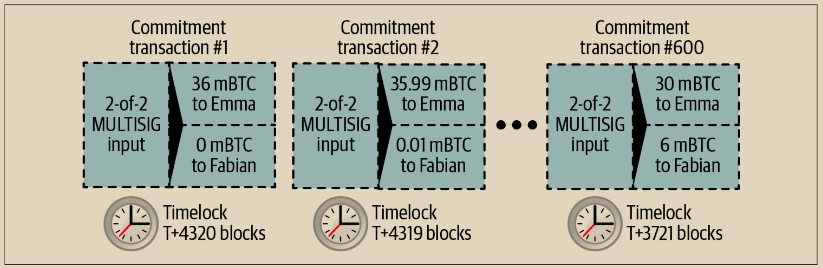

# 创建无需信任的通道

刚刚描述的通道只有在双方合作、没有任何故障或试图欺骗的情况下才能运作。让我们看看一些破坏这一通道的情况，并看看如何修复：

• 一旦发生资金交易，Emma 需要 Fabian 的签名才能拿回任何资金。如果 Fabian 消失，Emma 的资金将被锁定在 2-of-2 中，并且实际上丢失了。如果在至少有一份双方签署的承诺交易之前，其中一方变得不可用，那么按照当前构建的通道，资金将会丢失。&#x20;

• 在通道运行期间，Emma 可以取任何 Fabian 已经签署的承诺交易中的一份并将其传输到区块链。如果她可以传输承诺交易＃1 并仅支付 1 秒的视频，为什么要支付 600 秒的视频呢？Emma 可以通过广播对她有利的先前承诺来欺骗，这导致通道失败。

这两个问题都可以通过时间锁解决——让我们看看如何使用交易级时间锁。

Emma 不能冒险进行 2-of-2 多重签名资金，除非她有一种保证的退款。为了解决这个问题，Emma 同时构建了资金和退款交易。她签署了资金交易，但不将其传输给任何人。Emma 仅将退款交易传输给 Fabian 并获得他的签名。

退款交易充当了第一笔承诺交易，其时间锁确定了通道的生命周期上限。在这种情况下，Emma 可以将锁定时间设置为 30 天或未来 4,320 个区块。在之后的所有承诺交易必须有一个更短的时间锁，以便在退款交易到期之前赎回。

现在，Emma 有了一个完全签名的退款交易，她可以放心地传输已签名的资金交易，知道即使 Fabian 消失，她也可以在时间锁到期后赎回退款交易。

在通道的生命周期内，双方交换的每笔承诺交易都将被时间锁定到未来。但是，对于每个承诺，延迟都会略微缩短，以便最新的承诺在使其无效的先前承诺之前可以被赎回。由于时间锁，没有一方能够成功传播任何承诺交易，直到其时间锁到期。如果一切顺利，他们将合作并以和解交易优雅地关闭通道，无需传输中间承诺交易。如果没有，最新的承诺交易可以传播以结算账户并使所有先前的承诺交易无效。

例如，如果承诺交易＃1 被时间锁定到未来的 4,320 个区块，那么承诺交易＃2 将被时间锁定到未来的 4,319 个区块。承诺交易＃600 可以在承诺交易＃1 生效之前的 600 个区块被消费。

图 14-4. 显示了每个承诺交易设置了一个较短的时间锁，使其可以在先前的承诺变为有效之前被消费

<figure><figcaption>
图 14-4 . 每个承诺交易都设置了较短的时间锁，使其可以在先前的承诺变为有效之前被消费
</figcaption></figure>

每个后续的承诺交易都必须设置更短的时间锁，以便在其前身和退款交易之前进行广播。提前广播承诺交易的能力确保它能够支出资金输出，并阻止其他任何承诺交易通过支出输出来赎回。比特币区块链提供的保证，防止双重支付并强制执行时间锁，有效地使每个承诺交易都能使其前身无效。

状态通道使用时间锁来跨时间维度执行智能合约。在本示例中，我们看到时间维度保证了最近的承诺交易在任何早期承诺之前生效。因此，最新的承诺交易可以被传输，支出输入并使先前的承诺交易无效。使用绝对时间锁来执行智能合约可以防止其中一方作弊。这种实现除了绝对事务级别的锁定时间外，不需要任何其他内容。接下来，我们将看到如何使用脚本级别的时间锁，CHECKLOCKTIMEVERIFY 和 CHECKSEQUENCEVERIFY，来构建更灵活、有用和复杂的状态通道。

时间锁不是使前期承诺交易无效的唯一方法。在接下来的章节中，我们将看到如何使用吊销密钥来实现相同的结果。时间锁是有效的，但它们有两个明显的缺点。首先，在通道首次打开时，通过建立最大时间锁，它们限制了通道的寿命。更糟糕的是，它们迫使通道实现在允许长期存在的通道和迫使其中一方在提前关闭时等待很长时间以获得退款之间取得平衡。例如，如果通过将退款时间锁设置为30天来允许通道保持开放30天，则如果其中一方立即消失，另一方必须等待30天才能获得退款。终点越远，退款的时间就越长。

第二个问题是，由于每个后续的承诺交易必须递减时间锁，因此对于可以在各方之间交换的承诺交易数量有明确的限制。例如，一个30天的通道，将时间锁设置为未来的4320个块，只能容纳4320个中间承诺交易，然后必须关闭。将承诺交易之间的时间锁定间隔设置为1个块存在风险。通过将承诺交易之间的时间锁定间隔设置为1个块，开发人员为通道参与者创造了一个非常高的负担，他们必须保持警惕，保持在线并监视，并准备在任何时候传输正确的承诺交易。

在之前描述的单向通道示例中，消除每次承诺的时间锁是很容易的。在Emma从Fabian那里收到定时退款交易的签名后，不会在承诺交易上设置时间锁。相反，Emma向Fabian发送每个承诺交易的签名，但Fabian不会向Emma发送任何承诺交易的签名。这意味着只有Fabian拥有承诺交易的两个签名，因此只有他可以广播其中之一。当Emma完成视频流时，Fabian总是倾向于广播支付他最多的交易，即最新的状态。这种构造称为Spillman风格的支付通道，它最早是在2013年首次描述和实现的，尽管它们只能与见证（segwit）交易一起使用，这些交易直到2017年才可用。

现在我们了解了如何使用时间锁来使前期的承诺无效，我们可以看到通过广播承诺交易来合作关闭通道和单方关闭通道之间的区别。在我们之前的示例中，所有的承诺交易都有时间锁，因此广播承诺交易总是涉及等待直到时间锁到期。但是，如果双方就最终余额达成一致，并知道他们都持有最终将实现该余额的承诺交易，他们可以构建一个不带时间锁的结算交易来代表相同的余额。在合作关闭中，任何一方都可以采用最新的承诺交易并构建一个完全相同的结算交易，只是省略了时间锁。双方都可以签署此结算交易，因为知道没有任何作弊的方法，并且无法获得更有利的余额。通过合作签署和传输结算交易，他们可以立即关闭通道并兑现余额。最糟糕的情况是，其中一方可能会小气，拒绝合作，并迫使另一方通过最新的承诺交易进行单方关闭。如果这样做，他们也必须等待他们的资金。
