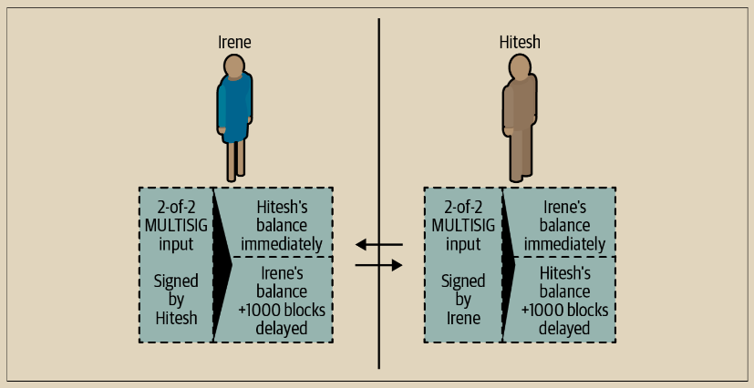

# 非对称撤销承诺

另一种处理先前承诺状态的方法是明确地撤销它们。然而，这并不容易实现。比特币的一个关键特性是，一旦一笔交易有效，它就保持有效，不会过期。取消交易的唯一方法是让一笔与之冲突的交易得到确认。这就是为什么在简单支付通道示例中我们使用了时间锁，以确保更新的承诺可以在旧的承诺变得有效之前花费。然而，在时间上排序承诺会产生许多约束，使得支付通道难以使用。&#x20;

即使一笔交易无法取消，也可以通过构造一种使其不受欢迎的方式来实现。我们这样做的方式是给每一方提供一个撤销密钥，如果对方试图作弊，就可以用来惩罚对方。这种撤销先前承诺交易的机制首次作为闪电网络的一部分提出。&#x20;

为了解释撤销密钥，我们将构建一个更复杂的支付通道，该通道由 Hitesh 和 Irene 经营的两家交易所之间创建。Hitesh 和 Irene 在印度和美国分别经营比特币交易所。Hitesh 的印度交易所的客户经常向 Irene 的美国交易所的客户发送付款，反之亦然。目前，这些交易发生在比特币区块链上，但这意味着支付费用并等待几个区块的确认。在交易所之间建立支付通道将大大降低成本并加快交易流程。 Hitesh 和 Irene 通过协作构建资金交易来启动通道，每个人用 5 比特币为通道提供资金。在签署资金交易之前，他们必须签署第一组承诺（称为退款），以分配给 Hitesh 和 Irene 初始余额各为 5 比特币。资金交易将通道状态锁定在一个 2-of-2 的多重签名中，就像简单通道示例中一样。&#x20;

资金交易可能有来自 Hitesh 的一个或多个输入（总计达到 5 比特币或更多），以及来自 Irene 的一个或多个输入（总计达到 5 比特币或更多）。输入必须略微超过通道容量，以支付交易费用。交易有一个输出，将总共的 10 比特币锁定到由 Hitesh 和 Irene 共同控制的 2-of-2 多重签名地址。如果他们的输入超出了他们的预期通道贡献，资金交易可能还会有一个或多个输出将剩余资金找零返回给 Hitesh 和 Irene。这是一笔由两方提供和签署的单一交易。它必须在协作构建并由每一方签署之后才能传输。&#x20;

现在，与其创建一笔由两方签署的单一承诺交易，Hitesh 和 Irene 创建了两个不同的非对称承诺交易。

Hitesh 拥有一笔承诺交易，其中包含两个输出。第一个输出**立即**支付给 Irene 她所欠的 5 比特币。第二个输出向 Hitesh 支付他所欠的 5 比特币，但必须经过 1,000 个区块的时间锁定才能生效。交易输出如下：

```
Input: 2-of-2 funding output, signed by Irene

Output 0 <5 bitcoins>:
     <Irene's Public Key> CHECKSIG
Output 1 <5 bitcoins>:
     <1000 blocks>
     CHECKSEQUENCEVERIFY
     DROP
     <Hitesh's Public Key> CHECKSIG
```

Irene 拥有一笔不同的承诺交易，其中包含两个输出。第一个输出立即向 Hitesh 支付他所欠的 5 比特币。第二个输出向 Irene 支付她所欠的 5 比特币，但必须经过 1,000 个区块的时间锁定才能生效。Irene 拥有的承诺交易（由 Hitesh 签名）如下：

```
Input: 2-of-2 funding output, signed by Hitesh

Output 0 <5 bitcoins>:
    <Hitesh's Public Key> CHECKSIG
    
Output 1 <5 bitcoins>:
    <1000 blocks>
    CHECKSEQUENCEVERIFY
    DROP
    <Irene's Public Key> CHECKSIG
```

这样，每个参与方都拥有一笔承诺交易，用于支配 2-of-2 的资金输出。该输入由另一方签名。任何时候，持有交易的一方也可以签名（完成 2-of-2）并广播交易。然而，如果他们广播承诺交易，它会立即支付给另一方，而他们必须等待时间锁定的到期。通过对一个输出的赎回施加延迟，我们在每个参与方选择单方面广播承诺交易时都让其稍微处于不利地位。但仅靠时间延迟还不足以促使公平行为。

图 14-5 显示了两个非对称的承诺交易，其中支付给承诺持有者的输出被延迟。

<figure><figcaption><p>图 14-5.  两个非对称的承诺交易，其中支付给持有交易一方的款项被延迟</p></figcaption></figure>

\
现在，我们介绍这个方案的最后一个元素：一个撤销密钥，用于防止作弊者广播已过期的承诺。 撤销密钥允许受害方通过获取渠道的全部余额来惩罚作弊者。&#x20;

撤销密钥由两个部分组成，每个渠道参与者独立生成一半。 它类似于2-of-2多重签名，但使用椭圆曲线算术构建，以便双方都知道撤销公钥，但每个参与方只知道撤销秘密的一半。

在每一轮中，双方都向对方揭示他们撤销秘密的一半，从而为对方（现在拥有两半）提供了要求惩罚输出的手段，如果此已撤销交易被广播。

每个承诺交易都有一个“延迟”输出。 该输出的赎回脚本允许一方在1,000个区块之后赎回它，或者另一方在拥有撤销密钥的情况下赎回它，以惩罚广播已撤销的承诺。

因此，当Hitesh为Irene创建一个承诺交易供其签名时，他将第二个输出设置为在1,000个区块之后支付给自己，或者支付给撤销公钥（他只知道一半的秘密）。 Hitesh构建了此交易。 他只会在准备转移到新的渠道状态并希望撤销此承诺时向Irene揭示其撤销秘密的一半。

第二个输出的脚本如下：

<pre><code>Output 0 &#x3C;5 bitcoins>:
    &#x3C;Irene's Public Key> CHECKSIG
    
Output 1 &#x3C;5 bitcoins>:
IF
<strong>    # Revocation penalty output
</strong>    &#x3C;Revocation Public Key>
ELSE
    &#x3C;1000 blocks>
    CHECKSEQUENCEVERIFY
    DROP
    &#x3C;Hitesh's Public Key>
ENDIF
CHECKSIG
</code></pre>

\
Irene可以放心地签署此交易，因为如果传输，它将立即支付她所欠的款项。Hitesh持有该交易，但知道如果他在单方面关闭渠道时传输该交易，他将需要等待 1,000 个区块才能获得支付。在渠道推进到下一个状态之后，Hitesh必须撤销此承诺交易，然后Irene才会同意签署任何进一步的承诺交易。要做到这一点，他所要做的就是将他的撤销密钥的一半发送给Irene。一旦Irene拥有了这个承诺的撤销秘钥的两个部分，她就可以放心地签署未来的承诺。她知道如果Hitesh试图通过发布先前的承诺来欺骗，她可以使用撤销密钥来赎回Hitesh的延迟产出。如果Hitesh欺骗，Irene会获得双重产出。同时，Hitesh只拥有该撤销公钥的一半，因此无法在 1,000 个区块之前赎回产出。在 1,000 个区块结束之前，Irene将能够赎回产出并惩罚Hitesh。

撤销协议是双边的，意味着在每个轮次中，随着渠道状态的推进，两方交换新的承诺，交换前一次承诺的撤销密钥，并签署彼此的新的承诺交易。在他们接受新状态之后，他们通过彼此提供必要的撤销密钥来使先前的状态不可能被使用，以惩罚任何欺骗行为。

让我们看一个它是如何工作的例子。Irene 的一位客户想要将 2 个比特币发送给 Hitesh 的一位客户。为了在渠道之间传输 2 个比特币，Hitesh 和 Irene 必须推进渠道状态以反映新的余额。他们将承诺到一个新的状态（状态号 2），在这个状态下，渠道的 10 个比特币被分成 7 个比特币给 Hitesh 和 3 个比特币给 Irene。为了推进渠道的状态，他们将各自创建新的承诺交易，反映新的渠道余额。

与之前一样，这些承诺交易是非对称的，因此每个一方持有的承诺交易会迫使他们等待，如果他们要赎回它。至关重要的是，在签署新的承诺交易之前，他们必须首先交换撤销密钥，以使任何过时的承诺无效。在这种特定情况下，Hitesh 的利益与渠道的真实状态保持一致，因此他没有理由广播先前的状态。然而，对于 Irene 来说，状态号 1 让她的余额高于状态号 2。当 Irene 给 Hitesh 提供她之前承诺交易（状态号 1）的撤销密钥时，她实际上正在撤销她从将渠道退回到先前状态中获利的能力，因为有了撤销密钥，Hitesh 可以在没有延迟的情况下赎回先前承诺交易的所有产出。这意味着如果 Irene 广播先前的状态，Hitesh 可以行使权利并获得所有产出。重要的是，撤销不会自动发生。虽然 Hitesh 有能力惩罚 Irene 的欺骗行为，但他必须密切关注区块链的变化迹象。如果他看到先前的承诺交易被广播，他有 1,000 个区块的时间来采取行动并使用撤销密钥来阻止 Irene 的欺骗行为，并通过取走全部余额来惩罚她，总共 10 个比特币。

具有相对时间锁定（CSV）的非对称可撤销承诺是实施支付渠道的一种更好的方法，也是这项技术中的一个非常重要的创新。通过这种构造，渠道可以无限期保持开放，并且可以有数十亿个中间承诺交易。在 LN 的实现中，承诺状态由一个 48 位索引标识，允许在任何单个渠道中进行超过 281 万亿（2.8 × 10¹⁴）次状态转换。
