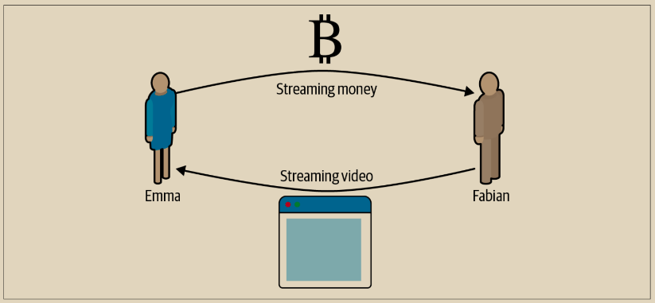
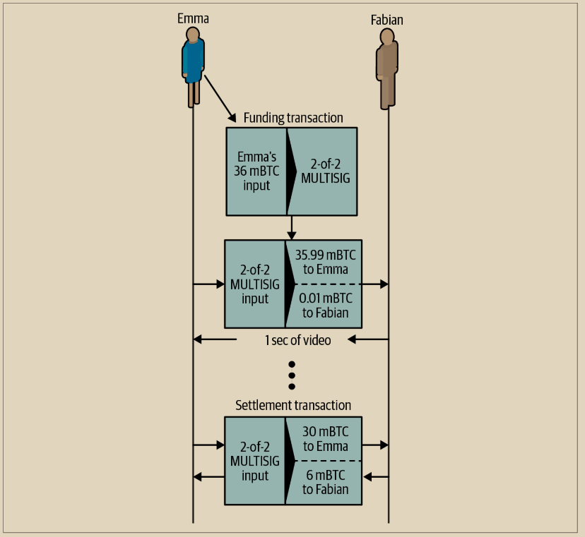

# 简单支付通道示例

为了解释状态通道，我们从一个非常简单的例子开始。我们展示一个单向通道，意味着价值只在一个方向上流动。我们还将从一个天真的假设开始，即没有人试图作弊，以保持简单。一旦我们解释了基本的通道概念，我们将看看如何使它变得无需信任，以便双方都无法作弊，即使他们试图这样做。&#x20;

在这个例子中，我们假设有两个参与者：Emma 和 Fabian。Fabian 提供按秒计费的视频流服务，使用微支付通道。Fabian 每秒视频收取 0.01 毫比特（0.00001 BTC），相当于每小时视频收取 36 毫比特（0.036 BTC）。Emma 是一位购买 Fabian 的视频流服务的用户。图 14-2 显示了 Emma 使用支付通道从 Fabian 购买视频流服务。

<figure><figcaption>
图 14-2.  Emma 使用支付通道购买 Fabian 的视频流服务，按每秒的视频付费
</figcaption></figure>

\
在这个例子中，Fabian 和 Emma 使用的是能够处理支付通道和视频流的特殊软件。Emma 在她的浏览器中运行该软件，而 Fabian 则在服务器上运行。这个软件包括基本的比特币钱包功能，可以创建和签署比特币交易。用户完全不知道“支付通道”这个概念和术语，他们看到的是按秒付费的视频。

为了建立支付通道，Emma 和 Fabian 建立了一个 2-of-2 的多签名地址，他们各自持有其中一个密钥。从 Emma 的角度来看，她浏览器中的软件会显示一个带有地址的二维码，并要求她提交支付金额，以便观看多长时间的视频。然后，Emma 把这个地址进行了资金注入。Emma 支付到多签名地址的交易是支付通道的资金或锚定交易。

在这个例子中，假设 Emma 用 36 毫比特（0.036 BTC）资助了该通道。这将允许 Emma 观看多达 1 小时的流媒体视频。在这种情况下，资金交易设置了该通道中可传输的最大金额，即通道容量。

资金交易从 Emma 的钱包中消耗一个或多个输入来获取资金。它创建一个输出，金额为 36 毫比特，支付到由 Emma 和 Fabian 共同控制的多签名 2-of-2 地址。它可能还有其他输出，作为找零返回给 Emma 的钱包。

资金交易确认到足够的深度后，Emma 可以开始观看视频。Emma 的软件创建并签署一个承诺交易，将通道余额更改为向 Fabian 的地址支付 0.01 毫比特，同时将 35.99 毫比特退还给 Emma。Emma 签署的交易消耗了资金交易创建的 36 毫比特输出，并创建了两个输出：一个是她的退款，另一个是 Fabian 的支付。这笔交易只部分签署 - 它需要两个签名（2-of-2），但只有 Emma 的签名。当 Fabian 的服务器接收到这笔交易时，它会添加第二个签名（对于 2-of-2 输入），然后将其与 1 秒钟的视频一起返回给 Emma。现在，双方都有了一个完全签署的承诺交易，可以兑现，代表了通道的正确最新余额。双方都不会将此交易广播到网络中。

在下一轮中，Emma 的软件创建并签署另一个承诺交易（承诺 #2），该交易使用来自资金交易的相同 2-of-2 输出。第二次承诺交易将一个输出的 0.02 毫比特分配给 Fabian 的地址，另一个输出的 35.98 毫比特返回给 Emma 的地址。这笔新交易是两秒视频的支付。Fabian 的软件签署并返回第二次承诺交易，再加上另一秒的视频。

通过这种方式，Emma 的软件继续向 Fabian 的服务器发送承诺交易，以换取视频流。通道的余额逐渐积累到 Fabian 的利益，因为 Emma 消耗了更多的视频秒数。假设 Emma 观看了 600 秒（10 分钟）的视频，创建并签署了 600 笔承诺交易。最后一笔承诺交易（#600）将两个输出，将通道的余额分成 6 毫比特给 Fabian，30 毫比特给 Emma。

最后，Emma 点击“停止”以停止观看视频。现在 Fabian 或 Emma 可以传输最终状态交易以进行结算。这最后一笔交易是结算交易，向 Fabian 支付 Emma 消耗的所有视频，将剩余的资金交易退还给 Emma。

图 14-3 展示了 Emma 和 Fabian 之间的通道以及更新通道余额的承诺交易。

<figure><figcaption>
图 14-3. Emma与Fabian之间的支付通道，显示更新通道余额的承诺交易
</figcaption></figure>

