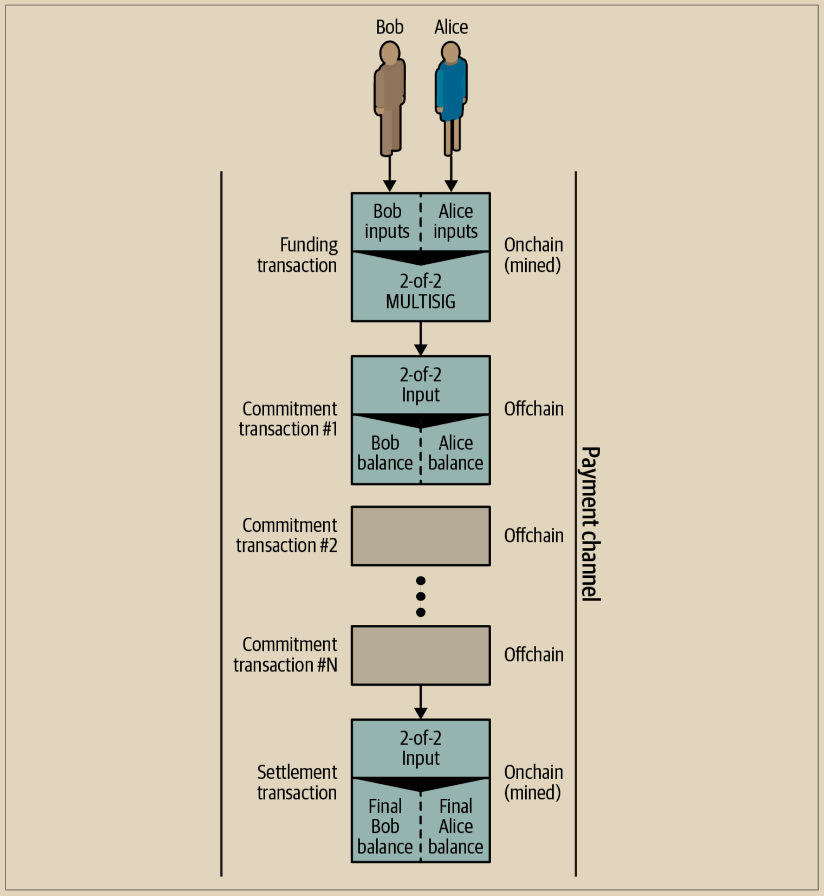

# 状态通道 - 基本概念和术语

\
状态通道是通过在区块链上锁定共享状态的交易来建立的，这称为资金交易。这笔单一交易必须被传输到网络并被挖掘以建立通道。在支付通道的例子中，锁定的状态是通道的初始余额（以货币计）。

然后，两个参与方交换已签名的交易，称为承诺交易，以修改初始状态。这些交易是有效的交易，因为它们可以由任一方提交进行结算，但是实际上被每个参与方持有，直到通道关闭。状态更新可以根据每个参与方创建、签名和传输交易的速度来创建，实际上这意味着可以交换数十个每秒。

在交换承诺交易时，两个参与方还会阻止使用先前的状态，以便始终使用最新的承诺交易进行赎回。这样做可以防止任一方通过单方面关闭通道并使用比当前状态更有利的先前状态来作弊。在本章的其余部分，我们将检查可以用来阻止发布先前状态的各种机制。

最后，通道可以通过合作方式关闭，通过提交最终的结算交易到区块链上，或者通过单方面关闭，通过任一方提交最后的承诺交易到区块链上。需要单方面关闭选项以防止其中一方意外断开连接。结算交易代表通道的最终状态，并在区块链上进行结算。

在通道的整个生命周期中，只需要提交两笔交易进行区块链上的挖掘：资金和结算交易。在这两个状态之间，两个参与方可以交换任意数量的承诺交易，这些交易对其他人不可见，也不会提交到区块链上。

图14-1说明了Bob和Alice之间的支付通道，显示了资金、承诺和结算交易。

<figure><figcaption>
图 14-1.  Bob 和 Alice 之间的支付通道，显示了资金、承诺和结算交易
</figcaption></figure>

