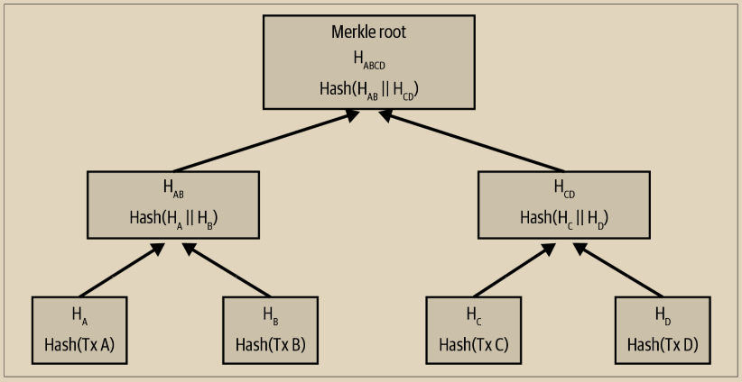
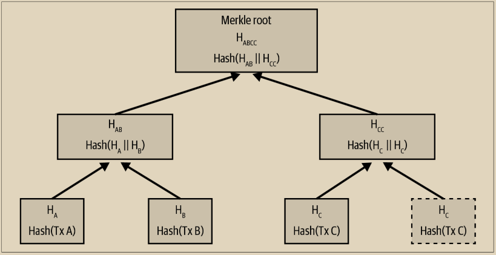
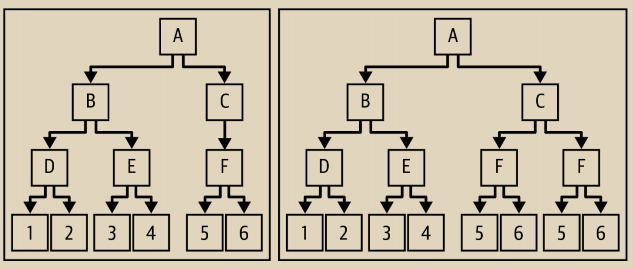
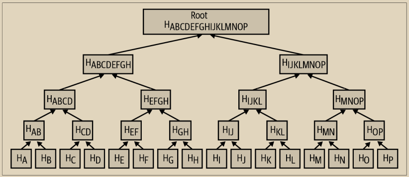
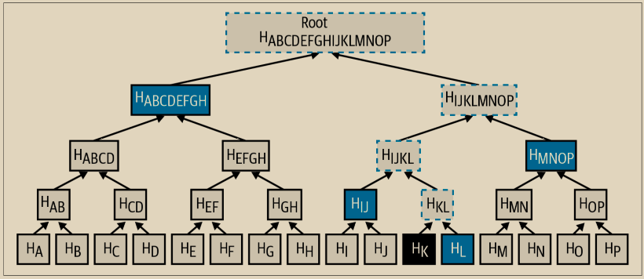

# 默克尔树

比特币区块链中的每个区块都包含了对该区块中所有交易的摘要，使用了默克尔树。

默克尔树，也称为二叉哈希树，是一种用于高效总结和验证大型数据集完整性的数据结构。默克尔树是包含了加密哈希的二叉树。计算机科学中的“树”一词用于描述分支数据结构，但这些树通常在图表中是倒置的，顶部是“根”，底部是“叶子”，正如你将在后面的示例中看到的那样。

比特币中使用默克尔树来总结一个区块中的所有交易，产生对整个交易集合的整体承诺，并允许非常有效地验证一个交易是否包含在区块中。默克尔树是通过递归地对元素成对进行哈希处理构建的，直到只剩下一个哈希，称为根，或默克尔根。比特币中用于默克尔树的加密哈希算法是SHA256应用两次，也称为双SHA256。

当N个数据元素被哈希并在默克尔树中进行总结时，你可以通过大约log2(N)次计算来检查其中是否包含任何一个数据元素，使得这成为一种非常高效的数据结构。

默克尔树是自底向上构建的。在下面的例子中，我们从四个交易A、B、C和D开始，它们形成了默克尔树的叶子节点，如图11-2所示。交易并不存储在默克尔树中；相反，它们的数据被哈希处理，产生的哈希结果存储在每个叶子节点中，分别为HA、HB、HC和HD：

\
HA = SHA256(SHA256(Transaction A))

然后，将相邻的叶子节点成对合并到一个父节点中，方法是将这两个哈希连接在一起，然后将它们一起进行哈希处理。例如，要构建父节点HAB，将两个子节点的32字节哈希连接起来，形成一个64字节的字符串。然后对该字符串进行双重哈希处理，以生成父节点的哈希值：

HAB = SHA256(SHA256(HA || HB))

这个过程持续进行，直到顶部只剩下一个节点，即被称为 Merkle 根的节点。这个 32 字节的哈希值存储在区块头中，总结了所有四笔交易中的所有数据。图 11-2 展示了通过节点的成对哈希计算根节点的过程。

<figure><figcaption>
图 11-2. 计算 Merkle 树中的节点
</figcaption></figure>

因为 Merkle 树是一个二叉树，所以需要有偶数个叶子节点。如果要总结的交易数量为奇数，则最后一个交易的哈希将被复制，以创建一个偶数个叶子节点，也称为平衡树。如图 11-3 所示，交易 C 被复制。同样地，如果在任何层级中要处理的哈希数量为奇数，则最后一个哈希将被复制。

<figure><figcaption>
图 11-3.  复制一个数据元素可以实现有偶数个数据元素
</figcaption></figure>

> **比特币的默克尔树设计中存在一个缺陷**
>
> 比特币核心代码中的一段扩展注释，稍作修改后再次呈现，描述了比特币的默克尔树中一个重要问题：
>
> 警告！如果你正在阅读这篇文章，因为你正在学习加密货币和/或设计一个将使用默克尔树的新系统，请记住以下默克尔树算法存在一个严重的缺陷，与重复的交易ID相关，导致一个漏洞（CVE-2012-2459）。&#x20;
>
> 原因是，如果在给定级别的列表中哈希的数量是奇数，那么在计算下一个级别之前，最后一个会被复制一次（这在默克尔树中是不寻常的）。 这会导致某些交易序列导致相同的默克尔根。例如，图11-4中的两棵树：

<figure><figcaption>
图 11-4.  两棵类比特币的默克尔树，根相同但叶节点数量不同
</figcaption></figure>

> 交易列表\[1,2,3,4,5,6]和\[1,2,3,4,5,6,5,6]（其中5和6重复出现）导致相同的根哈希A（因为(F)和(F,F)的哈希值均为C）。 这个漏洞的原因在于可以发送一个具有相同默克尔根和与原始交易列表不重复的块，导致验证失败。如果接收节点继续将该块标记为永久无效，那么它将无法接受进一步的未修改（因此可能有效）的相同块的版本。我们通过检测在列表末尾将两个相同的哈希值进行哈希处理的情况来防范这种情况，并将其视为块具有无效的默克尔根。假设没有双SHA256碰撞，这将检测到所有已知的在不影响默克尔根的情况下更改交易的方法。&#x20;
>
> ——Bitcoin Core _src/consensus/merkle.cpp_

构建树的相同方法可以推广到构建任何大小的树。在比特币中，一个区块中常常有数千个交易，它们以完全相同的方式进行汇总，产生的只是 32 字节的数据作为单一的 Merkle 根。在图 11-5 中，您将看到一个由 16 个交易构建的树。请注意，尽管在图中根节点看起来比叶子节点大，但它们的大小是完全相同的，都是 32 字节。无论在区块中有一个交易还是一万个交易，Merkle 根始终将它们汇总为 32 字节。&#x20;

为了证明特定交易包含在一个区块中，一个节点只需要产生大约 log2(N) 个 32 字节的哈希，构成了一个连接特定交易与树根的认证路径或 Merkle 路径。随着交易数量的增加，这一点尤其重要，因为交易数量的底数对数增长得非常缓慢。这使得比特币节点能够高效地产生由 10 到 12 个哈希（320–384 字节）组成的路径，这可以提供对多兆字节区块中一千多个交易的单个交易的证明。

<figure><figcaption>
图 11-5.  总结许多数据元素的 Merkle 树
</figcaption></figure>

在图 11-6 中，节点可以通过生成一个只有四个 32 字节哈希值长的 Merkle 路径（总共 128 字节）来证明交易 K 包含在区块中。该路径由四个哈希值组成（带有阴影背景显示）HL，HIJ，HMNOP 和 HABCDEFGH。通过提供这四个哈希作为认证路径，任何节点都可以证明 HK（在图的底部具有黑色背景）包含在 Merkle 根中，方法是计算四个额外的逐对哈希值 HKL，HIJKL，HIJKLMNOP 和 Merkle 树根（在图中用虚线轮廓显示）。

<figure><figcaption>
图 11-6. 用于证明数据元素包含在内的 Merkle 路径
</figcaption></figure>

当规模增加时，Merkle 树的效率变得明显。最大可能的区块可以容纳近 16,000 笔交易，占用 4,000,000 字节，但证明其中的任何一笔交易是该区块的一部分只需要交易的副本、80 字节区块头的副本和 448 字节的 Merkle 证明。这使得最大可能的证明几乎比最大可能的比特币区块小了 10,000 倍。

补充说明下，这里为什么需要448字节的Merkle证明。

构造16000笔交易的Merkle树过程如下（只包含当前层数，节点当前数量）：

<pre><code><strong>1.16000
</strong>2.8000
3.4000
4.2000
5.1000
6.500
7.250
8.125->126 (这里125为奇数，需要复制最后一个节点)
9.64
10.32
11.16
12.8
13.4
14.2
15.1
</code></pre>

可以看出整颗树高为15，而构造出Merkle path只需要前14层各一个hash即可，root可直接计算出。由于每个hash是32个字节，所以一共需要14\*32=448字节。
