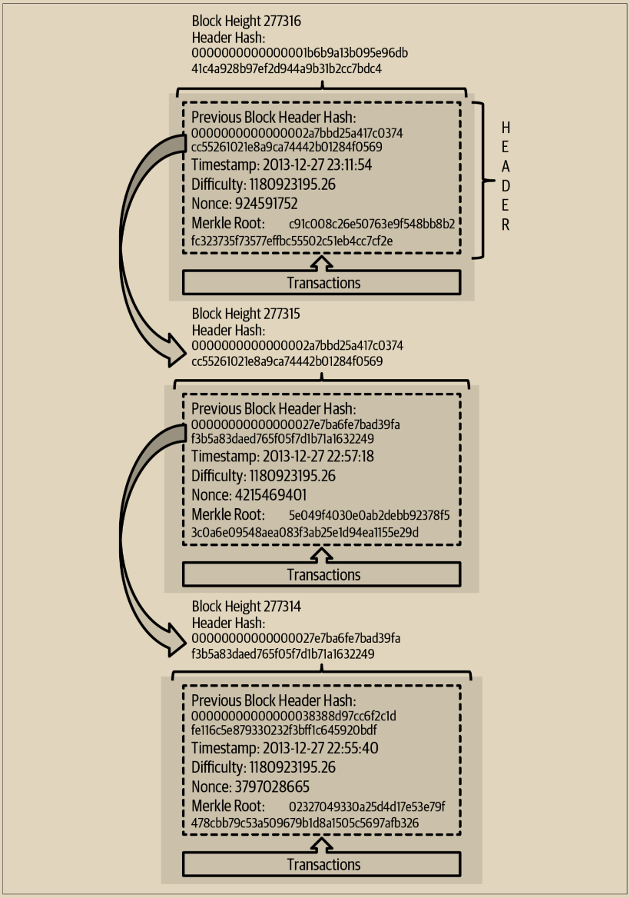

# 区块链中的区块链接

图比特币全节点会验证从创世区块之后的每个区块。它们对区块链的本地视图会随着新的区块被发现并用于扩展链条而不断更新。当节点从网络中接收到新的区块时，它会验证这些区块，然后将它们链接到现有区块链的视图中。为了建立链接，节点会检查接收到的区块头，并查找“上一个区块哈希”。

例如，假设一个节点在本地拷贝的区块链中有277,314个区块。节点所知道的最后一个区块是第277,314块，其区块头哈希为：

00000000000000027e7ba6fe7bad39faf3b5a83daed765f05f7d1b71a1632249

然后比特币节点从网络中接收到一个新的区块，它解析如下：

```
{
"size" : 43560,
"version" : 2,
"previousblockhash" :
"00000000000000027e7ba6fe7bad39faf3b5a83daed765f05f7d1b71a1632249",
"merkleroot" :
"5e049f4030e0ab2debb92378f53c0a6e09548aea083f3ab25e1d94ea1155e29d",
"time" : 1388185038,
"difficulty" : 1180923195.25802612,
"nonce" : 4215469401,
"tx" : [
"257e7497fb8bc68421eb2c7b699dbab234831600e7352f0d9e6522c7cf3f6c77",
"[... many more transactions omitted ...]",
"05cfd38f6ae6aa83674cc99e4d75a1458c165b7ab84725eda41d018a09176634"
] }
```

查看这个新区块，节点发现了 previousblockhash 字段，其中包含其父区块的哈希值。这个哈希值是节点已知的，即链上高度为 277,314 的最后一个区块的哈希值。因此，这个新区块是链上最后一个区块的子区块，并扩展了现有的区块链。节点将这个新区块添加到链的末尾，使得区块链变得更长，高度为 277,315。图 11-1 显示了由 previousblockhash 字段中的引用链接起来的三个区块的链条。

<figure><figcaption><p> 11-1.  区块通过每个引用前一个区块头哈希值来链接成链</p></figcaption></figure>

