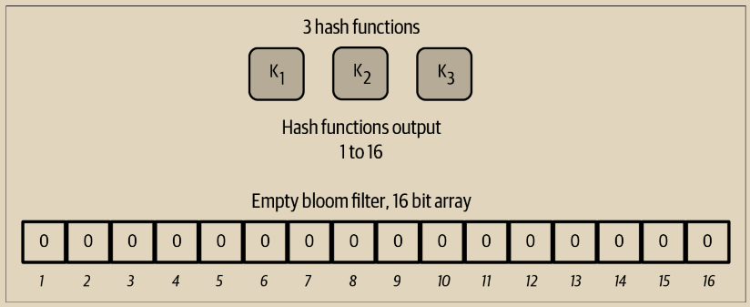
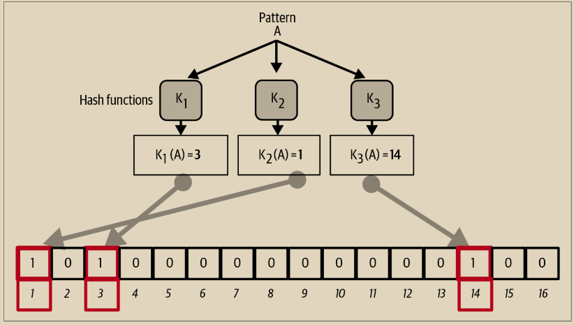
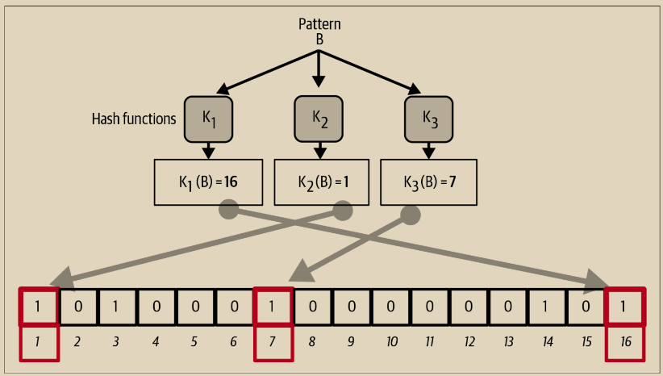
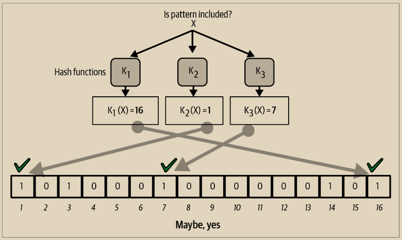
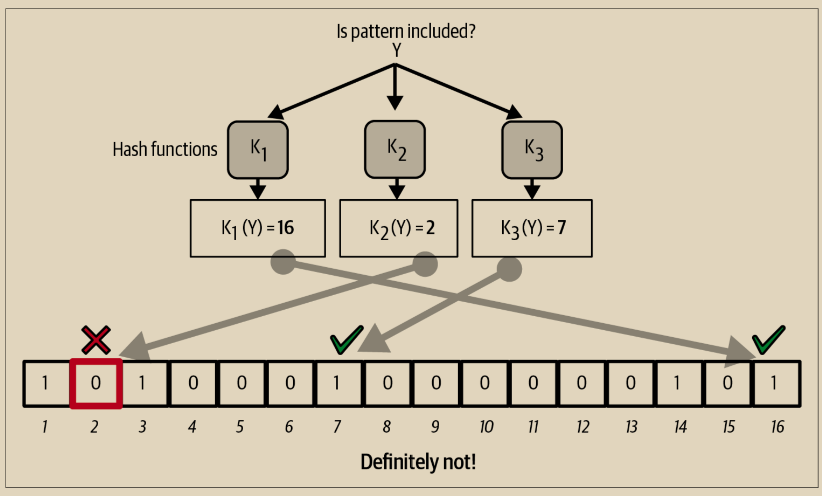

# 布隆过滤器工作原理

布隆过滤器被实现为一个可变大小的包含 N 个二进制数字（一个位域）和可变数量的 M 个哈希函数的数组。这些哈希函数被设计成总是产生一个介于 1 和 N 之间的输出，对应于二进制数字数组。哈希函数是确定性生成的，因此任何实现布隆过滤器的客户端都将始终使用相同的哈希函数，并为特定输入获得相同的结果。通过选择不同长度（N）的布隆过滤器和不同数量（M）的哈希函数，可以调整布隆过滤器，从而变化精度水平，进而影响隐私保护程度。

在图 10-6 中，我们使用一个非常小的 16 位数组和一组三个哈希函数来演示布隆过滤器的工作原理。

<figure><figcaption>
图 10-6.   一个简单的布隆过滤器示例，使用16位字段和三个哈希函数
</figcaption></figure>

布隆过滤器的初始化是将位数组全部设置为零。要向布隆过滤器添加一个模式，首先依次对该模式进行每个哈希函数的哈希计算。将第一个哈希函数应用于输入，得到一个介于1和N之间的数字。找到数组中相应的位（从1到N进行索引），并将其设置为1，从而记录哈希函数的输出。然后，使用下一个哈希函数来设置另一个位，依此类推。一旦所有M个哈希函数都被应用，搜索模式就会被“记录”在布隆过滤器中，作为M个从0变为1的位。

图10-7是将一个模式“A”添加到图10-6中显示的简单布隆过滤器的示例。

添加第二个模式与重复此过程一样简单。模式依次通过每个哈希函数进行哈希计算，然后通过将位设置为1来记录结果。需要注意的是，随着布隆过滤器填充更多模式，哈希函数的结果可能与已经设置为1的位重叠，此时该位不会更改。实质上，随着更多模式记录在重叠的位上，布隆过滤器开始饱和，其中更多的位被设置为1，过滤器的准确性降低。这就是为什么该过滤器是一种概率性数据结构的原因——随着添加更多模式，其准确性会降低。准确性取决于添加的模式数量与位数组（N）和哈希函数数量（M）的大小。更大的位数组和更多的哈希函数可以以更高的准确性记录更多的模式。较小的位数组或较少的哈希函数将记录较少的模式，并产生较低的准确性。

<figure><figcaption>
图 10-7.  将模式“A”添加到我们的简单布隆过滤器中
</figcaption></figure>

图10-8是将第二个模式“B”添加到简单布隆过滤器中的示例。

<figure><figcaption>
图 10-8.  将模式“B”添加到我们的简单布隆过滤器中。
</figcaption></figure>

\
要测试一个模式是否存在于布隆过滤器中，需要对该模式应用每个哈希函数，并将结果与位数组进行比较。如果由哈希函数索引的所有位都被设置为1，那么该模式很可能被记录在布隆过滤器中。然而，由于这些位可能是由于多个模式的重叠而设置的，因此结果并不确定，而是概率性的。简单来说，布隆过滤器的正匹配是一个“也许，是”的情况。

图10-9是在简单布隆过滤器中测试模式“X”存在性的示例。由于相应的位被设置为1，所以该模式很可能匹配。

<figure><figcaption>
图 10-9. 在布隆过滤器中测试模式“X”的存在性。结果是一个概率性的正匹配，意味着“可能”
</figcaption></figure>

相反，如果对模式进行布隆过滤器测试，并且任何一个位设置为0，则证明该模式未记录在布隆过滤器中。负结果不是概率，而是确定性。简单来说，布隆过滤器的负匹配是“绝对不是！”&#x20;

图10-10是对简单布隆过滤器中测试模式“Y”的存在性的示例。其中一个相应的位设置为0，因此该模式绝对不是匹配项。

<figure><figcaption>
图 10-10.  测试在布隆过滤器中模式“Y”的存在性。结果是明确的负匹配，意味着“绝对不是！”
</figcaption></figure>

