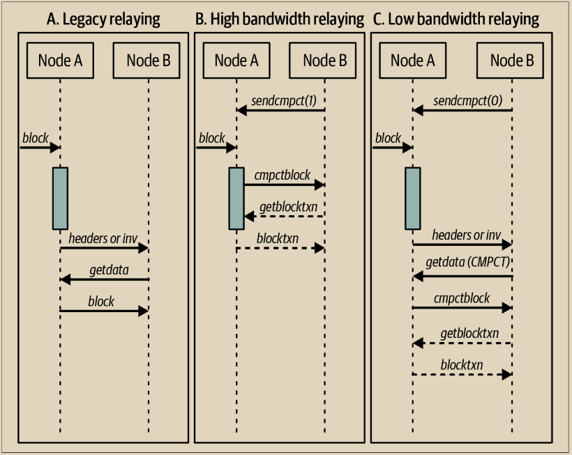

# 紧凑块传输

当矿工发现一个新的区块时，他们会向比特币网络（包括其他矿工）宣布。发现该区块的矿工可以立即在其上构建；尚未获知该区块的其他矿工将继续在前一个区块上构建，直到他们获知为止。

如果在他们获知新区块之前，其他矿工之一创建了一个区块，他们的区块将与第一个矿工的新区块竞争。只有一个区块会被包含在所有完整节点使用的区块链中，并且矿工只有在被广泛接受的区块中才能获得收益。

先有第二个区块构建在其上的任何一个区块获胜（除非有另一个接近平局的情况），这称为区块发现竞赛，在图10-1中进行了说明。区块发现竞赛使得最大的矿工获得了优势，因此它们与比特币的基本去中心化原则相矛盾。为了防止区块发现竞赛，并允许任何规模的矿工平等参与比特币挖矿的抽奖，极其有用的是尽量减少一个矿工宣布新区块与其他矿工接收到该区块之间的时间。

<figure><figcaption>
图 10-1. 需要挖矿竞赛的区块链分叉
</figcaption></figure>

\
2015年，比特币核心的一个新版本添加了一项名为紧凑块传输（在BIP152中指定）的功能，可以更快地传输新区块并减少带宽使用。

作为背景，中继未确认交易的完整节点也会将许多这些交易存储在其内存池中（参见第244页的“内存池和孤立池”）。当其中一些交易在新的区块中得到确认时，节点不需要再收到这些交易的副本。

紧凑块传输不再接收冗余的未确认交易，而是允许节点将每个交易发送一个短的6字节标识符。当您的节点收到一个或多个标识符的紧凑块时，它会检查其内存池中是否存在这些交易，并在找到时使用它们。对于在本地节点的内存池中找不到的任何交易，您的节点可以向对等方发送请求以获取副本。

相反，如果远程节点认为您的节点的内存池中没有某些在区块中出现的交易，它可以在紧凑块中包含这些交易的副本。例如，比特币核心始终发送一个区块的 Coinbase 交易。

如果远程节点猜对了您的节点在其内存池中有哪些交易，以及哪些交易没有，它将以几乎理论上可能的效率发送一个区块（对于典型的区块，其效率将在97%到99%之间）。


紧凑块传输并不会减小区块的大小。它只是防止了节点已经拥有的信息的冗余传输。当一个节点之前没有关于一个区块的信息，例如当一个节点首次启动时，它必须接收每个区块的完整副本。


比特币核心当前实现了两种发送紧凑块的模式，如图10-2所示：

\
**低带宽模式**&#x20;

当您的节点请求对等方使用低带宽模式时（默认情况下），该对等方将告知您的节点一个新区块的32字节标识符（头哈希），但不会向您的节点发送任何有关该区块的详细信息。如果您的节点首先从其他来源获取到该区块，这将避免浪费更多的带宽来获取该区块的冗余副本。如果您的节点确实需要该区块，它将请求一个紧凑块。

**高带宽模式**&#x20;

当您的节点请求对等方使用高带宽模式时，该对等方将在完全验证该区块的有效性之前，向您的节点发送一个新区块的紧凑块。该对等方进行的唯一验证是确保区块的头包含正确数量的工作证明。由于工作证明的生成成本昂贵（根据当前情况约为150,000美元），矿工不太可能伪造它只是为了浪费中继节点的带宽。在传输之前跳过验证允许新区块在网络中的每个跳点之间以最小的延迟传播。

高带宽模式的缺点是，您的节点很可能会从每个选择的高带宽对等方接收到冗余信息。截至目前，比特币核心目前只要求三个对等方使用高带宽模式（并尝试选择已经快速宣布区块历史的对等方）。

<figure><figcaption>
图 10-2.  BIP152模式比较（来自BIP152）。阴影条表示节点验证区块所需的时间。
</figcaption></figure>

这两种方法的名称（取自BIP152）可能有些令人困惑。低带宽模式通过在大多数情况下不发送区块来节省带宽。高带宽模式比低带宽模式使用更多的带宽，但在大多数情况下，比实施紧凑块之前的区块传输使用的带宽要少得多。
