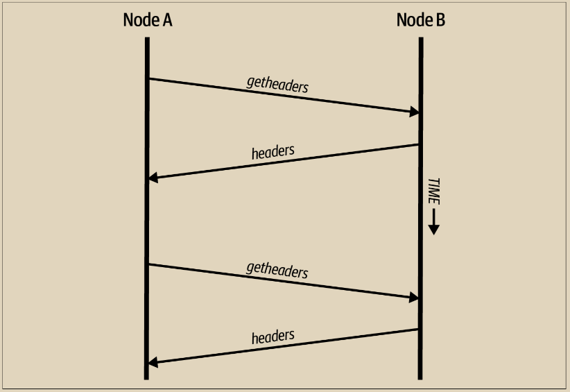

# 轻量级客户端

\
许多比特币客户端都设计用于空间和功耗受限的设备，比如智能手机、平板电脑或嵌入式系统。对于这些设备，使用一种简化的支付验证（SPV）方法，使它们能够在不验证完整区块链的情况下运行。这种类型的客户端称为轻量级客户端。

轻量级客户端仅下载区块头，不下载每个区块中包含的交易。没有交易的区块头链约比完整区块链小约 10,000 倍。轻量级客户端无法构建所有可用于支出的 UTXO 的完整图片，因为它们不知道网络上的所有交易。相反，它们使用略有不同的方法验证交易，依赖对等节点根据需求提供区块链相关部分的部分视图。

作为类比，全节点就像是身处陌生城市的游客，装备有每条街道和每个地址的详细地图。相比之下，轻量级客户端就像是身处陌生城市的游客，向随机的陌生人寻求逐步指示，而只知道一个主要大道。虽然两位游客都可以通过访问街道来验证其存在，但没有地图的游客不知道侧街上有什么，也不知道还有哪些其他街道。站在 23 Church Street 前，没有地图的游客无法知道城市中是否有十几个其他的“23 Church Street”地址，以及这是否是正确的地址。没有地图的游客最好的机会就是询问足够多的人，并希望其中一些人不是试图抢劫他。

轻量级客户端通过参考交易在区块链中的深度来验证交易。全节点将构建一个经过完全验证的数千个区块和数百万笔交易的链，一直向下（时间上）延伸到创世区块。轻量级客户端将验证所有区块的工作量证明（但不验证区块及其所有交易的有效性），并将该链与感兴趣的交易链接起来。

例如，当查看第 800,000 个区块中的交易时，全节点将验证自创世区块以来所有 800,000 个区块，并构建一个完整的 UTXO 数据库，通过确认交易存在且其输出仍未花费来验证交易的有效性。轻量级客户端只能验证交易是否存在。客户端使用 Merkle 路径将交易与包含它的区块建立关联。然后，轻量级客户端等待直到看到块 800,001 到 800,006 堆叠在包含该交易的块的上方，然后通过建立其位于块 800,006 到 800,001 下面的深度来验证它。网络中的其他节点接受区块 800,000 并且矿工们在其之上产生了六个以上的区块，通过代理证明交易确实存在。

轻量级客户端通常无法被说服相信某个交易确实存在于一个区块中，而事实上该交易并不存在。轻量级客户端通过请求 Merkle 路径证明并验证区块链中的工作量证明来确认一个交易在一个区块中的存在。然而，一个交易的存在可以对轻量级客户端“隐藏”。轻量级客户端确实可以验证一个交易存在，但不能验证某个交易，比如同一 UTXO 的双重花费，不存在，因为它没有所有交易的记录。这种漏洞可以被用于对轻量级客户端进行拒绝服务攻击或双重支付攻击。为了防御这一点，轻量级客户端需要随机连接到几个客户端，以增加与至少一个诚实节点接触的概率。这种随机连接的需要意味着轻量级客户端也容易受到网络分割攻击或 Sybil 攻击的影响，其中它们连接到虚假节点或虚假网络，并且无法访问诚实节点或真实的比特币网络。

对于许多实际目的来说，连接良好的轻量级客户端已经足够安全，实现了资源需求、实用性和安全性之间的平衡。然而，要实现绝对的安全性，运行一个全节点是无可替代的。&#x20;


全节点通过检查下面的成千上万个区块的整个链条来验证交易，以确保UTXO存在且未被花费，而轻量级客户端仅证明交易存在，并检查包含该交易的区块是否被其上方的少数区块所覆盖。


为了获取验证交易是否属于链的块头，轻量级客户端使用getheaders消息。响应的对等节点将使用单个headers消息发送最多2,000个块头。请参阅图10-5中的插图。

<figure><figcaption>
图 10-5. 轻量级客户端同步区块头
</figcaption></figure>

区块头允许轻量级客户端验证任何单个区块是否属于具有最多工作量证明的区块链，但它们并不告诉客户端哪些区块包含对其钱包有兴趣的交易。客户端可以下载每个区块并进行检查，但这将使用大量资源，相当于运行完整节点所需的资源的一部分，因此开发人员寻找其他解决方案。

\
在轻量级客户端引入不久后，比特币开发人员添加了一项名为布隆过滤器的功能，旨在减少轻量级客户端需要使用的带宽，以了解其传入和传出交易。布隆过滤器允许轻量级客户端接收交易的子集，而不直接透露它们感兴趣的确切地址，通过使用概率而不是固定模式的过滤机制。
