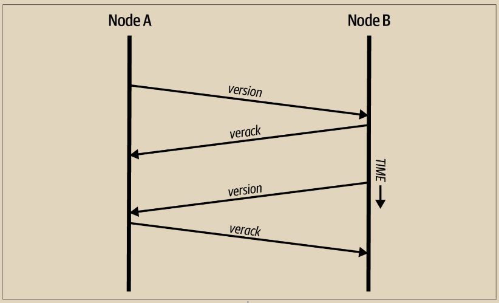
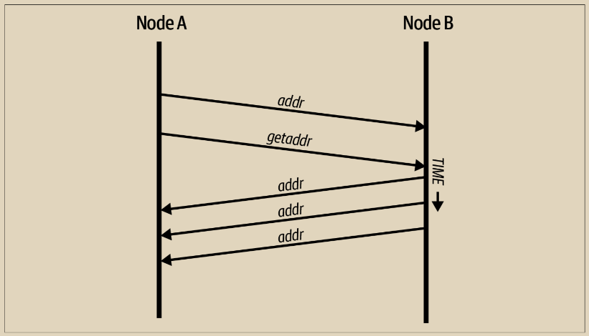

# 网络发现

当新节点启动时，它必须发现网络上的其他比特币节点才能参与其中。要启动此过程，新节点必须至少发现网络上的一个现有节点并连接到它。其他节点的地理位置无关紧要；比特币网络拓扑结构不是地理上定义的。因此，可以随机选择任何现有的比特币节点。&#x20;

要连接到已知的对等方，节点会建立一个TCP连接，通常连接到端口8333（通常被称为比特币使用的端口），或者如果提供了其他端口，则连接到替代端口。建立连接后，节点将通过发送版本消息（见图10-3）开始“握手”，该消息包含基本的识别信息，包括：

**版本（Version）：**

&#x20;      客户端“发言”的比特币P2P协议版本（例如，70002）

**本地服务（nLocalServices）：**

&#x20;      节点支持的本地服务列表

**时间（nTime）：**

&#x20;       当前时间

**addrYou：**

&#x20;       远程节点的IP地址，从本节点看到的

**addrMe：**

&#x20;       本地节点的IP地址，由本地节点发现的

**subver：**

&#x20;       显示在此节点上运行的软件类型的子版本（例如，/Satoshi:0.9.2.1/）

**最佳高度（BestHeight）：**

&#x20;        此节点区块链的块高度

**fRelay：**

&#x20;        由BIP37添加的字段，用于请求不接收未确认的交易

版本消息始终是任何对等方向另一个对等方发送的第一条消息。接收版本消息的本地对等方将检查远程对等方报告的版本，并决定远程对等方是否兼容。如果远程对等方是兼容的，则本地对等方将确认版本消息并通过发送verack建立连接。

新节点如何找到对等节点？第一种方法是使用一些DNS种子进行DNS查询，这些DNS种子是提供比特币节点IP地址列表的DNS服务器。其中一些DNS种子提供稳定的比特币监听节点的IP地址静态列表。一些DNS种子是BIND（Berkeley Internet Name Daemon）的自定义实现，它们从由网络爬虫或长时间运行的比特币节点收集的IP地址列表中返回随机子集。比特币核心客户端包含几个不同DNS种子的名称。不同DNS种子的所有权和实现的多样性为初始引导过程提供了高可靠性水平。在比特币核心客户端中，使用DNS种子的选项由选项开关-dnsseed控制（默认设置为1，以使用DNS种子）。&#x20;

另外，一个对网络一无所知的引导节点必须至少给出一个比特币节点的IP地址，之后它可以通过进一步的介绍建立连接。命令行参数-seednode可用于仅使用它作为种子进行介绍的连接到一个节点。在使用初始种子节点进行介绍后，客户端将与其断开连接并使用新发现的对等节点。

<figure><figcaption><p>图 10-3.  对等方之间的初始握手</p></figcaption></figure>

一旦建立了一个或多个连接，新节点将向其邻居发送一个包含自己 IP 地址的 addr 消息。邻居们将转发 addr 消息给它们的邻居，确保新连接的节点变得广为人知并且连接更加稳固。此外，新连接的节点可以向其邻居发送 getaddr，请求它们返回其他节点的 IP 地址列表。这样，一个节点就可以找到要连接的节点，并在网络上广告自己的存在，以便其他节点找到它。下图展示了地址发现协议。

<figure><figcaption><p>图 10-4.  地址传播和发现</p></figcaption></figure>

\
节点必须连接到几个不同的对等节点才能建立进入比特币网络的多样化路径。路径并不可靠 - 节点会不断加入和离开网络 - 因此节点必须在失去旧连接时继续发现新节点，并在引导其他节点时提供帮助。引导只需要连接到一个节点，因为第一个节点可以向其对等节点提供介绍，而这些对等节点可以提供进一步的介绍。连接到多个节点是不必要的，也是对网络资源的浪费。引导完成后，节点将记住其最近成功的对等节点连接，因此如果重新启动，它可以快速重新与其以前的对等网络建立连接。如果没有任何以前的对等节点响应其连接请求，则节点可以再次使用种子节点进行引导。

在运行比特币核心客户端的节点上，您可以使用命令 getpeerinfo 列出对等连接：

```
$ bitcoin - cli getpeerinfo
[{
	"id": 0,
	"addr": "82.64.116.5:8333",
	"addrbind": "192.168.0.133:50564",
	"addrlocal": "72.253.6.11:50564",
	"network": "ipv4",
	"services": "0000000000000409",
	"servicesnames": [
		"NETWORK",
		"WITNESS",
		"NETWORK_LIMITED"
	],
	"lastsend": 1683829947,
	"lastrecv": 1683829989,
	"last_transaction": 0,
	"last_block": 1683829989,
	"bytessent": 3558504,
	"bytesrecv": 6016081,
	"conntime": 1683647841,
	"timeoffset": 0,
	"pingtime": 0.204744,
	"minping": 0.20337,
	"version": 70016,
	"subver": "/Satoshi:24.0.1/",
	"inbound": false,
	"bip152_hb_to": true,
	"bip152_hb_from": false,
	"startingheight": 788954,
	"presynced_headers": -1,
	"synced_headers": 789281,
	"synced_blocks": 789281,
	"inflight": [],
	"relaytxes": false,
	"minfeefilter": 0.00000000,
	"addr_relay_enabled": false,
	"addr_processed": 0,
	"addr_rate_limited": 0,
	"permissions": [],
	"bytessent_per_msg": {
		...
	},
	"bytesrecv_per_msg": {
		...
	},
	"connection_type": "block-relay-only"
}, ]
```

要覆盖对等节点的自动管理并指定 IP 地址列表，用户可以提供选项 -connect= 并指定一个或多个 IP 地址。如果使用了此选项，则节点将只连接到选定的 IP 地址，而不会自动发现和维护对等连接。如果连接上没有流量，节点将定期发送消息以维持连接。

如果节点在某个连接上长时间没有通信，就会被认为已断开连接，并寻找一个新的对等节点。因此，网络会动态调整以适应短暂的节点和网络问题，并在没有任何中央控制的情况下根据需要有机地增长和收缩。
