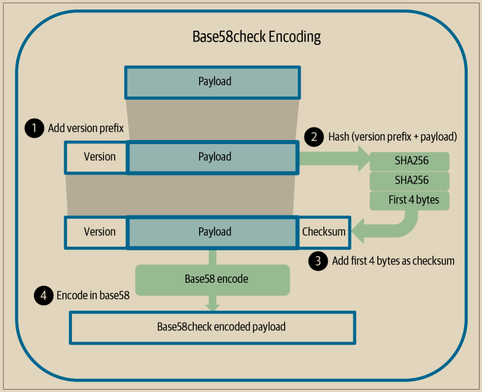
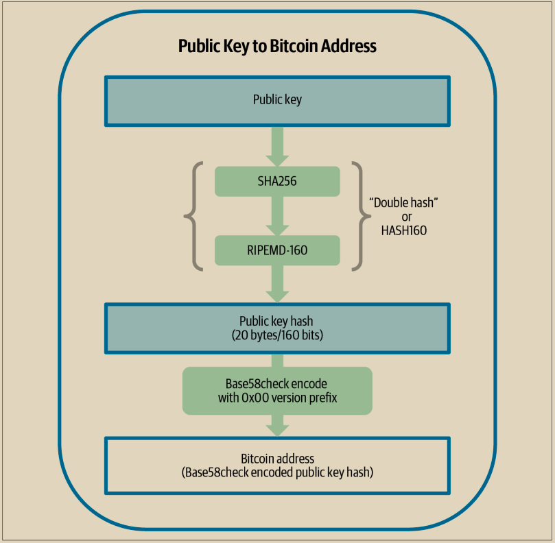

# Base58check编码

为了以紧凑的方式表示长数字，使用较少的符号，许多计算机系统使用基数高于10的混合字母数字表示。例如，传统的十进制系统使用10个数字，0到9，而十六进制系统使用16个数字，包括字母A到F作为另外六个符号。以十六进制格式表示的数字比等价的十进制表示更短。更紧凑的是，base64表示法使用26个小写字母，26个大写字母，10个数字，以及两个更多的字符，如“+”和“/”，用于在基于文本的媒体（例如电子邮件）上传输二进制数据。

Base58是与base64类似的编码，使用大写和小写字母以及数字，但省略了一些经常被误认为相同并且在某些字体中显示时看起来相同的字符。具体来说，base58是base64去掉了数字0，大写字母O，小写字母l，大写字母I以及符号“+”和“/”。或者更简单地说，它是一个不包含刚提到的四个字符（0、O、l、I）的小写字母、大写字母和数字集合。示例4-2显示了完整的base58字母表。

示例4-2. 比特币的base58字母表

123456789ABCDEFGHJKLMNPQRSTUVWXYZabcdefghijkmnopqrstuvwxyz

\
为了增加额外的安全性，防止输入错误或转录错误，base58check在base58字母表中包含了一个校验和。校验和是添加到正在编码的数据末尾的额外的四个字节。校验和是从编码数据的哈希派生出来的，因此可以用来检测转录和输入错误。当提供base58check代码时，解码软件将计算数据的校验和，并将其与代码中包含的校验和进行比较。如果两者不匹配，则引入了错误，base58check数据无效。这可以防止被误输入的比特币地址被钱包软件接受为有效的目标地址，否则会导致资金损失。

要将数据（一个数字）转换为base58check格式，首先我们要为数据添加一个前缀，称为“版本字节”，它用于轻松识别所编码的数据类型。例如，前缀零（十六进制中的0x00）表示数据应该用作传统P2PKH输出脚本中的承诺（哈希）。常见版本前缀列表如表4-1所示：

接下来，我们计算“双SHA”校验和，意思是我们在之前的结果（前缀与数据连接起来）上两次应用SHA256哈希算法：

checksum = SHA256(SHA256(prefix||data))

从结果得到的32字节哈希（哈希的哈希）中，我们只取前四个字节。这四个字节用作错误检查码或校验和。校验和附加到末尾。

结果由三个部分组成：一个前缀、数据和一个校验和。然后，使用先前描述的base58字母表对此结果进行编码。图4-6说明了base58check编码过程。

<figure><figcaption>
图 4-6.  Base58check编码：一种用于明确编码比特币数据的基于Base58、带版本和校验和的格式。
</figcaption></figure>

在比特币中，除了公钥承诺之外，其他数据也以base58check编码的方式呈现给用户，以使数据紧凑、易于阅读和易于检测错误。base58check编码中的版本前缀用于创建易于区分的格式，当以base58编码时，在base58check编码的有效负载的开头包含特定的字符。这些字符使人们能够轻松识别编码的数据类型以及如何使用它。例如，以1开头的base58check编码的比特币地址与以5开头的base58check编码的私钥钱包导入格式（WIF）是有区别的。示例版本前缀及其相应的base58字符如下表4-1所示:

表4-1. Base58check版本前缀和编码结果示例

<table><thead><tr><th width="393">类型</th><th>版本前缀（十六进制）</th><th>Base58 结果前缀</th></tr></thead><tbody><tr><td>Address for pay to public key hash (P2PKH)</td><td>0x00</td><td>1</td></tr><tr><td>Address for pay to script hash (P2SH)</td><td>0x05</td><td>3</td></tr><tr><td>Testnet Address for P2PKH</td><td>0x6F</td><td>m or n</td></tr><tr><td>Testnet Address for P2SH</td><td>0xC4</td><td>2</td></tr><tr><td>Private Key WIF</td><td>0x80</td><td>5, K, or L</td></tr><tr><td>BIP32 Extended Public Key</td><td>0x0488B21E</td><td>xpub</td></tr></tbody></table>

将公钥与基于哈希的承诺和base58check编码相结合，图4-7说明了将公钥转换为比特币地址的过程。

<figure><figcaption>
图 4-7.  公钥到比特币地址：将公钥转换为比特币地址的过程
</figcaption></figure>

