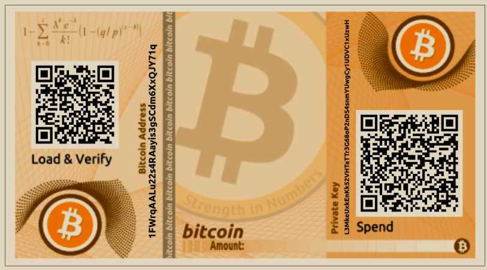

# 纸钱包

纸钱包是印在纸上的私钥。通常，纸钱包还包括相应的比特币地址以便使用，但这并非必要，因为地址可以从私钥派生出来。


纸钱包是一种已经过时的技术，对大多数用户来说是危险的。生成它们涉及许多微妙的陷阱，其中最重要的是生成代码可能被“后门”入侵。很多比特币就是这样被盗走的。这里仅仅展示纸钱包供信息参考，不应用于存储比特币。使用恢复码备份您的密钥，可能还可以使用硬件签名设备来存储密钥和签署交易。请勿使用纸钱包。


纸钱包有许多不同的设计和尺寸，具有许多不同的功能。图4-10显示了一个样品纸钱包。

<figure><figcaption>
图 4-10. 简单纸钱包的示例
</figcaption></figure>

\
有些纸钱包设计成礼物赠送，具有季节性主题，如圣诞节和新年。其他设计用于存放在银行保险箱或保险柜中，私钥以某种方式隐藏，可以使用不透明的刮开贴纸或折叠并用防篡改的粘贴铝箔密封。其他设计则包含私钥和地址的额外副本，形式类似于可拆卸的车票副本，允许您存储多个副本以防火灾、水灾或其他自然灾害。

从比特币最初的公钥设计到现代地址和脚本，如bech32m和支付到taproot，甚至是未来比特币升级的地址，您已经了解到比特币协议如何允许支付者识别应该接收他们支付的钱包。但当实际上是您的钱包接收支付时，您肯定希望确保即使发生了钱包数据丢失，您仍然能够访问这笔资金。在下一章中，我们将看看比特币钱包是如何设计来保护其资金免受各种威胁的。
