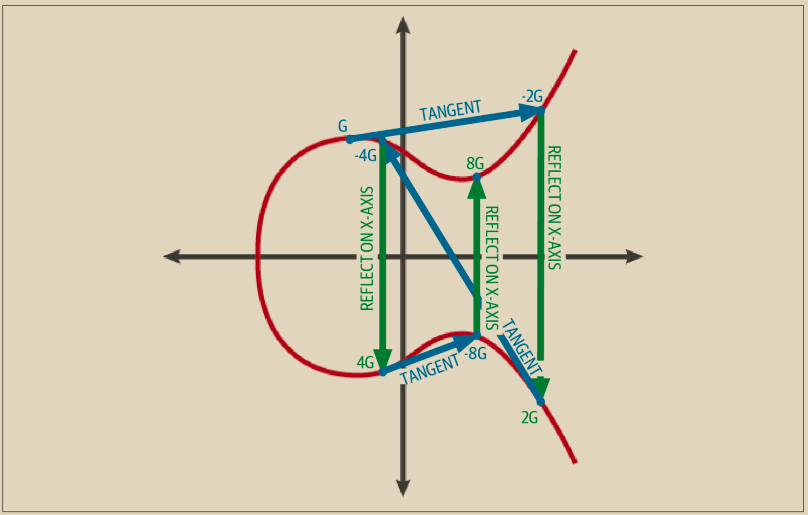

# 公钥

公钥是使用椭圆曲线乘法从私钥计算的，这是不可逆的过程：K = k × G，其中 k 是私钥，G 是一个称为生成点的常量点，而 K 是生成的公钥。反向操作称为“找到离散对数”——即在已知 K 的情况下计算 k，就像尝试所有可能的 k 值一样（即，进行穷举搜索）。在我们演示如何从私钥生成公钥之前，让我们稍微详细地了解一下椭圆曲线密码学。


椭圆曲线乘法是密码学家称之为“陷阱门”函数的一种类型：在一个方向上（乘法）很容易进行，而在相反方向（除法）则几乎不可能进行。拥有私钥的人可以轻松地创建公钥，然后将其与世界分享，因为他们知道没有人能够反转该函数并从公钥计算出私钥。这种数学技巧成为无法伪造和安全的数字签名的基础，证明对比特币资金的控制权。


从形式为随机生成的数字 k 的私钥开始，我们将其乘以曲线上的一个预定点，称为生成点 G，以在曲线上的其他位置生成另一个点，即相应的公钥 K。生成点作为 secp256k1 标准的一部分被指定，并且对比特币中的所有密钥始终是相同的：\


K = k × G

其中，k 是私钥，G 是生成点，而 K 是结果公钥，即曲线上的一个点。由于生成点对于所有比特币用户都是相同的，私钥 k 乘以 G 总是会得到相同的公钥 K。k 和 K 之间的关系是固定的，但只能在一个方向上计算，即从 k 到 K。这就是为什么比特币公钥（K）可以与任何人共享而不会暴露用户的私钥（k）。


私钥可以转换为公钥，但公钥不能转换回私钥，因为数学运算只能单向进行。


实现椭圆曲线乘法时，我们将之前生成的私钥 k 与生成点 G 相乘，以得到公钥 K：

这里G的坐标为(79BE667E F9DCBBAC 55A06295 CE870B07 029BFCDB 2DC28D9 59F2815B 16F81798, 483ADA77 26A3C465 5DA4FBFC 0E1108A8 FD17B448 A6855419 9C47D08F FB10D4B8)。由于椭圆曲线，只要知道点x轴坐标，就可以算出y轴坐标，但是由于y有正负两种。所以可以使用压缩表示。前缀02表示y为正的点，03表示y为负的点，04表示不压缩。像下面两种压缩表示都是一样的点坐标，但可以看出压缩后的02表示类型所需要的字节数差不多少了一半字节。

```
G_compressed = 02 79BE667E F9DCBBAC 55A06295 CE870B07 029BFCDB 2DCE28D9 59F2815B 16F81798
G_uncompressed = 04 79BE667E F9DCBBAC 55A06295 CE870B07 029BFCDB 2DCE28D9 59F2815B 16F81798 483ADA77 26A3C465 5DA4FBFC 0E1108A8 FD17B448 A6855419 9C47D08F FB10D4B8
```

K = 1E99423A4ED27608A15A2616A2B0E9E52CED330AC530EDCC32C8FFC6A526AEDD × G

公钥 K 被定义为点 K = (x, y)：

\
K = (x, y)

其中，

x = F028892BAD7ED57D2FB57BF33081D5CFCF6F9ED3D3D7F159C2E2FFF579DC341A&#x20;

y = 07CF33DA18BD734C600B96A72BBC4749D5141C90EC8AC328AE52DDFE2E505BDB&#x20;

为了可视化点与整数的乘法，我们将使用实数上的简单椭圆曲线——请记住，数学是一样的。我们的目标是找到生成点 G 的倍数 kG，这等同于将 G 加上自身，连续 k 次。在椭圆曲线中，将一个点加到它自身相当于在该点上画一条切线，并找到它再次与曲线相交的位置，然后将该点在 x 轴上反射。&#x20;

图 4-4 展示了在曲线上执行几何操作来得到 G、2G、4G 的过程。


许多比特币实现使用 libsecp256k1 加密库执行椭圆曲线数学运算。



<figure><figcaption><p>图 4-4.  椭圆曲线密码学：在椭圆曲线上将点 G 与整数 k 相乘的可视化示例。</p></figcaption></figure>

