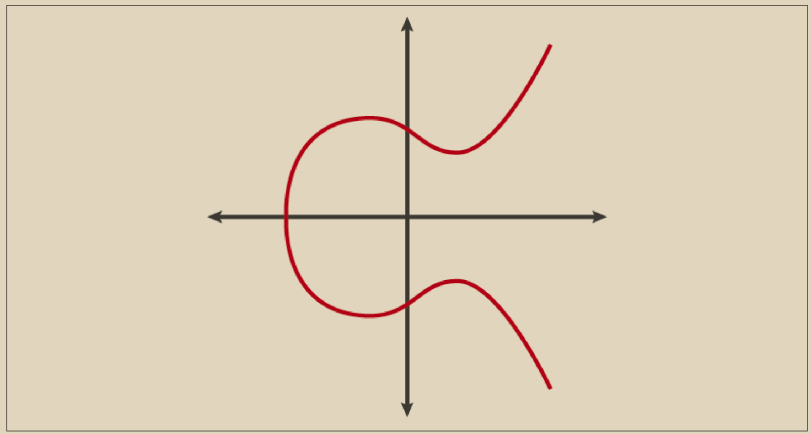
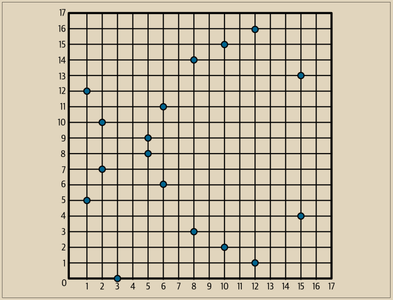

# 椭圆曲线密码学解释

椭圆曲线密码学（ECC）是一种基于离散对数问题的非对称或公钥密码学，其表达方式是通过椭圆曲线上的点的加法和乘法来实现的。&#x20;

图4-2是椭圆曲线的一个示例，类似于比特币使用的曲线。


<figure><figcaption><p>图 4-2.  一种椭圆曲线</p></figcaption></figure>

比特币使用一种特定的椭圆曲线和一组数学常数，这在一种称为secp256k1的标准中定义，该标准由美国国家标准与技术研究院（NIST）确定。 secp256k1曲线由以下函数定义，该函数产生一个椭圆曲线：

$$
y^2=(x^3+7) over (F_p)
$$

或者

$$
y^2\mod\  p  = (x^3 + 7) \mod \ p
$$

模 p（模质数 p）表示这个曲线是在一个素数 p 的有限域上，也写作 Fp，其中 p = 2^256 - 2^32 - 2^9 - 2^8 - 2^7 - 2^6 - 2^4 - 1，是一个非常大的素数。因为这个曲线是在一个素数的有限域上定义的，而不是在实数上，所以它看起来像是在二维空间中散布的点的模式，这使得它难以可视化。然而，数学上与实数上的椭圆曲线完全相同。举个例子，图 4-3 展示了相同的椭圆曲线在一个比较小的素数阶有限域 17 上的情况，显示了一个点在网格上的模式。Bitcoin 的 secp256k1 椭圆曲线可以看作是一个非常复杂的点模式在一个超大网格上。

<figure><figcaption><p>图 4-3.  椭圆曲线密码学：可视化椭圆曲线在 F(p) 上，其中 p=17。</p></figcaption></figure>

因此，例如，以下是 secp256k1 曲线上的坐标为 (x, y) 的点 P：

\
P = (55066263022277343669578718895168534326250603453777594175500187360389116729240, 32670510020758816978083085130507043184471273380659243275938904335757337482424)

Example 4-1 展示了如何使用 Python 自行验证这一点。

Example 4-1. 使用 Python 确认该点位于椭圆曲线上

```python
Python 3.10.6 (main, Nov 14 2022, 16:10:14) [GCC 11.3.0] on linux
Type "help", "copyright", "credits" or "license" for more information.
> p = 115792089237316195423570985008687907853269984665640564039457584007908834671663
> x = 55066263022277343669578718895168534326250603453777594175500187360389116729240
> y = 32670510020758816978083085130507043184471273380659243275938904335757337482424
> (x ** 3 + 7 - y**2) % p
0
```

在椭圆曲线数学中，有一个称为“无穷点”的点，大致对应于加法中的零。在计算机中，它有时以 x = y = 0 表示（虽然不满足椭圆曲线方程，但这是一个容易单独检查的简单情况）。

还有一个称为“加法”的 + 运算符，其性质与小学生学习的实数加法类似。给定椭圆曲线上的两点 P1 和 P2，有第三点 P3 = P1 + P2，也在椭圆曲线上。

几何上，第三点 P3 是通过在 P1 和 P2 之间画一条线来计算的。这条线将在椭圆曲线上的一个额外位置相交。将这一点称为 P3' =（x，y）。然后在 x 轴上反射以得到 P3 =（x，-y）。

有几种特殊情况解释了“无穷点”的必要性。如果 P1 和 P2 是相同的点，则“介于” P1 和 P2 之间的线应延伸成为此点 P1 上的切线。这条切线将在曲线上的一个新点上相交。您可以使用微积分技术确定切线的斜率。尽管我们将兴趣限制在具有两个整数坐标的曲线上的点，但这些技术奇迹般地奏效！

在某些情况下（即，如果 P1 和 P2 具有相同的 x 值但具有不同的 y 值），切线将正好是垂直的，此时 P3 = “无穷点”。

如果 P1 是“无穷点”，则 P1 + P2 = P2。同样，如果 P2 是无穷点，则 P1 + P2 = P1。这显示了无穷点起到了零的作用。

事实证明 + 是可结合的，这意味着（A + B）+ C = A +（B + C）。这意味着我们可以写出 A + B + C，而无需括号或模棱两可。

现在我们已经定义了加法，我们可以按照扩展加法的标准方式来定义乘法。对于椭圆曲线上的点 P，如果 k 是一个整数，则 kP = P + P + P + … + P（k 次）。请注意，在这种情况下，有时会令人困惑地称 k 为“指数”。
