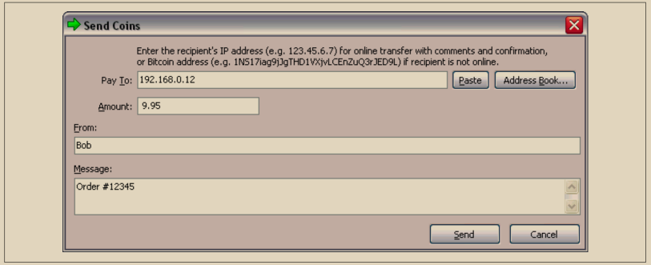

# IP 地址：比特币的原始地址（P2PK）

我们已经确定，Alice 可以通过将她的一些比特币分配给 Bob 的一个公钥来支付 Bob。但是，Alice 如何获得 Bob 的一个公钥呢？Bob 可以直接给她一份副本，但让我们再次看一下我们在“公钥”中使用的公钥。注意它非常长。想象一下 Bob 试图通过电话向 Alice 读取公钥的情景：

x = F028892BAD7ED57D2FB57BF33081D5CFCF6F9ED3D3D7F159C2E2FFF579DC341A&#x20;

y = 07CF33DA18BD734C600B96A72BBC4749D5141C90EC8AC328AE52DDFE2E505BDB

在比特币软件的早期版本中，允许支付者输入接收者的 IP 地址，如图 4-5 所示。这个功能后来被移除了——使用 IP 地址存在很多问题——但对它的快速描述将有助于我们更好地理解为什么某些特性可能被添加到比特币协议中。

<figure><figcaption>
图 4-5. 早期通过互联网档案馆发送比特币的截图。
</figcaption></figure>

如果Alice在比特币0.1中输入了Bob的IP地址，她的全节点将与他的全节点建立连接，并从Bob的钱包接收一个新的公钥，这个公钥以前从未给过任何人。这个新的公钥很重要，以确保支付给Bob的不同交易不能被某人通过查看区块链连接在一起，因为他们注意到所有交易都支付给了相同的公钥。

\
使用她的节点从Bob的节点接收的公钥，Alice的钱包将构造一个非常简单的输出脚本来支付：

\<Bob's public key> OP\_CHECKSIG

Bob稍后可以使用完全由他的签名组成的输入脚本来花费该输出：

\<Bob's signature>

为了弄清楚输出和输入脚本的作用，您可以将它们组合在一起（输入脚本在前），然后注意每个数据片段（用尖括号显示）都被放置在一个名为堆栈的项目列表的顶部。当遇到操作码（opcode）时，它使用来自堆栈的项目，从最顶部的项目开始。让我们看看从组合脚本开始是如何工作的：

\<Bob's signature> \<Bob's public key> OP\_CHECKSIG

\
对于这个脚本，Bob的签名被放置在堆栈上，然后Bob的公钥被放置在签名上面。OP\_CHECKSIG操作消耗两个元素，从公钥开始，接着是签名，将它们从堆栈中移除。它验证签名是否对应于公钥，并且对交易中的各个字段进行签名。如果签名正确，OP\_CHECKSIG会用值1替换自身在堆栈上的位置；如果签名不正确，它会用0替换自身。如果在评估结束时堆栈顶部有一个非零项，则脚本通过。如果交易中的所有脚本都通过，并且交易的所有其他细节都有效，则完整节点将认为该交易有效。

简而言之，前面的脚本使用了原始论文中描述的相同公钥和签名，但增加了两个脚本字段和一个操作码的复杂性。这似乎是多余的工作，但当我们看到接下来的部分时，我们将开始看到它的好处。

这种类型的输出今天被称为付给公钥，或简称为P2PK。它从未被广泛用于支付，而且几乎十年来没有任何广泛使用的程序支持IP地址支付。\
