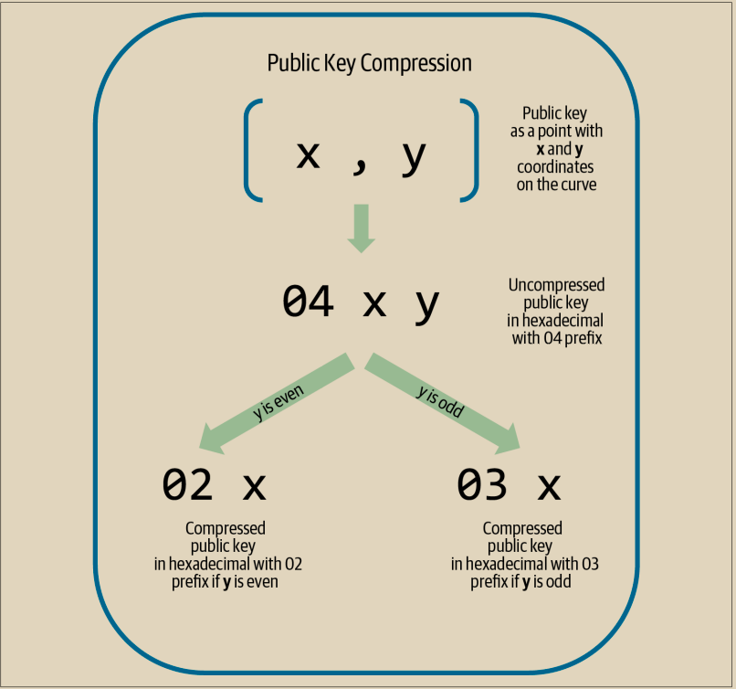

# 压缩公钥

当比特币刚被设计时，其开发者只知道如何创建 65 字节的公钥。然而，后来的一个开发者发现了一种只使用 33 字节的替代编码公钥的方法，而且这种方法与当时所有的比特币全节点都是向后兼容的，因此不需要改变比特币协议。这些 33 字节的公钥被称为压缩公钥，而原始的 65 字节的公钥被称为非压缩公钥。使用更小的公钥可以减小交易的大小，允许在同一个区块中进行更多的支付。&#x20;

正如我们在第 59 页的“公钥”部分中看到的那样，公钥是椭圆曲线上的一个点 (x, y)。因为曲线表示一个数学函数，曲线上的一个点代表了方程的一个解，因此如果我们知道 x 坐标，我们可以通过求解方程 y^2 mod p = (x^3 + 7) mod p 来计算出 y 坐标。这使得我们只需存储公钥点的 x 坐标，省略 y 坐标，从而减小了密钥的大小和存储它所需的空间，节省了 256 位的空间。在每个交易中几乎减小了 50% 的大小，随着时间的推移，节省了大量的数据！

&#x20;以下是我们在第 59 页的“公钥”部分创建的私钥生成的公钥：

x = F028892BAD7ED57D2FB57BF33081D5CFCF6F9ED3D3D7F159C2E2FFF579DC341A&#x20;

y = 07CF33DA18BD734C600B96A72BBC4749D5141C90EC8AC328AE52DDFE2E505BDB

同样的公钥可以表示为一个 520 位的数（130 个十六进制数字），带有前缀 04，后面跟着 x 和 y 坐标，格式为 04 x y：

K = 04F028892BAD7ED57D2FB57BF33081D5CFCF6F9ED3D3D7F159C2E2FFF579DC341A\\\
07CF33DA18BD734C600B96A72BBC4749D5141C90EC8AC328AE52DDFE2E505BDB

与未压缩的公钥以 04 作为前缀不同，压缩的公钥以 02 或 03 作为前缀。让我们看看为什么会有两个可能的前缀：因为等式的左侧是 y2，所以 y 的解是一个平方根，可以有正值或负值。从视觉上看，这意味着得到的 y 坐标可以在 x 轴上方或下方。正如您从图 4-2 中的椭圆曲线图中所看到的那样，曲线是对称的，这意味着它像镜子一样被 x 轴反射。因此，虽然我们可以省略 y 坐标，但我们必须存储 y 的符号（正或负）；换句话说，我们必须记住它是否在 x 轴上方或下方，因为这两种选项代表不同的点和不同的公钥。在二进制算术上计算素数阶 p 的有限域上的椭圆曲线时，y 坐标要么是偶数，要么是奇数，这对应于前面解释的正负号。因此，为了区分 y 的两个可能值，如果 y 是偶数，则存储带有前缀 02 的压缩公钥，如果 y 是奇数，则存储带有前缀 03 的压缩公钥，从而使软件能够从 x 坐标推断出 y 坐标，并将公钥展开为点的完整坐标。公钥压缩如图 4-8 所示。

<figure><figcaption>
图 4-8. 公钥压缩
</figcaption></figure>

这里是与在第59页生成的相同的公钥，显示为压缩的公钥，以264位（66个十六进制数字）存储，并带有前缀03，表示y坐标为奇数：

K = 03F028892BAD7ED57D2FB57BF33081D5CFCF6F9ED3D3D7F159C2E2FFF579DC341A

\
这个压缩的公钥对应于相同的私钥，意味着它是由相同的私钥生成的。然而，它与未压缩的公钥看起来不同。更重要的是，如果我们将这个压缩的公钥转换为一个承诺，使用HASH160函数（RIPEMD160(SHA256(K))），它将产生一个不同的承诺，而不是未压缩的公钥，从而导致不同的地址。这可能会让人困惑，因为这意味着一个单一的私钥可以产生以两种不同格式（压缩和未压缩）表示的公钥，从而产生两个不同的比特币地址。然而，私钥对于两个比特币地址是相同的。

几乎所有比特币软件现在默认使用压缩的公钥，并且在稍后的协议升级中添加了某些新功能时需要使用压缩的公钥。

然而，一些软件仍然需要支持未压缩的公钥，比如从旧钱包导入私钥的钱包应用程序。当新钱包扫描区块链以查找旧的P2PKH输出和输入时，它需要知道是扫描65字节的密钥（以及这些密钥的承诺）还是33字节的密钥（以及它们的承诺）。如果没有扫描正确的类型，用户可能无法花费他们的全部余额。为了解决这个问题，当私钥从钱包中导出时，在新的比特币钱包中使用的WIF有所不同，以指示这些私钥已被用于生成压缩的公钥。
