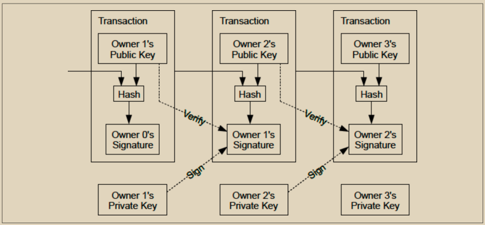

# 综合介绍

\
Alice想向Bob支付比特币，但成千上万的比特币全节点将验证她的交易，这些节点不知道Alice或Bob的真实身份，我们希望保持这种状态以保护他们的隐私。Alice需要传达的是，Bob应该收到她的一些比特币，但不应将该交易的任何方面与Bob的真实世界身份或Bob收到的其他比特币支付联系起来。Alice使用的方法必须确保只有Bob能进一步花费他收到的比特币。

最初的比特币论文描述了一种实现这些目标的非常简单的方案，如图4-1所示。

<figure><figcaption>
图 4-1.  原始比特币论文中的交易链。
</figcaption></figure>

像Bob这样的接收者接受由花费者（如Alice）签名的交易中的比特币到一个公钥。Alice要花费的比特币之前是通过她的一个公钥接收到的，她使用相应的私钥生成她的签名。全节点可以验证Alice的签名是否承诺给出一个哈希函数的输出，该哈希函数本身承诺给出Bob的公钥和其他交易细节。

我们将在本章中讨论公钥、私钥、签名和哈希函数，然后将它们全部结合起来描述现代比特币软件使用的地址。
