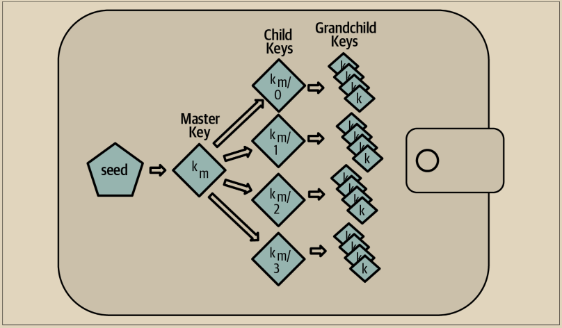

# 分层确定性(HD)密钥生成(BIP32)

我们所知道的每个现代比特币钱包默认都使用分层确定性（HD）密钥生成。这个标准在BIP32中定义，使用确定性密钥生成和可选的公共子密钥派生算法，生成一组密钥的树。在这个树中，任何密钥都可以是一系列子密钥的父密钥，而这些子密钥中的任何一个都可以是另一系列子密钥（原始密钥的子孙）的父密钥。树的深度没有任何任意限制。这种树结构如图5-3所示

<figure><figcaption>
图 5-3. HD钱包：从单个种子生成的密钥树
</figcaption></figure>

\
树结构可以用来表示额外的组织含义，比如特定的子密钥分支用于接收传入付款，另一个分支用于接收传出付款的找零。密钥的分支也可以在企业设置中使用，将不同的分支分配给部门、子公司、特定功能或会计类别。

我们将在“从种子创建HD钱包”一节中进行对HD钱包的详细探讨。
