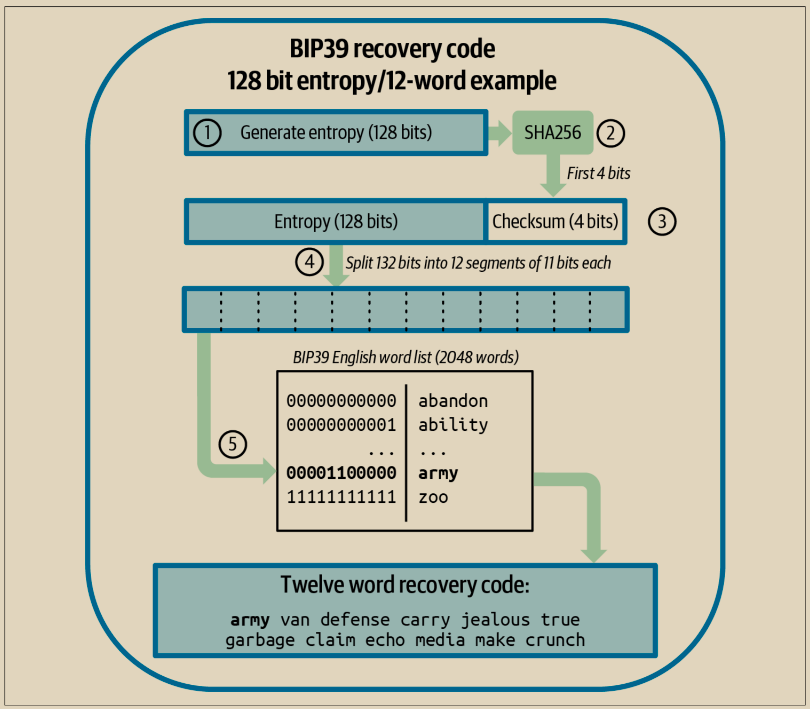
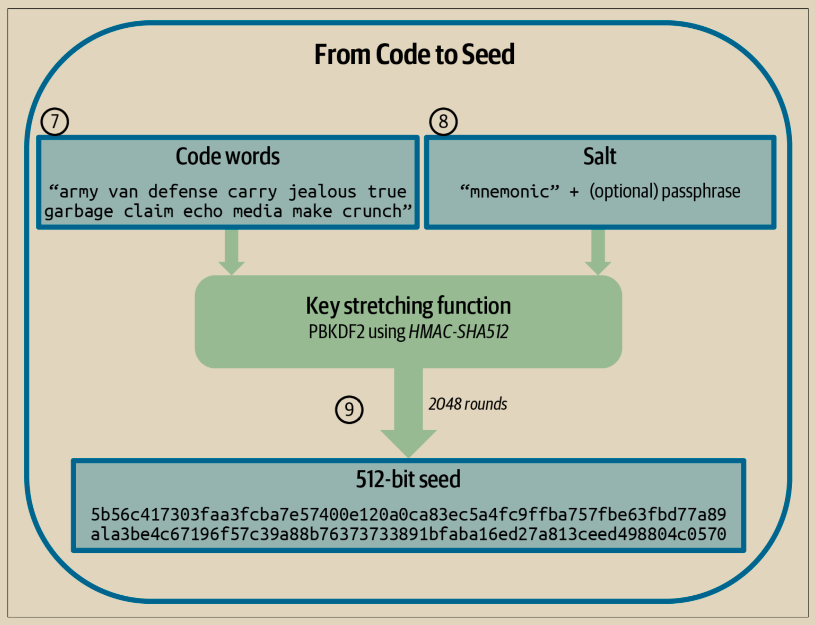

# BIP39恢复码

BIP39恢复代码是表示（编码）用作种子的随机数的单词序列，用于派生确定性钱包。这个单词序列足以重新创建种子，从而重新创建所有派生密钥。实现了具有BIP39恢复代码的确定性钱包的钱包应用程序在首次创建钱包时会向用户显示一个由12到24个单词组成的序列。这个单词序列是钱包的备份，可以用来在相同或任何兼容的钱包应用程序中恢复和重新创建所有密钥。恢复代码使用户更容易备份，因为它们易于阅读和正确转录。


恢复代码经常与“脑钱包”混淆。它们并不相同。主要区别在于脑钱包由用户选择的单词组成，而恢复代码是由钱包随机创建并呈现给用户的。这个重要区别使得恢复代码更加安全，因为人类是非常不好的随机源。


\
请注意，BIP39是恢复代码标准的一种实现。BIP39由Trezor硬件钱包背后的公司提出，并与许多其他钱包应用兼容，尽管肯定不是所有钱包都兼容。

BIP39定义了恢复代码和种子的创建过程，我们在这里分成两部分描述，步骤1到6在“生成恢复代码”中展示，步骤7到9在“从恢复代码到种子”中展示。

## 生成恢复码

恢复代码是由钱包应用程序使用BIP39中定义的标准化流程自动生成的。钱包从熵源开始，添加一个校验和，然后将熵映射到一个单词列表中：

1. 创建一个128到256位的随机序列（熵）。
2. 通过取其SHA256哈希的前（熵长度/32）位来创建随机序列的校验和。
3. 将校验和添加到随机序列的末尾。
4. 将结果分割成11位长度的段。
5. 将每个11位值映射到预定义的2,048个单词字典中的一个单词。
6. 恢复代码是单词序列。

&#x20;图5-4显示了熵是如何用来生成BIP39恢复代码的。

<figure><figcaption>
图 5-4. 生成熵并将其编码为恢复代码
</figcaption></figure>

表5-4显示了熵数据的大小与恢复代码长度（以字为单位）之间的关系。&#x20;

表5-4. BIP39：熵和字长度

| 熵(比特数) | 校验码(比特数) | 熵+校验码(比特数) | 恢复码单词数 |
| ------ | -------- | ---------- | ------ |
| 128    | 4        | 132        | 12     |
| 160    | 5        | 165        | 15     |
| 192    | 6        | 198        | 18     |
| 224    | 7        | 231        | 21     |
| 256    | 8        | 264        | 24     |

## 从恢复码到种子

恢复码代表长度为 128 到 256 位的熵。然后使用熵通过密钥拉伸函数 PBKDF2 派生一个更长的（512 位）种子。生成的种子然后用于构建确定性钱包并派生其密钥。

密钥拉伸函数接受两个参数：熵和盐。盐在密钥拉伸函数中的目的是使构建查找表以进行暴力攻击变得困难。在 BIP39 标准中，盐还有另一个目的——它允许引入一个密码短语，作为额外的安全因素来保护种子，我们将在“BIP39 中的可选密码短语”（第 107 页）中更详细地描述。


密钥拉伸函数，具有 2,048 轮哈希，使使用软件进行暴力攻击恢复码变得稍微困难一些。特殊用途硬件没有受到明显影响。对于需要猜测用户完整恢复码的攻击者来说，代码长度（至少 128 位）提供了足够的安全性。但是对于攻击者可能了解用户代码的一小部分的情况，密钥拉伸通过减慢攻击者检查不同恢复码组合的速度，增加了一些安全性。即使在将近十年前首次发布时，BIP39 的参数也被现代标准认为是脆弱的，尽管这可能是为了与低功耗 CPU 的硬件签名设备兼容而设计的后果。一些替代方案使用更强大的密钥拉伸参数，例如 Aezeed 的 32,768 轮哈希使用更复杂的 Scrypt 算法，尽管它们可能在硬件签名设备上运行时不太方便


\
步骤7至9描述的过程是从前文“生成恢复代码”中描述的过程继续的：

&#x20; 7\. PBKDF2密钥拉伸函数的第一个参数是步骤6生成的熵。

8. PBKDF2密钥拉伸函数的第二个参数是盐。盐由字符串常量“助记词”与可选的用户提供的密码字符串连接而成。
9. PBKDF2使用HMAC-SHA512算法对恢复代码和盐参数进行2048轮哈希拉伸，生成一个512位的值作为其最终输出。这个512位的值就是种子。&#x20;

图5-5展示了如何使用恢复代码生成种子。

<figure><figcaption>
图 5-5. 从恢复码到种子
</figcaption></figure>

表5-5、5-6和5-7显示了一些恢复代码及其生成的种子的示例。&#x20;

表5-5. 128位熵BIP39恢复代码，无口令，生成的种子

| 类型         | 示例                                                                                                                                |
| ---------- | --------------------------------------------------------------------------------------------------------------------------------- |
| 熵输入(128比特) | 0c1e24e5917779d297e14d45f14e1a1a                                                                                                  |
| 恢复码(12个单词) | army van defense carry jealous true garbage claim echo media make crunch                                                          |
| 密码         | 无                                                                                                                                 |
| 种子(512比特)  | 5b56c417303faa3fcba7e57400e120a0ca83ec5a4fc9ffba757fbe63fbd77a89a1a3be4 c67196f57c39a88b76373733891bfaba16ed27a813ceed498804c0570 |

表 5-6. 128位熵BIP39恢复代码，带有口令，生成的种子

| 类型         | 示例                                                                                                                                |
| ---------- | --------------------------------------------------------------------------------------------------------------------------------- |
| 熵输入(128比特) | 0c1e24e5917779d297e14d45f14e1a1a                                                                                                  |
| 恢复码(12个单词) | army van defense carry jealous true garbage claim echo media make crunch                                                          |
| 密码         | SuperDuperSecret                                                                                                                  |
| 种子(512比特)  | 3b5df16df2157104cfdd22830162a5e170c0161653e3afe6c88defeefb0818c793dbb28 ab3ab091897d0715861dc8a18358f80b79d49acf64142ae57037d1d54 |

表 5-7. 256位熵BIP39恢复代码，无口令，生成的种子

| 类型         | 示例                                                                                                                                                  |
| ---------- | --------------------------------------------------------------------------------------------------------------------------------------------------- |
| 熵输入(256比特) | 2041546864449caff939d32d574753fe684d3c947c3346713dd8423e74abcf8c                                                                                    |
| 恢复码(24个单词) | cake apple borrow silk endorse fitness top denial coil riot stay wolf luggage oxygen faint major edit measure invite love trap field dilemma oblige |
| 密码         | 无                                                                                                                                                   |
| 种子(512比特)  | 3269bce2674acbd188d4f120072b13b088a0ecf87c6e4cae41657a0bb78f5315b33b3 a04356e53d062e55f1e0deaa082df8d487381379df848a6ad7e98798404                   |

> **需要多少熵？**
>
> BIP32允许种子从128位到512位。BIP39接受从128位到256位的熵；Electrum v2接受132位熵；Aezeed接受128位熵；SLIP39接受128位或256位熵。这些数字的变化使得确定安全所需的熵量变得不清晰。我们将尝试澄清这一点。&#x20;
>
> BIP32扩展私钥由256位密钥和256位链代码组成，总共512位。这意味着最多有2512个不同的可能扩展私钥。如果您的熵超过512位，您仍将获得包含512位熵的扩展私钥，因此即使我们提到的任何标准允许这样做，也没有使用超过512位的必要。&#x20;
>
> 然而，即使有2512个不同的扩展私钥，也只有(稍少于)2256个常规私钥——而实际上正是这些私钥保护了您的比特币。这意味着，如果您的种子使用了超过256位的熵，您仍然会得到仅包含256位熵的私钥。可能会有未来与比特币相关的协议，在这些协议中，扩展密钥中的额外熵提供额外的安全性，但目前并非如此。&#x20;
>
> 比特币公钥的安全强度为128位。使用经典计算机（截至目前，这是唯一可以进行实际攻击的计算机）的攻击者需要对比特币的椭圆曲线执行约2^128次操作，以找到另一个用户的公钥的私钥。128位的安全强度意味着在使用128位熵以上的熵时没有明显的好处（尽管您需要确保您生成的私钥在整个2^256范围内均匀选择）。&#x20;
>
> 更大熵的一个额外好处是：如果攻击者看到了恢复代码的固定百分比（但不是整个代码），那么熵越大，他们就越难以弄清楚他们没有看到的代码的部分。例如，如果攻击者看到了128位代码的一半（64位），则他们可能会能够破解剩余的64位。如果他们看到了256位代码的一半（128位），则他们不太可能能够破解另一半。我们不建议依赖这种防御——要么将您的恢复代码保管得非常安全，要么使用像SLIP39这样的方法，让您将恢复代码分布到多个位置，而不依赖于任何单个代码的安全性。&#x20;
>
> 截至2023年，大多数现代钱包为其恢复代码生成128位熵（或接近128位的值，例如Electrum v2的132位）。

## BIP39可选口令

\
BIP39标准允许在生成种子的派生过程中使用可选的口令。如果没有使用口令，恢复代码将与由常量字符串“mnemonic”组成的盐一起进行拉伸，从而从给定的任何恢复代码生成特定的512位种子。如果使用口令，则拉伸函数将从相同的恢复代码生成不同的种子。事实上，对于单个恢复代码，每个可能的口令都会导致不同的种子。基本上，不存在“错误”的口令。所有口令都是有效的，并且它们都导致不同的种子，形成了一个庞大的可能未初始化的钱包集合。可能的钱包集合如此之大（2^512），以至于没有实际可能性对其进行穷举或意外猜测使用中的钱包。


在BIP39中，不存在“错误”的口令。每个口令都会导致某个钱包，除非该钱包之前已被使用，否则该钱包将为空。


\
可选的口令创建了两个重要的功能：

* 第二因素（记忆的东西），使得仅凭恢复码无法单独使用，从而保护恢复码免受随意窃贼的威胁。为了防止技术娴熟的窃贼，您需要使用一个非常强大的口令。
* 可以提供一种合理的否认或“胁迫钱包”，其中选定的口令导致一个只包含少量资金的钱包，用于转移攻击者对“真实”钱包的注意力，而“真实”钱包包含了大部分资金。&#x20;

需要注意的是，使用口令也会引入丢失的风险：

* 如果钱包所有者丧失能力或去世，而没有其他人知道口令，那么种子就无法使用，钱包中存储的所有资金都将永远丢失。
* 相反，如果所有者将口令备份在与种子相同的地方，那么就失去了第二因素的作用。&#x20;

虽然口令非常有用，但应仅与备份和恢复的精心计划流程结合使用，考虑到可能存活的所有者并允许其家人恢复加密货币资产的可能性。
