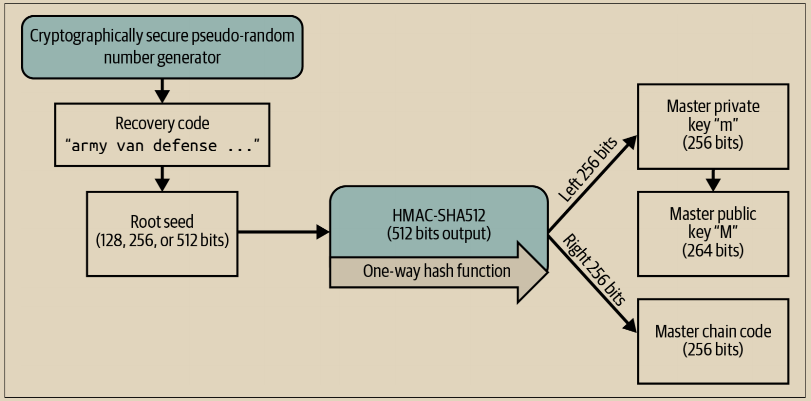
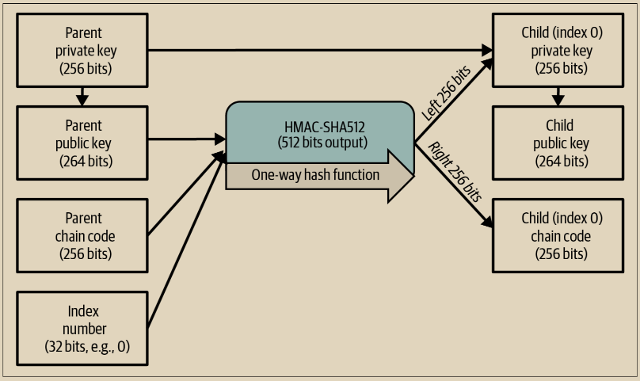
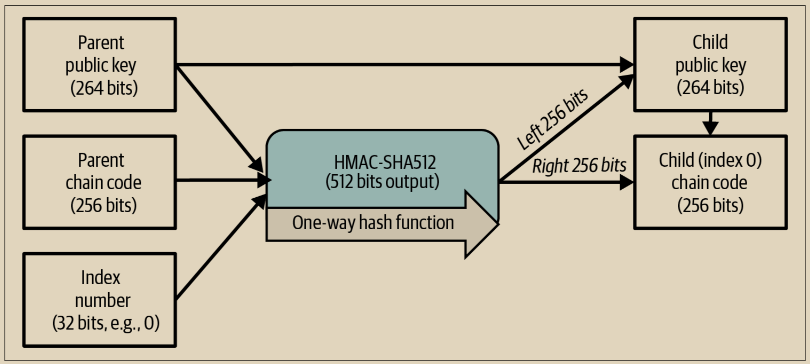

# 从种子创建HD钱包

HD钱包是从单个根种子创建的，该种子是一个128位、256位或512位的随机数。通常情况下，这个种子是通过前面部分详细介绍的恢复码生成或解密的。

HD钱包中的每个密钥都是从这个根种子确定性地派生出来的，这使得在任何兼容的HD钱包中都可以从该种子重新创建整个HD钱包。这使得通过仅转移从根种子派生的恢复码，即可轻松备份、恢复、导出和导入包含数千甚至数百万个密钥的HD钱包。创建HD钱包的主密钥和主链码的过程如图5-6所示。\

<figure><figcaption>
图 5-6. 从根种子创建主密钥和链码
</figcaption></figure>

根种子被输入到HMAC-SHA512算法中，生成的哈希用于创建一个主私钥（m）和一个主链码（c）。

主私钥（m）然后使用正常的椭圆曲线乘法过程 m × G 生成相应的主公钥（M），就像我们在“公钥”中看到的一样。

主链码（c）用于在从父密钥创建子密钥的函数中引入熵，正如我们将在下一节中看到的那样。

## 子私钥派生

\
HD钱包使用子密钥派生（CKD）函数从父密钥派生子密钥。

子密钥派生函数基于一种单向哈希函数，结合了：

* 父私钥或公钥（未压缩密钥）
* 一个称为链码的种子（256位）
* 一个索引号（32位）

链码用于在过程中引入确定性随机数据，因此仅知道索引和一个子密钥不足以推导出其他子密钥。仅知道一个子密钥也不足以找到它的兄弟，除非你也有链码。初始链码种子（在树的根部）由种子生成，而后续的子链码从每个父链码派生而来。

这三个项目（父密钥、链码和索引）被组合并进行哈希处理以生成子密钥，具体如下所示。

父公钥、链码和索引号被组合并使用HMAC-SHA512算法进行哈希处理，生成512位哈希。这512位哈希被分成两个256位的半部分。哈希输出的右半部分256位成为子的链码。哈希的左半部分256位被添加到父私钥上，生成子私钥。在图5-7中，我们看到了这个过程的示例，将索引设置为0以生成父的“零”（按索引排序的第一个）子密钥。

<figure><figcaption>
图 5-7.  扩展父私钥以创建子私钥
</figcaption></figure>

更改索引使我们能够扩展父节点并创建序列中的其他子节点（例如，Child 0、Child 1、Child 2 等）。每个父密钥可以拥有 2,147,483,647（2^31）个子节点（2^31 是整个 2^32 范围的一半，因为另一半保留用于我们稍后将在本章中讨论的一种特殊派生类型）。&#x20;

重复此过程一级下来，每个子节点可以进一步成为一个父节点，并创建自己的子节点，以无限的代数。

## 使用派生子私钥

子私钥与不确定性（随机）密钥无法区分。 因为派生函数是一个单向函数，所以子密钥不能用于找到父密钥。子密钥也不能用于找到任何兄弟节点。如果你有第 n 个子节点，你无法找到它的兄弟节点，比如第 n-1 个子节点或第 n+1 个子节点，或者序列中的其他任何子节点。只有父密钥和链码才能派生出所有的子节点。如果没有子链码，子密钥也不能用于派生任何孙节点。您需要子私钥和子链码才能启动一个新的分支并派生出孙子节点。

&#x20;那么子私钥单独能用来做什么呢？它可以用来生成公钥和比特币地址。然后，它可以用来签署交易以花费支付给该地址的任何内容。


子私钥、对应的公钥和比特币地址与随机创建的密钥和地址完全相同。它们属于一个序列的事实在创建它们的 HD 钱包功能之外是不可见的。一旦创建，它们的操作方式与“普通”密钥完全相同。


## 扩展密钥

正如我们之前所见，密钥派生函数可以根据三个输入在树的任何级别上创建子级，这三个输入是：一个密钥、一个链码和所需子级的索引。这两个基本要素是密钥和链码，它们的组合称为扩展密钥。术语“扩展密钥”也可以被视为“可扩展密钥”，因为这样的密钥可以用来派生子级。

扩展密钥简单地存储和表示为密钥和链码的串联。有两种类型的扩展密钥。扩展私钥是私钥和链码的组合，可用于派生子私钥（以及从中派生的子公钥）。扩展公钥是公钥和链码，可用于创建子公钥（仅公钥），如第59页的“公钥”中描述的。

将扩展密钥视为 HD 钱包树结构中分支的根。有了分支的根，您可以派生出分支的其余部分。扩展私钥可以创建完整的分支，而扩展公钥只能创建公钥分支。

扩展密钥使用 base58check 进行编码，以便在不同的 BIP32 兼容钱包之间轻松导出和导入。扩展密钥的 base58check 编码使用特殊的版本号，在编码为 base58 字符时会生成前缀“xprv”和“xpub”，以使其易于识别。因为扩展密钥包含的字节比常规地址多得多，所以它也比我们之前见过的其他 base58check 编码字符串长得多。

这里是一个扩展私钥的 base58check 编码示例：

xprv9tyUQV64JT5qs3RSTJkXCWKMyUgoQp7F3hA1xzG6ZGu6u6Q9VMNjGr67Lctvy5P8oyaYAL9CA WrUE9i6GoNMKUga5biW6Hx4tws2six3b9c

这是相应的扩展公钥，使用base58check编码：

xpub67xpozcx8pe95XVuZLHXZeG6XWXHpGq6Qv5cmNfi7cS5mtjJ2tgypeQbBs2UAR6KECeeMVKZBP LrtJunSDMstweyLXhRgPxdp14sk9tJPW9

## 公钥子派生

正如前面提到的，HD钱包的一个非常有用的特性是能够从公钥父级键派生公钥子级键，而无需私钥。这使我们有两种方式来派生子公钥：要么从子私钥，要么直接从父公钥。

因此，扩展公钥可以用来派生该HD钱包结构分支中的所有公钥（仅限公钥）。

这种快捷方式可用于创建仅公钥的部署，其中服务器或应用程序具有扩展公钥的副本，但完全没有私钥。这种部署方式可以产生无限数量的公钥和比特币地址，但不能花费发送到这些地址的任何资金。同时，在另一个更安全的服务器上，扩展私钥可以派生所有相应的私钥来签署交易并花费资金。

这种解决方案的一个常见应用是在提供电子商务应用程序的Web服务器上安装扩展公钥。Web服务器可以使用公钥派生函数为每笔交易（例如，为客户购物车）创建一个新的比特币地址。Web服务器将不具有可能被盗的私钥。没有HD钱包，唯一的方法是在一个单独的安全服务器上生成数千个比特币地址，然后预加载它们到电子商务服务器上。这种方法繁琐，并且需要不断维护，以确保电子商务服务器不会“用完”密钥。

> **注意间隙**&#x20;
>
> 扩展公钥可以生成大约40亿个直接子密钥，远远超过任何商店或应用程序可能需要的数量。然而，一个钱包应用程序要生成所有40亿个密钥并扫描区块链以查找涉及这些密钥的交易，需要的时间是不合理的。因此，大多数钱包一次只生成几个密钥，扫描涉及这些密钥的支付，并在使用之前的密钥时按顺序生成更多的密钥。例如，Alice的钱包生成100个密钥。当它看到对第一个密钥的支付时，它会生成第101个密钥。 有时，一个钱包应用程序会向某人分发一个密钥，后来决定不支付，从而在密钥链中创建一个间隙。只要钱包在间隙之后已经生成了密钥，以便找到后续的支付并继续生成更多的密钥，这是可以接受的。连续未收到支付的最大未使用密钥数量而不会引起问题称为间隙限制。 当一个钱包应用程序已经分发了所有的密钥直到它的间隙限制，而且这些密钥都没有收到支付时，它有三个选项来处理未来请求的新密钥：
>
> 1. 它可以拒绝请求，阻止其接收任何进一步的支付。这显然是一个不受欢迎的选项，尽管它是最简单的实现方式。
> 2. 它可以生成超出间隙限制的新密钥。这样确保每个请求支付的人都获得一个唯一的密钥，防止地址重用并提高隐私。然而，如果需要从恢复代码中恢复钱包，或者如果钱包所有者正在使用加载了相同扩展公钥的其他软件，那么这些其他钱包将看不到扩展间隙之后收到的任何支付。
> 3. 它可以分发先前分发的密钥，确保平稳恢复，但可能降低钱包所有者和与其交易的人的隐私。
>
> &#x20;在线商户的开源生产系统，例如BTCPay Server，试图通过使用非常大的间隙限制和限制生成发票的速率来回避这个问题。其他解决方案已经被提出，例如在支付者收到实际交易的新地址之前，要求支付者的钱包构建（但不广播）一笔向可能重用的地址支付的交易。然而，截至目前，这些其他解决方案尚未在生产中使用。

另一个常见的应用是用于冷存储或硬件签名设备。在这种情况下，扩展私钥可以存储在纸钱包或硬件设备上，而扩展公钥可以在线上保存。用户可以随意创建“接收”地址，而私钥则安全地存储在离线状态下。要花费资金，用户可以在离线软件钱包应用程序或硬件签名设备上使用扩展私钥。图5-8说明了将父公钥扩展以派生子公钥的机制。

<figure><figcaption>
图 5-8. 扩展父公钥以创建子公钥
</figcaption></figure>
