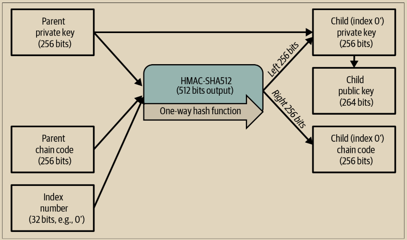

# 在网络商店使用扩展公钥

让我们通过看看加布里埃尔的网络商店来了解HD钱包是如何使用的。

加布里埃尔最初是抱着兴趣的心态建立了他的网络商店，基于一个简单的托管的WordPress页面。他的商店非常基础，只有几个页面和一个带有单一比特币地址的订单表单。

加布里埃尔使用他的常规钱包生成的第一个比特币地址作为他的商店的主要比特币地址。顾客会使用表单提交订单并向加布里埃尔发布的比特币地址付款，触发一封包含订单详情的电子邮件，供加布里埃尔处理。尽管每周只有几个订单，但这个系统足够满足需求，尽管它削弱了加布里埃尔、他的客户和他支付的人的隐私。

然而，这个小型网络商店变得相当成功，吸引了很多来自当地社区的订单。很快，加布里埃尔就不堪重负。由于所有订单支付同一个地址，因此在正确匹配订单和交易时变得困难，特别是当相同金额的多个订单相继而来时。

典型比特币交易接收者选择的唯一元数据是金额和付款地址。没有主题或消息字段可用于保存唯一标识发票号。

通过HD钱包，加布里埃尔的问题得到了更好的解决方案，因为他可以在不知道私钥的情况下生成公共子密钥。加布里埃尔可以在他的网站上加载一个扩展公钥（xpub），用于为每个客户订单派生一个唯一地址。这个唯一地址立即提高了隐私，还为每个订单提供了一个可以用于跟踪已支付发票的唯一标识。

使用HD钱包允许加布里埃尔从他的个人钱包应用程序中支出资金，但加载在网站上的xpub只能生成地址并接收资金。这是HD钱包的一个很好的安全功能。加布里埃尔的网站不包含任何私钥，因此对其的任何黑客攻击都只能窃取加布里埃尔未来可能收到的资金，而不是他过去收到的任何资金。

为了从他的Trezor硬件签名设备中导出xpub，加布里埃尔使用基于Web的Trezor钱包应用程序。要导出公钥，Trezor设备必须插入。请注意，大多数硬件签名设备永远不会导出私钥——它们始终保留在设备上。

加布里埃尔将xpub复制到他的网店的比特币支付处理软件中，比如广泛使用的开源BTCPay服务器。

## 强化子密钥衍生

从xpub推导出公钥分支的能力非常有用，但也带来了潜在的风险。访问xpub并不会给予对子私钥的访问权限。然而，因为xpub包含了链代码，如果某个子私钥已知或某种方式泄露，它可以与链代码一起用于推导出所有其他子私钥。一个泄露的子私钥，加上父链代码，会暴露出所有子节点的私钥。更糟糕的是，子私钥与父链代码一起可以用于推断出父私钥。

为了应对这种风险，HD钱包提供了一种另类的衍生函数，称为硬化衍生，它打破了父公钥与子链代码之间的关系。硬化衍生函数使用父私钥来推导子链代码，而不是使用父公钥。这在父子序列中创建了一个“防火墙”，其链代码不能用于危及父或同级私钥。硬化衍生函数看起来几乎与普通的子私钥衍生相同，只是父私钥被用作哈希函数的输入，而不是父公钥，如图5-9中的图表所示。

<figure><figcaption>
图 5-9.  子密钥的硬化衍生；省略了父公钥。
</figcaption></figure>

当使用硬化私有派生函数时，得到的子私钥和链码与使用常规派生函数得到的完全不同。结果的“分支”密钥可以用来生成扩展公钥，因为它们包含的链码不能被利用来揭示它们的兄弟或父母的任何私钥。因此，硬化派生用于在扩展公钥使用的级别上创建“间隙”。&#x20;

简而言之，如果您想要使用xpub方便地派生公钥分支，而又不暴露于泄漏链码的风险之中，那么您应该从硬化父节点派生它，而不是从普通父节点派生。作为最佳实践，主密钥的一级子代始终通过硬化派生来派生，以防止主密钥被破坏。

## 普通和强化衍生的索引号

\
派生函数中使用的索引号是一个32位整数。为了区分通过常规派生函数创建的密钥和通过硬化派生创建的密钥，该索引号被分为两个范围。

索引号介于0和2^31-1（0x0到0x7FFFFFFF）之间，仅用于常规派生。索引号介于2^31和2^32-1（0x80000000到0xFFFFFFFF）之间，仅用于硬化派生。因此，如果索引号小于2^31，则子代是常规的，而如果索引号等于或大于2^31，则子代是硬化的。

为了使索引号更易于阅读和显示，硬化子代的索引号从零开始显示，但带有一个质数符号。因此，第一个常规子代密钥显示为0，而第一个硬化子代（索引0x80000000）显示为0'。然后，在序列中，第二个硬化密钥的索引将为0x80000001，并显示为1'，依此类推。当您看到HD钱包索引i'时，意味着2^31+i。在常规ASCII文本中，质数符号被替换为单引号或字母h。对于可能在shell或其他上下文中使用文本的情况（其中单引号具有特殊含义），建议使用字母h。

## HD钱包密钥标志符(路径)

\
HD钱包中的密钥使用“路径”命名约定来标识，树的每个级别之间用斜杠（/）字符分隔（见表5-8）。从主私钥派生的私钥以“m.”开头。从主公钥派生的公钥以“M.”开头。因此，主私钥的第一个子私钥是m/0。第一个子公钥是M/0。第一个子代的第二个孙子是m/0/1，依此类推。

密钥的“祖先”从右向左读取，直到达到派生它的主密钥为止。例如，标识符m/x/y/z描述的是密钥m/x/y的第z个子代，它是密钥m/x/y的第y个子代，它是密钥m/x的第x个子代，它是m的子代。

表 5-8. 以下是 HD 钱包路径的一些示例

| HD路径        | 私钥描述                                                                                                                     |
| ----------- | ------------------------------------------------------------------------------------------------------------------------ |
| m/0         | The first (0) child private key from the master private key (m)                                                          |
| m/0/0       | The first grandchild private key from the first child (m/0)                                                              |
|  m/0'/0     | The first normal grandchild private key from the firsthardened child (m/0')                                              |
| m/1/0       | The first grandchild private key from the second child (m/1)                                                             |
| M/23/17/0/0 | The first great-great-grandchild public key from the first great-grandchild from the 18th grandchild from the 24th child |

## HD钱包树状结构导航

在 HD 钱包树结构中导航提供了巨大的灵活性。每个父扩展密钥可以有 40 亿个子级：20 亿个普通子级和 20 亿个硬化子级。每个子级都可以有另外 40 亿个子级，依此类推。树的深度可以任意，有无限的代数。然而，尽管有如此大的灵活性，但在这个无限树中导航变得非常困难。将 HD 钱包在实现之间转移尤其困难，因为将其内部组织成分支和子分支的可能性是无穷无尽的。

&#x20;两个 BIP 提出了这种复杂性的解决方案，通过创建一些关于 HD 钱包树结构的标准提出了解决方案。BIP43 提议使用第一个硬化子级索引作为特殊标识符，表示树结构的“目的”。根据 BIP43，HD 钱包应该只使用树的一级分支，通过定义其目的来使用索引号来识别树的其余部分的结构和命名空间。例如，只使用分支 m/i' 的 HD 钱包旨在表示特定目的，并且该目的由索引号 “i” 来标识。

在此规范的基础上，BIP44 提议作为 BIP43 下的 “目的” 编号 44' 的多账户结构。遵循 BIP44 结构的所有 HD 钱包都被识别为它们只使用树的一个分支：m/44'。&#x20;

BIP44 指定了结构，由五个预定义的树级别组成：

m / purpose' / coin\_type' / account' / change / address\_index

第一级 “purpose” 总是设为 44'。第二级 “coin\_type” 指定了加密货币币种的类型，允许创建多币种 HD 钱包，其中每种币种都有自己的子树位于第二级之下。比特币为 m/44'/0'，比特币测试网为 m/44'/1'。&#x20;

树的第三级是 “account”，它允许用户将他们的钱包细分为不同的逻辑子账户，用于会计或组织目的。例如，一个 HD 钱包可能包含两个比特币 “账户”：m/44'/0'/0' 和 m/44'/0'/1'。每个账户都是其自己子树的根。

\
在第四级 “change” 上，HD 钱包有两个子树，一个用于创建接收地址，另一个用于创建找零地址。需要注意的是，前面的级别使用了硬化派生，而这一级别使用了普通派生。这是为了允许这一级别的树导出扩展公钥供非安全环境使用。 可用地址由 HD 钱包作为第四级的子代派生，使得树的第五级成为 “address\_index”。例如，主帐户中用于付款的第三个接收地址将是 M/44'/0'/0'/0/2。下表显示了一些更多的示例。

Table 5-9. BIP44 HD 钱包结构示例

| HD 钱包路径          | 描述                       |
| ---------------- | ------------------------ |
| m/44'/0'/0'/0/2  | 主比特币账户的第三个接收公钥           |
| M/44'/0'/3'/1/14 | 第四个比特币账户的第十五个找零地址公钥      |
| m/44'/2'/0'/0/1  | Litecoin主账户的第二个私钥，用于签署交易 |

\
许多人关注保护比特币免受盗窃和其他攻击，但丢失比特币的主要原因之一，也许是主要原因之一，是数据丢失。如果丢失了用于花费比特币的密钥和其他必要数据，那么这些比特币将永远无法花费。没有人可以为您取回它们。在本章中，我们看了现代钱包应用程序使用的系统，帮助您防止丢失这些数据。然而，请记住，实际上要使用可用的系统来制作好的备份并定期测试它们是由您来决定的。
