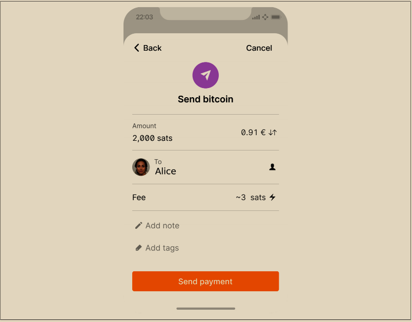

# 发送和接收比特币

爱丽丝决定购买0.001比特币。在她和乔确认了汇率之后，她递给了乔一定金额的现金，打开了她的手机钱包应用程序，并选择了“接收”。这会显示一个带有爱丽丝的第一个比特币地址的二维码。

接着，乔在他的智能手机钱包上选择“发送”并打开了二维码扫描器。这使得乔可以用他的智能手机摄像头扫描条形码，而不必输入爱丽丝的比特币地址，因为地址非常长。

现在，乔已将爱丽丝的比特币地址设置为接收方。乔输入了0.001比特币（BTC）的金额；见图1-2。一些钱包可能会以不同的计量单位显示金额：0.001 BTC相当于1毫比特币（mBTC）或100,000 satoshi（sats）。&#x20;

一些钱包也许会建议乔为这笔交易输入一个标签；如果是这样，乔输入“Alice”。几周或几个月后，这将帮助乔记住他为什么发送了这0.001比特币。一些钱包也许会提示乔有关手续费的事项。根据钱包以及交易的发送方式，钱包可能会要求乔输入交易费率，或者提示他一个建议的手续费（或费率）。交易手续费越高，交易确认的速度就越快（参见“确认”）。

\

<figure><figcaption>
图 1-2.  比特币钱包发送界面
</figcaption></figure>

接着，Joe 仔细检查以确保输入的金额正确，因为他即将发送资金，而错误很快将变得不可逆转。在双重检查地址和金额之后，他按下“发送”按钮来发送交易。Joe 的移动比特币钱包构建了一笔交易，将 0.001 BTC 分配到 Alice 提供的地址上，资金来源于 Joe 的钱包，并使用 Joe 的私钥对交易进行签名。这告诉比特币网络，Joe 已经授权将价值转移到 Alice 的新地址。由于交易通过对等协议传输，它很快就会在比特币网络中传播。几秒钟后，网络中的大多数连接良好的节点都会接收到交易，并首次看到 Alice 的地址。

与此同时，Alice 的钱包不断“监听”比特币网络上的新交易，寻找与其包含的地址匹配的任何交易。几秒钟后，Joe 的钱包发送交易，Alice 的钱包将指示正在接收 0.001 BTC。

\
&#x20;                                                                                **确认**

起初，Alice 的地址会显示来自 Joe 的交易为“未确认”。这意味着交易已经传播到网络上，但尚未记录在比特币交易日志中，即区块链上。要得到确认，交易必须被包含在一个区块中并添加到区块链中，这通常每 10 分钟发生一次。在传统金融术语中，这被称为清算。有关比特币交易的传播、验证和清算（确认）的更多详细信息，请参阅第 12 章。

Alice现在是0.001 BTC的自豪所有者，她可以进行消费。在接下来的几天里，Alice通过自动取款机和交易所购买了更多的比特币。在下一章中，我们将详细探讨她使用比特币进行的第一次购买，并更详细地研究底层的交易和传播技术。
