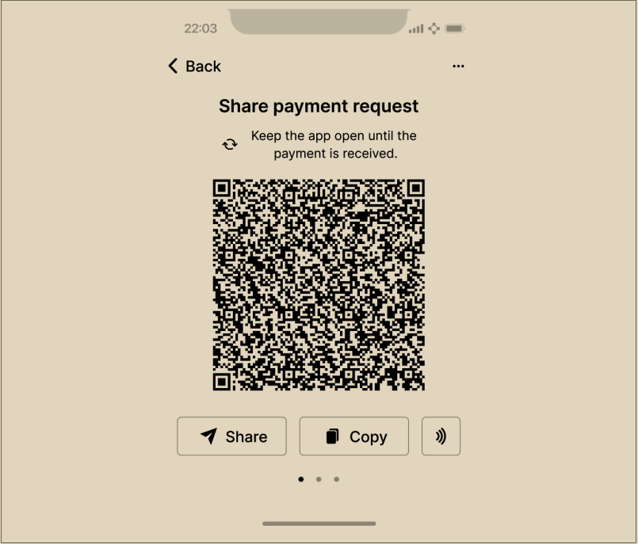

# 接收比特币

艾丽丝点击“接收”按钮，显示了一个二维码，如图1-1所示。

\

<figure><figcaption>
图 1-1. Alice在她的手机比特币钱包上使用“接收”界面，并以二维码格式显示了她的地址。
</figcaption></figure>

二维码是一个方形的黑白点阵图案，它包含着相同的信息，可以被Joe的智能手机摄像头扫描。

本书中的地址收到的任何资金都会丢失。如果你想测试发送比特币，请考虑将其捐赠给接受比特币的慈善机构。
