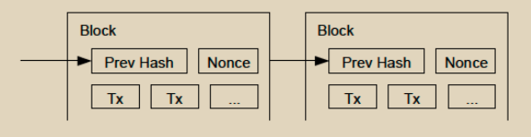

# 工作量证明(PoW)

为了在点对点基础上实现分布式时间戳服务器，我们将需要使用类似于Adam Back的Hashcash的工作量证明系统，而不是使用报纸或Usenet帖子。工作量证明涉及扫描一个值，使其哈希（例如，使用SHA-256）以一定数量的零位开始。所需的平均工作量随所需的零位数量呈指数增长，并且可以通过执行单个哈希来验证。对于我们的时间戳网络，我们通过在区块中递增一个随机数（nonce）来实现工作量证明，直到找到一个值，使得区块的哈希具有所需的零位。一旦CPU投入了足够的工作量使其满足工作量证明，区块就无法更改，除非重新进行这项工作。随着后续区块的链接，要更改该区块需要重新做所有后续区块的工作。

<figure><figcaption></figcaption></figure>

工作量证明还解决了确定多数决策中的代表性的问题。如果多数决策基于一个IP地址一票，那么任何能够分配多个IP的人都可以篡改它。工作量证明本质上是一个CPU一票制。多数决策由最长的链表示，该链在其中投入了最大的工作量证明努力。如果多数CPU算力由诚实节点控制，那么诚实链将增长最快，并超过任何竞争链。要修改过去的区块，攻击者必须重新做该区块以及其后的所有区块的工作量证明，然后赶上并超过诚实节点的工作量。我们将在后面展示，随着后续区块的添加，较慢的攻击者追赶的概率呈指数级下降。&#x20;

为了补偿硬件速度的增加和随时间变化的节点运行兴趣的差异，工作量证明的难度由一个移动平均数确定，以达到每小时平均区块数量的目标。如果生成得太快，难度就会增加。
