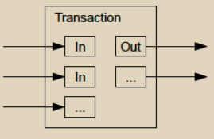

# 合并和拆分价值

虽然可以单独处理硬币，但对于每一分钱都进行单独交易将会很不方便。为了允许价值的拆分和合并，交易包含多个输入和输出。通常情况下，会有一个较大的前一笔交易作为单一输入，或者多个输入合并较小的金额，最多有两个输出：一个用于支付，另一个将余额（如果有）退回给发送者。

<figure><figcaption></figcaption></figure>

应该注意的是，扇出（即一笔交易依赖于多笔交易，而这些交易又依赖于更多的交易）在这里并不是一个问题。这里从不需要提取一笔交易的完整独立历史记录。
