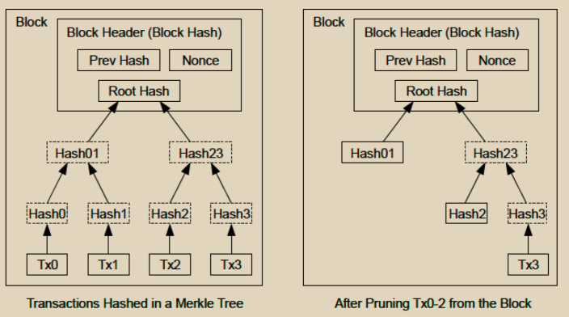

# 回收磁盘空间

一旦一个币的最新交易被足够多的区块深埋之后，该币之前的已花费交易就可以被丢弃以节省磁盘空间。为了实现这一点而不破坏区块的哈希，交易被哈希成一个默克尔树，在区块的哈希中只包含根。旧的区块可以通过截断树的分支来压缩。内部哈希值不需要被存储。

<figure><figcaption></figcaption></figure>

一个没有交易的区块头大约是80字节。假设每10分钟生成一个区块，那么每年大约是80字节 \* 6 \* 24 \* 365 = 4.2MB。截至2008年，计算机系统通常配备2GB的RAM，而摩尔定律预测当前每年增长1.2GB，即使区块头必须保留在内存中，存储也不应该是一个问题。
