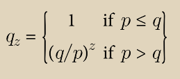
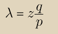
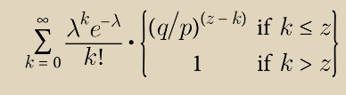
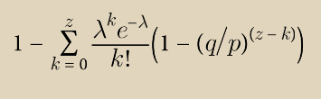

# 计算

\
我们考虑的情况是攻击者试图比诚实链更快地生成替代链。即使成功，也不会使系统对任意更改敞开大门，比如凭空创造价值或获取从未属于攻击者的资金。节点不会接受无效的交易作为支付，而诚实的节点永远不会接受包含这些交易的区块。攻击者只能尝试改变自己的一笔交易，以取回最近花费的资金。&#x20;

诚实链和攻击者链之间的竞赛可以被描述为一个二项随机游走。成功事件是诚实链被延长一块，其领先优势增加 +1，而失败事件是攻击者链被延长一块，使差距减少 -1。&#x20;

攻击者从给定的落后位置赶上的概率类似于《赌徒破产问题》。假设一个信用无限的赌徒从赤字开始，并进行可能无限次的尝试来达到盈亏平衡。我们可以计算他是否会达到盈亏平衡，或者攻击者是否会赶上诚实链的概率，如下所示：&#x20;

p = 诚实节点找到下一个区块的概率&#x20;

q = 攻击者找到下一个区块的概率&#x20;

qz = 攻击者从 z 个区块落后赶上的概率

<figure><figcaption></figcaption></figure>

鉴于我们假设 p > q，随着攻击者需要赶上的区块数量增加，概率呈指数下降。面对不利的情况，如果攻击者在早期没有幸运地迈出重要的一步，随着他落后的距离增加，他的机会将变得微乎其微。&#x20;

现在我们考虑新交易的接收方需要等待多久才能足够确信发送方无法更改交易。我们假设发送方是一名攻击者，他希望让接收方相信他已经付款了一段时间，然后在一段时间后将其更改为支付给自己。当接收方发现时，他已经晚了，但发送方希望这会太晚。&#x20;

接收方在签名前不久生成一个新的密钥对，并将公钥提供给发送方。这样可以防止发送方提前准备好一连串的区块，不断地工作直到他幸运地领先一段距离，然后在那一刻执行交易。一旦交易发送出去，不诚实的发送方会秘密地开始在一个平行链上工作，其中包含他交易的另一个版本。&#x20;

接收方等待直到交易被添加到一个区块中，并且之后链接了 z 个区块。他不知道攻击者取得了多少进展，但是假设诚实的区块需要平均预期时间来生成，攻击者的潜在进展将服从泊松分布，其期望值为：

<figure><figcaption></figcaption></figure>

为了得到攻击者现在仍然有可能赶上的概率，我们将他可能已经取得的每一次进展的泊松密度与他从那一点上赶上的概率相乘：

<figure><figcaption></figcaption></figure>

重新排列以避免对分布的无限尾部求和...

<figure><figcaption></figcaption></figure>

转换为C代码...

<pre class="language-c"><code class="lang-c">#include &#x3C;math.h>
double AttackerSuccessProbability(double q, int z) 
{
    double p = 1.0 - q;
<strong>    double lambda = z * (q / p);
</strong>    double sum = 1.0;
    int i, k;
    for (k = 0; k &#x3C;= z; k++) 
    {
<strong>        double poisson = exp(-lambda);
</strong>        for (i = 1; i &#x3C;= k; i++)
<strong>            poisson *= lambda / i;
</strong>        sum -= poisson * (1 - pow(q / p, z - k));
<strong>    }
</strong>    return sum; 
}
</code></pre>

运行一些结果，我们可以看到概率随着 z 呈指数级下降。

```
q=0.1
z=0 P=1.0000000
z=1 P=0.2045873
z=2 P=0.0509779
z=3 P=0.0131722
z=4 P=0.0034552
z=5 P=0.0009137
z=6 P=0.0002428
z=7 P=0.0000647
z=8 P=0.0000173
z=9 P=0.0000046
z=10 P=0.0000012
q=0.3
z=0 P=1.0000000
z=5 P=0.1773523
z=10 P=0.0416605
z=15 P=0.0101008
z=20 P=0.0024804
z=25 P=0.0006132
z=30 P=0.0001522
z=35 P=0.0000379
z=40 P=0.0000095
z=45 P=0.0000024
z=50 P=0.0000006
```

解决 P 小于 0.1% 的情况...

```
P < 0.001
q=0.10 z=5
q=0.15 z=8
q=0.20 z=11
q=0.25 z=15
q=0.30 z=24
q=0.35 z=41
q=0.40 z=89
q=0.45 z=340
```
