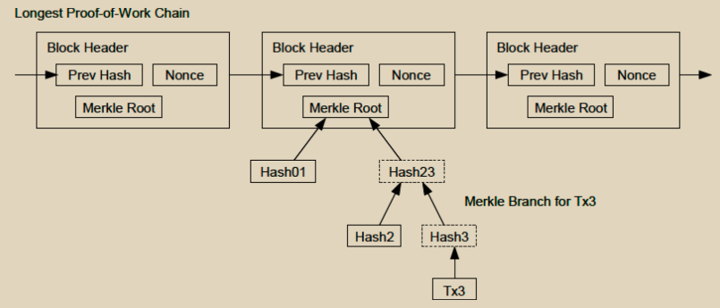

# 简化支付验证（Simplified Payment Verification，SPV）

用户只需保留最长工作量证明链的区块头副本即可验证支付，他可以通过查询网络节点获取这些副本，直到确信自己拥有了最长的链，并获取将交易链接到其时间戳位置的默克尔分支。虽然用户无法自行验证交易，但通过将其与链中的某个位置关联起来，他可以看到网络节点已接受该交易，并且之后添加的区块进一步确认了网络已接受该交易。

<figure><figcaption></figcaption></figure>

因此，只要诚实的节点控制着网络，验证就是可靠的，但如果网络被攻击者压倒性地控制，则更容易受到攻击。虽然网络节点可以自行验证交易，但简化的方法可能会被攻击者伪造的交易欺骗，只要攻击者能够继续压倒网络。保护措施之一是接受来自网络节点的警报，当它们检测到无效区块时，提示用户的软件下载完整区块和警报交易以确认不一致之处。经常收到支付的企业可能仍然希望运行自己的节点，以获得更独立的安全性和更快的验证速度。
