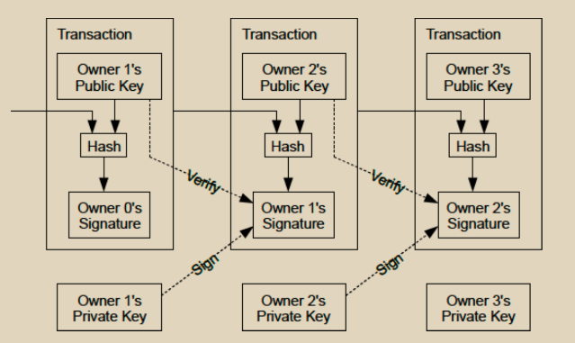

# 交易

我们将电子硬币定义为一系列数字签名。每个所有者通过对上一笔交易的哈希和下一位所有者的公钥进行数字签名，并将它们添加到硬币的末尾来将硬币转移给下一个所有者。收款人可以验证这些签名以验证所有权链。

<figure><figcaption></figcaption></figure>

问题当然是收款人无法验证其中一个所有者是否曾经双重支付了该硬币。一个常见的解决方案是引入一个可信的中央机构或者铸币厂，来检查每一笔交易是否存在双重支付。在每笔交易之后，硬币必须被退回给铸币厂以发行新的硬币，而只有直接由铸币厂发行的硬币才被信任不会被双重支付。这种解决方案的问题在于整个货币系统的命运取决于运行铸币厂的公司，每笔交易都必须通过他们进行，就像银行一样。

我们需要一种方法让收款人知道前任所有者没有签署任何早期的交易。对于我们而言，最早的交易才是重要的，所以我们不关心后来的双重支付尝试。确认没有交易存在的唯一方法是了解所有交易。在基于铸币厂的模型中，铸币厂知道所有交易，并决定哪些先到达。为了在没有可信方的情况下实现这一点，交易必须公开宣布，而且我们需要一个参与者能够就它们被接收的顺序达成一致意见的系统。收款人需要证明，在每笔交易时，大多数节点都同意它是第一次接收的。
